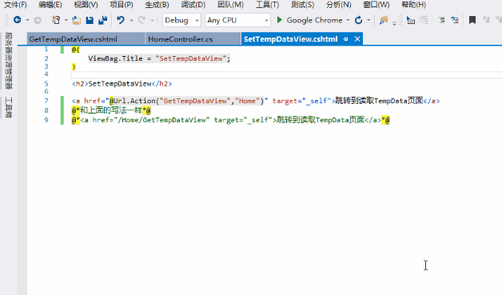

<!-- TOC -->

- [Controller](#controller)
- [View](#view)
    - [部分视图](#部分视图)
        - [调用方法](#调用方法)
            - [Partial 与 RenderPartial 方法](#partial-与-renderpartial-方法)
            - [RenderPartial 与 RenderAction 方法](#renderpartial-与-renderaction-方法)
            - [RenderAction 与 Action](#renderaction-与-action)
            - [RenderPage 与 RenderPartial 方法](#renderpage-与-renderpartial-方法)
            - [总结](#总结)
- [Controller 和 View 的传值](#controller-和-view-的传值)
    - [Controller->View](#controller-view)
        - [直接通过 View() 返回](#直接通过-view-返回)
        - [通过 JsonResult 返回](#通过-jsonresult-返回)

<!-- /TOC -->
# Controller
# View
## 部分视图
为了代码的复用，相当于我们自己实现的分页控件一样。

使用部分视图 ：  1. 可以简写代码。2. 页面代码更加清晰、更好维护。

### 调用方法
Partial()  Action()  **RenderPartial()  RenderAction()**  RenderPage() 

#### Partial 与 RenderPartial 方法
1. Razor 语法：@Html.Partial() 与 @{Html.RenderPartial();}

2. 区别：Partial 可以直接输出内容，它内部是 将 html 内容转换为 string 字符（MVCHtmlString），然后缓存起来，      最后在一次性输出到页面。显然，这个转换的过程，会降低效率，所以通常使用 RenderPartial 代替。

#### RenderPartial 与 RenderAction 方法
1. Razor 语法：@{Html.RenderPartial();}  与 @{Html.RenderAction();}

2. 区别：RenderPartial 不需要创建 Controller 的 Action ，而 RenderAction 需要在 Controller 创建要加载的 Action。

RenderAction 会先去调用 Contorller 的 Action ，最后再 呈现视图，所以这里 页面会在 发起一个链接。

如果这个部分视图只是一些简单 的 html 代码，请使用 RenderPartial。 但如果这个部分视图 除了有 html 代码外，     还需要 通过 读取数据库里的数据 来渲染，就必须使用 RenderAction 了，因为 它可以在 Action 里调用 Model里的     方法读取数据库，渲染视图后在呈现，而 RenderPartial 没有 Action，所以无法做到。

#### RenderAction 与 Action
1. Razor 语法：@{Html.RenderAction();}  与 @Html.Action();

2. 区别：Action 也是直接输出，和 Partial 一样，也存在一个转换的过程。不如 RenderAction 直接输出到 当前 HttpContext 的效率高。

#### RenderPage 与 RenderPartial 方法
1. Razor 语法：@{Html.RenderPartial();}  与 @RenderPage()

2. 区别：也可以使用 RenderPage 来呈现部分，但它不能使用 原来视图的 Model 和 ViewData ,只能通过参数来传递。而 RenderPartial 可以使用原来视图的 Model 和 ViewData。

#### 总结
最常用的还是 @{Html.RenderAction();} 和 @{Html.RenderPartial();}

# Controller 和 View 的传值
## Controller->View
### 直接通过 View() 返回
- 强类型

``` cs
//控制器 Action代码
public ActionResult SinglePerson()
{
    Person p =new Person();
    return View(p);
}

```

``` cshtml
//前端代码使用 cshtml文件
@model MVC.Demo.Models.Person
<input id="txtName" value="@Model.Name" />
```

- 弱类型 ViewBag和ViewData

``` cs
//Controller文件中写法：
//ViewBag基本上是对ViewData的封装，发生重定向后ViewBag和ViewData中存储的变量将变为null
ViewBag.Title = "和ViewData是一样的";
ViewData["CityName"] = "和ViewBag是一样的";

```

``` html
//View文件中获取：
<input id = "txtTitle" value = "@ViewBag.Title" />
<br/>
<input id = "txtCityName" value = "@ViewData["CityName"]" />
<br/>
```

- 弱类型 TempData

``` cs
public ActionResult SetTempDataView()
{
    TempData["Remark"] = "读取一次自动销毁!!!";
    return View();
}
public ActionResult GetTempDataView()
{
    return View();
}
```

``` html
//SetTempDataView 视图中跳转
<a href="@Url.Action("GetTempDataView","Home")" target="_self">跳转到读取TempData页面</a>
@*和上面的写法一样*@
@*<a href="/Home/GetTempDataView" target="_self">跳转到读取TempData页面</a>*@

//GetTempDataView 视图中调用
由SetTempDataView跳转过来有值，再次刷新后为null
<br/>
<label>@TempData["Remark"]</label>

```
效果：


### 通过 JsonResult 返回
``` cs
public JsonResult GetAllPerson()
{
    // 集合的返回
    List<Person> lstPerson = new List<Person>();
    return Json(lstPerson);
}

public JsonResult GetOnePerson()
{
    //单个对象的返回
    Person p = new Person();
    return Json(p);
}
```

``` javascript

$.post("/Home/GetAllPerson",{},function(data){
        //集合lstPerson的处理
    });

$.post("/Home/GetOnePerson",{},function(data){
        //实例p的处理
    });
```


 
 