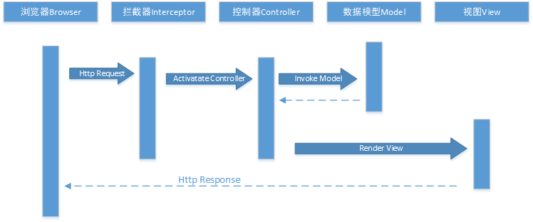

<!-- TOC -->

- [MVC概述](#mvc概述)
    - [执行的生命周期](#执行的生命周期)
    - [控制器Controller-核心](#控制器controller-核心)
        - [Controller-View传值](#controller-view传值)
            - [强类型传值](#强类型传值)
            - [动态类型传值](#动态类型传值)
            - [ViewData和ViewBag](#viewdata和viewbag)
            - [TempData](#tempdata)
            - [总结](#总结)
        - [View-Controller传值](#view-controller传值)
    - [视图View](#视图view)
        - [选择视图](#选择视图)
        - [部分视图](#部分视图)
            - [Partial 与 RenderPartial 方法](#partial-与-renderpartial-方法)
            - [RenderPartial 与 RenderAction 方法](#renderpartial-与-renderaction-方法)
            - [RenderAction 与 Action](#renderaction-与-action)
            - [RenderPage 与 RenderPartial 方法](#renderpage-与-renderpartial-方法)
        - [视图引擎Razor](#视图引擎razor)
            - [@符号](#符号)
    - [模型Model](#模型model)

<!-- /TOC -->

<a id="markdown-mvc概述" name="mvc概述"></a>
# MVC概述

<a id="markdown-执行的生命周期" name="执行的生命周期"></a>
## 执行的生命周期


ASP.NET MVC 执行生命周期大致如下 ：
1. 用户通过浏览器发出HTTP请求
2. WEB服务器接收到HTTP请求
3. ASP.NET MVC框架接收到HTTP请求
4. ASP.NET MVC框架分析HTTP请求的网址(URL)
5. ASP.NET MVC框架找到对应的Controller
6. ASP.NET MVC框架执行 对应Controller 的Action
7. Action执行中产生相应的Model(可能没有)
8. ASP.NET MVC框架执行 View 并返回HTTP结果

<a id="markdown-控制器controller-核心" name="控制器controller-核心"></a>
## 控制器Controller-核心
ASP.NET MVC 的核心就是Controller，它负责处理浏览器传送过来的所有请求，并决定要将什么内容响应给浏览器，但 Controller 并不负责决定内容应该如何显示，而是仅将特定形态的内容响应(ActionResult)给 ASP.NET MVC 框架，最后由 ASP.NET MVC 架构依据响应的形态(HTML，JSON，XML)来决定如何将内容响应给浏览器。

<a id="markdown-controller-view传值" name="controller-view传值"></a>
### Controller-View传值

<a id="markdown-强类型传值" name="强类型传值"></a>
#### 强类型传值
```cs
public class DefaultController : Controller
{
    /// <summary>
    /// 返回带有数据的视图
    /// </summary>
    /// <returns></returns>
    public ActionResult IndexSimpleData()
    {
        Student stu = new Student("jack", 123);

        return View(stu);
    }
}

/// <summary>
/// 定义一个view model类
/// </summary>
public class Student
{
    public Student(string name, int age)
    {
        Name = name;
        Age = age;
    }
    public string Name { get; set; }
    public int Age { get; set; }
}
```

对应的IndexSimpleData.cshtml
```html
@* @model 其实并不是必须的，可以缺省，显示的指明其实是为了智能提示，减少人为错误的干预*@
@model EmptyDemo.Controllers.Student
@{
    ViewBag.Title = "IndexSimpleData";
}

<h2>IndexSimpleData</h2>

<hr />

<p class="bg-info">
    <div>@Model.Name</div>
    <div>@Model.Age</div>
</p>
```

<a id="markdown-动态类型传值" name="动态类型传值"></a>
#### 动态类型传值
```cs
/// <summary>
/// 返回动态对象的视图
/// </summary>
/// <returns></returns>
public ActionResult IndexComplexData()
{
    dynamic viewModel = new ExpandoObject();
    viewModel.FirstName = "妲己";
    viewModel.LastName = "斯温";
    viewModel.ZhName = "路西法";

    return View(viewModel);
}
```

对应视图IndexComplexData.cshtml
```html
@{
    ViewBag.Title = "IndexComplexData";
}

<h2>IndexComplexData</h2>

<hr />
<h1>Controller->View 数据的传递 动态对象</h1>
<p class="bg-info">
    <div>@Model.FirstName</div>
    <div>@Model.LastName</div>
    <div>@Model.ZhName</div>
</p>
```

<a id="markdown-viewdata和viewbag" name="viewdata和viewbag"></a>
#### ViewData和ViewBag
```cs
public dynamic ViewBag { get; }  
public ViewDataDictionary ViewData { get; set; }  
```

ViewData 是一个 ViewDataDictionary 类，可用于存储任意对象的数据，但存储的键值必须为字符串。
ViewData 只会存在于当前的 HTTP请求中。

ViewBag 是 dynamic 类型对象，基于.NET4.0，在查询数据时不需要类型转换，可读性更好。
**也是应用最多的一种传值方式!**

ViewBag基本上是对ViewData的封装，发生重定向后ViewBag和ViewData中存储的变量将变为null。

区别：

viewdata | viewbag
---------|--------
它是key/value字典集合 | 它是dynamic类型对象
从asp.net mvc1就有了 | 从asp.netmvc3才有
基于asp.netframework 3.5 | 基于asp.net framework4.0
viewdata比viewbag快 | viewbag比viewdata慢
页面查询数据时需要转换合适的类型 | 在页面查询数据时不需要转换合适的类型
有一些类型转换代码 | 可读性较好

ViewData示例：
```cs
public ActionResult Index()
{
    ViewData["name"] = "jack";
    ViewData["obj"] = new { a = 1, b = 2 };
    return View();
}
```

```html
<h2>Index</h2>
<hr/>
@ViewData["name"]
<br/>
@ViewData["obj"]
```

ViewBag示例：
```cs
public ActionResult Index()
{
    ViewData["name"] = "jack";
    ViewData["obj"] = new { a = 1, b = 2 };
    return View();
}
```

```html
<h2>Index</h2>
<hr/>
@ViewBag.Name
<br/>
@ViewBag.Obj
```

<a id="markdown-tempdata" name="tempdata"></a>
#### TempData
TempData 数据结构与 ViewData 一样，但它是 TempDataDictionary 类。内部是用 Session 来存储数据，也就是说TempData只保存到下一个请求中，下一个请求完了之后，TempData就会被删除了。
我们可以通过Redirect视图来测试TempData的效果，示例如下：
```cs
public ActionResult Index()
{
    //相当于在Session中进行赋值
    TempData["Name"] = "镜花水月";
    return RedirectToAction("IndexByName");
}

public ActionResult IndexByName()
{
    //在此视图中获取后即删除该Session值
    return View();
}
```

IndexByName.cshtml中
```html
<h2>IndexByName</h2>

@TempData["Name"]
```
针对上例，访问url：http://localhost:11115/Home/Index

会自动跳转至http://localhost:11115/Home/IndexByName

并且视图中的TempData值仅在首次加载时有显示。

TempData附加示例：
``` cs
public ActionResult SetTempDataView()
{
    TempData["Remark"] = "读取一次自动销毁!!!";
    return View();
}
public ActionResult GetTempDataView()
{
    return View();
}
```

``` html
//SetTempDataView 视图中跳转
<a href="@Url.Action("GetTempDataView","Home")" target="_self">跳转到读取TempData页面</a>
@*和上面的写法一样*@
@*<a href="/Home/GetTempDataView" target="_self">跳转到读取TempData页面</a>*@

//GetTempDataView 视图中调用
由SetTempDataView跳转过来有值，再次刷新后为null
<br/>
<label>@TempData["Remark"]</label>

```
效果：


<a id="markdown-总结" name="总结"></a>
#### 总结
1. ViewData和TempData是字典类型，赋值方式用字典方式，ViewData["myName"]
2. ViewBag是动态类型，使用时直接添加属性赋值即可 ViewBag.myName
3. ViewBag和ViewData只在当前Action中有效，等同于View
4. TempData可以通过转向继续使用，因为它的值保存在Session中。但TempData只能经过一次传递，之后会被系统自动清除
5. ViewData和ViewBag中的值可以互相访问，因为ViewBag的实现中包含了ViewData

<a id="markdown-view-controller传值" name="view-controller传值"></a>
### View-Controller传值
其中一种常见的是表单提交的方式，通过表单的action属性进行提交到controller，具体示例如下：
```cs
public ActionResult Index()
{
    return View();
}

public ActionResult GetData(string userid)
{
    ViewBag.Name = userid;
    return Content(userid);
}
```

视图Index.cshtml：
```html
<form method="get" action="@Url.Action("GetData")">
    <input type="text" name="userid" value="" placeholder="userid" />
    <br />
    <input type="submit" />
</form>
```
针对上例，打开连接进行请求，会将表单中对应的值传递到controller中定义GetData方法中，并通过text方式进行返回。

还有另一种方式，就是通过ajax进行请求，同上。

<a id="markdown-视图view" name="视图view"></a>
## 视图View

类 | Controller辅助方法 | 用途
--|----------------|---
ActionResult |  | 所有Result类型的抽象基类
ContentResult | Content | 返回一段用户自定义的文字内容
EmptyResult |  | 不返回任何数据，即不响应任何数据
JsonResult | Json | 将数据序列转化成 JSON 格式返回
RedirectResult | Redirect | 重定向到指定的 URL
RedirectToRouteResult | RedirectToAction、RedirectToRoute | 与 RedirectResult 类似，但它将新定向到一个 Action 或 Route
ViewResult | View | 使用 IViewInstance 接口和 IViewEngine 接口，实际输出数据的是 IViewEngine 和 View
PartialViewResult | PartialView | 与 ViewResult 类相似，返回的是“部分显示”，即“UserControls”目录下的 View
FileResult | File | 以二进制串流的方式返回一个文件数据
JavaScriptResult | JavaScript | 返回的是 JavaScript 指令码

<a id="markdown-选择视图" name="选择视图"></a>
### 选择视图
View()方法有多种方法重载，Action中也有多种处理方式。
项目结构和代码如下所示：


```cs
/// <summary>
/// 选择默认视图返回
/// 与控制器对应文件夹【Home】中的Index视图
/// </summary>
/// <returns></returns>
public ActionResult Index()
{
    return View();
}

/// <summary>
/// 选择指定名称的视图返回
/// View("NewIndex") 返回对应的NewIndex名称视图
/// </summary>
/// <returns></returns>
public ActionResult IndexByName()
{
    return View("NewIndex");
}

/// <summary>
/// 选择指定名称的视图返回
/// 也可以指定其他控制器对应视图文件夹内的视图
/// 该示例对应返回的并非是Home文件夹中的视图
/// </summary>
/// <returns></returns>
public ActionResult IndexTempName()
{
    return View(@"~\Views\TestTemp\TestTemp.cshtml");
}

/// <summary>
/// 重定向到其他的Action，与调用重载View方法是不同的
/// return View("xxxx"); 直接返回一个视图，这里的参数是视图的名称
/// return RedirectToAction("xxx"); 重新指向到另一个Action，这里的参数应该是Action的名称，而非视图的名称，经过Controller的处理
/// </summary>
/// <returns></returns>
public ActionResult Reirect2Action()
{
    return RedirectToAction("Index");
}
```

<a id="markdown-部分视图" name="部分视图"></a>
### 部分视图
为了代码的复用，相当于我们自己实现的分页控件一样。

使用部分视图 ：  
1. 可以简写代码。
2. 页面代码更加清晰、更好维护。

```
Partial();
Action();
RenderPartial();//常用
RenderAction();//常用
RenderPage() ;
```

<a id="markdown-partial-与-renderpartial-方法" name="partial-与-renderpartial-方法"></a>
#### Partial 与 RenderPartial 方法
1. Razor 语法：@Html.Partial() 与 @{Html.RenderPartial();}
2. 区别：Partial 可以直接输出内容，它内部是 将 html 内容转换为 string 字符（MVCHtmlString），然后缓存起来，最后在一次性输出到页面。显然，这个转换的过程，会降低效率，所以通常使用 RenderPartial 代替。

<a id="markdown-renderpartial-与-renderaction-方法" name="renderpartial-与-renderaction-方法"></a>
#### RenderPartial 与 RenderAction 方法
1. Razor 语法：@{Html.RenderPartial();}  与 @{Html.RenderAction();}
2. 区别：RenderPartial 不需要创建 Controller 的 Action ，而 RenderAction 需要在 Controller 创建要加载的 Action。

RenderAction会先去调用 Contorller 的 Action ，最后再呈现视图，所以这里 页面会再发起一个链接。

如果这个部分视图只是一些简单 的 html 代码，请使用 RenderPartial。 但如果这个部分视图 除了有 html 代码外，还需要通过读取数据库里的数据来渲染，就必须使用RenderAction了，因为它可以在Action里调用 Model里的方法读取数据库，渲染视图后在呈现，而RenderPartial没有Action，所以无法做到。

<a id="markdown-renderaction-与-action" name="renderaction-与-action"></a>
#### RenderAction 与 Action
1. Razor 语法：@{Html.RenderAction();}  与 @Html.Action();
2. 区别：Action 也是直接输出，和 Partial 一样，也存在一个转换的过程。不如 RenderAction 直接输出到 当前 HttpContext 的效率高。

<a id="markdown-renderpage-与-renderpartial-方法" name="renderpage-与-renderpartial-方法"></a>
#### RenderPage 与 RenderPartial 方法
1. Razor 语法：@{Html.RenderPartial();}  与 @RenderPage()
2. 区别：也可以使用 RenderPage 来呈现部分，但它不能使用原来视图的Model 和ViewData ,只能通过参数来传递。而 RenderPartial 可以使用原来视图的 Model 和 ViewData。

<a id="markdown-视图引擎razor" name="视图引擎razor"></a>
### 视图引擎Razor
Razor是ASP.NET MVC内置的引擎，也是我们推荐使用的引擎
特点：
1. 精简、表达性强、
2. 容易学习
3. VS 提供很好的智能提示

<a id="markdown-符号" name="符号"></a>
#### @符号
所有以 @开头 或 @{ /* 代码体 */ }  (在@与{之间不得添加任何空格) 的部分代码都会被ASP.NET引擎进行处理.在 @{ /*代码体*/ } 内的代码每一行都必须以";"结束,如
```cs
@{
    var i = 10;
    var y = 20;
}
```
而 @xxx 则不需要以";"作为结束符,如

@i 输出 10

@y; 输出 20;

- 字符类型常量必须用""括起
例如: @{ string str = "my string"; }
- Razor提供智能分析功能
如果在@的前一个字符若是非空白字符,则ASP.NET不会对其进行处理。如:<p>text@i xx</p> 输出 text@i xx
- Razor的单行语法


<a id="markdown-模型model" name="模型model"></a>
## 模型Model

任务：
* 不该负责处理所有与数据处理无关的操作或是控制网站的执行流程
* 专注于如何有效地提供数据短暂存贮，数据格式验证等。

MVC 模型包含程序中的所有逻辑，而这些逻辑并不包含在视图或控制器中。模型应该包含所有程序业务逻辑，验证逻辑和数据库访问逻辑。例如，如果你用 Microsoft Entity Framework 来访问数据库，那么你要在Models文件夹中创建 Entity Framework 类 ( .edmx 文件) 。

视图应该仅仅包含生成用户界面的逻辑。控制器应该仅仅包含返回正确视图的最小逻辑或者将用户重定向到其他action(流控制)。其它的任何事情都应该包含在模型中。

通常，你应该为“胖”模型和“瘦”控制器而努力。控制器方法应该只包含几行代码。如果控制器action变得太“胖”的话，那么就应该考虑将逻辑挪出到Models文件夹中的一个新类中。

