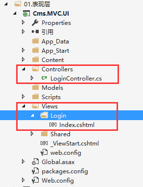
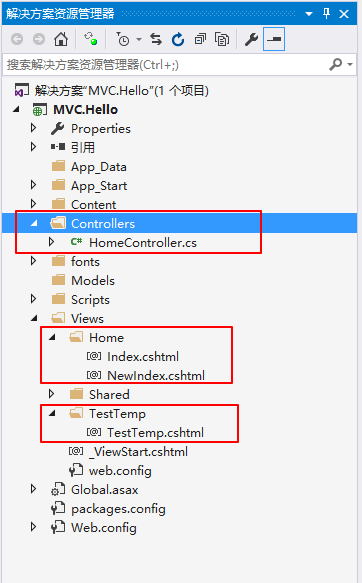
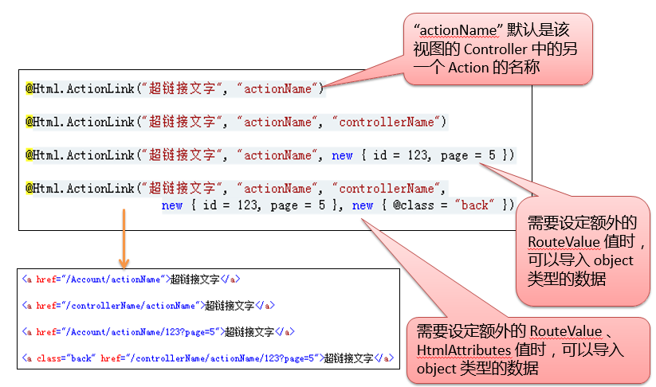
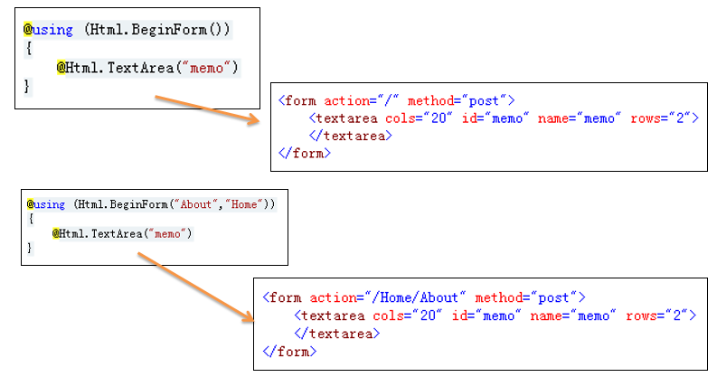
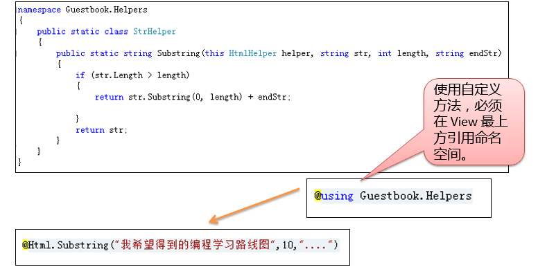

<!-- TOC -->

- [MVC概述](#mvc概述)
    - [执行的生命周期](#执行的生命周期)
    - [路由](#路由)
        - [默认路由](#默认路由)
        - [URL的写法](#url的写法)
    - [Razor](#razor)
        - [@符号](#符号)
        - [@变量](#变量)
    - [控制器Controller-核心](#控制器controller-核心)
        - [Controller-View传值](#controller-view传值)
            - [强类型传值](#强类型传值)
            - [动态类型传值](#动态类型传值)
            - [ViewData和ViewBag](#viewdata和viewbag)
            - [TempData](#tempdata)
            - [总结](#总结)
        - [View-Controller传值](#view-controller传值)
    - [视图View](#视图view)
        - [选择视图](#选择视图)
        - [公共模板@RenderBody()](#公共模板renderbody)
        - [@Section](#section)
        - [PartialView部分视图](#partialview部分视图)
    - [HTML 帮助器](#html-帮助器)
        - [建议使用强类型辅助方法](#建议使用强类型辅助方法)
        - [Html.Encode](#htmlencode)
        - [自定义 HTML 辅助方法](#自定义-html-辅助方法)
    - [Url 辅助方法](#url-辅助方法)
        - [Url.Action()](#urlaction)
        - [Url.Encode](#urlencode)
        - [Url.Content](#urlcontent)
    - [模型Model](#模型model)
    - [Area区域](#area区域)

<!-- /TOC -->

<a id="markdown-mvc概述" name="mvc概述"></a>
# MVC概述

<a id="markdown-执行的生命周期" name="执行的生命周期"></a>
## 执行的生命周期


ASP.NET MVC 执行生命周期大致如下 ：
1. 用户通过浏览器发出HTTP请求
2. WEB服务器接收到HTTP请求
3. ASP.NET MVC框架接收到HTTP请求
4. ASP.NET MVC框架分析HTTP请求的网址(URL)
5. ASP.NET MVC框架找到对应的Controller
6. ASP.NET MVC框架执行 对应Controller 的Action
7. Action执行中产生相应的Model(可能没有)
8. ASP.NET MVC框架执行 View 并返回HTTP结果

<a id="markdown-路由" name="路由"></a>
## 路由
<a id="markdown-默认路由" name="默认路由"></a>
### 默认路由

默认的路由在RegisterRoutes 方法中定义（/App_Start/RouteConfig.cs）

Web应用程序启动时调用Application_Start 方法，该方法会调用RegisterRoutes 方法
``` cs
public static void RegisterRoutes(RouteCollection routes)
    {
        routes.IgnoreRoute("{resource}.axd/{*pathInfo}");
        
        //添加默认路由  在这里是 /Home/Main
        routes.MapRoute(
            name: "Default",
            url: "{controller}/{action}/{id}",
            defaults: new { controller = "Home", action = "Main", id = UrlParameter.Optional }
        );
    }
```

<a id="markdown-url的写法" name="url的写法"></a>
### URL的写法
{controller}/{action}/{id}
``` cs
public class HomeController : Controller
{
	//对于的请求Url为 /Home/Index
	public ActionResult Index()
	{
		//默认寻找路径【/Views/Home/Index.cshtml】文件
		return View();
	}
}
```

项目结构：



<a id="markdown-razor" name="razor"></a>
## Razor
Razor 是一种允许您向网页中嵌入基于服务器的代码（Visual Basic 和 C#）的标记语法。

Razor是ASP.NET MVC内置的引擎，也是我们推荐使用的引擎

具有以下特点：
1. 精简、表达性强、
2. 容易学习
3. VS 提供很好的智能提示

<a id="markdown-符号" name="符号"></a>
### @符号

所有以 `@开头` 或 `@{ /* 代码体 */ }`  (在@与{之间不得添加任何空格) 的部分代码都会被ASP.NET引擎进行处理.

在 `@{ /*代码体*/ }` 内的代码每一行都必须以";"结束,如

```cs
@{
    var i = 10;
    var y = 20;
}
```
而 @xxx 则不需要以";"作为结束符,如

@i 输出 10

@y; 输出 20;

<a id="markdown-变量" name="变量"></a>
### @变量

```cs
<!-- 单行代码块 -->
@{ var myMessage =	"Hello World"; }

<!-- 行内表达式或变量 -->
<p>The value of myMessage is: @myMessage</p> 

<!-- 多行语句代码块 -->
@{
var greeting = "Welcome to our site!";
var weekDay = DateTime.Now.DayOfWeek;
var greetingMessage = greeting + " Here in Huston it is: " + weekDay;
}
<p>The greeting is: @greetingMessage</p>
```


```cshtml
<ul>
    @{ 
        for (int i = 0; i < 10; i++)
        {
            <li>@i</li>
        }
    }
</ul>
```

其他`foreach、while`循环类似
```html
<div>
    @{ var num = 0;}
</div>
<div>
    @{
        if (num > 0)
        {
            @:大于0
        }
        else if (num < 0)
        {
            @:小于0
        }
        else
        {
            @:等于0
        }
    }
</div>
```

**总的来说，可以归纳为以下几点：**
1. `@{ ... }` 中，`@ 和 {` 之间不得添加空格
2. `@{ ... }` 内的代码每一行C#代码都必须以 `;` 号结束，而`@xxx`则不需要`；`符合
3. `@{ ... }` 内可以包含HTML标记
4. `@{ ... }` 内输出文本的话，需要在文本前加上 `@:` 前缀，或使用`<textarea/>`进行多行输出
5. `@xxx`的前一个字符若是非空白字符，则ASP.NET不会对其进行处理

<a id="markdown-控制器controller-核心" name="控制器controller-核心"></a>
## 控制器Controller-核心
ASP.NET MVC 的核心就是Controller，它负责处理浏览器传送过来的所有请求，并决定要将什么内容响应给浏览器，

但 Controller 并不负责决定内容应该如何显示，而是仅将特定形态的内容响应(ActionResult)给 ASP.NET MVC 框架，

最后由 ASP.NET MVC 架构依据响应的形态(HTML，JSON，XML)来决定如何将内容响应给浏览器。


<a id="markdown-controller-view传值" name="controller-view传值"></a>
### Controller-View传值

<a id="markdown-强类型传值" name="强类型传值"></a>
#### 强类型传值
```cs
public class DefaultController : Controller
{
    /// <summary>
    /// 返回带有数据的视图
    /// </summary>
    /// <returns></returns>
    public ActionResult IndexSimpleData()
    {
        Student stu = new Student("jack", 123);

        return View(stu);
    }
}

/// <summary>
/// 定义一个view model类
/// </summary>
public class Student
{
    public Student(string name, int age)
    {
        Name = name;
        Age = age;
    }
    public string Name { get; set; }
    public int Age { get; set; }
}
```

对应的IndexSimpleData.cshtml
```html
@* @model 其实并不是必须的，可以缺省，显示的指明其实是为了智能提示，减少人为错误的干预*@
@model EmptyDemo.Controllers.Student
@{
    ViewBag.Title = "IndexSimpleData";
}

<h2>IndexSimpleData</h2>

<hr />

<p class="bg-info">
    <div>@Model.Name</div>
    <div>@Model.Age</div>
</p>
```

<a id="markdown-动态类型传值" name="动态类型传值"></a>
#### 动态类型传值
```cs
/// <summary>
/// 返回动态对象的视图
/// </summary>
/// <returns></returns>
public ActionResult IndexComplexData()
{
    dynamic viewModel = new ExpandoObject();
    viewModel.FirstName = "妲己";
    viewModel.LastName = "斯温";
    viewModel.ZhName = "路西法";
    
    // 下面这种动态对象的定义虽然没有问题，但是在前端无法解析识别属性名称，后期可以通过Json方法进行返回数据
    //object viewModel = new { FirstName = "Alan", LastName = "Waker" };
    
    return View(viewModel);
}
```

对应视图IndexComplexData.cshtml
```html
@{
    ViewBag.Title = "IndexComplexData";
}

<h2>IndexComplexData</h2>

<hr />
<h1>Controller->View 数据的传递 动态对象</h1>
<p class="bg-info">
    <div>@Model.FirstName</div>
    <div>@Model.LastName</div>
    <div>@Model.ZhName</div>
</p>
```

<a id="markdown-viewdata和viewbag" name="viewdata和viewbag"></a>
#### ViewData和ViewBag
```cs
public dynamic ViewBag { get; }
public ViewDataDictionary ViewData { get; set; }
```

ViewData 是一个 ViewDataDictionary 类，可用于存储任意对象的数据，但存储的键值必须为字符串。

ViewData 只会存在于当前的 HTTP请求中，可以当做当前视图View中可以访问。

ViewBag 是 dynamic 类型对象，基于.NET4.0，在查询数据时不需要类型转换，可读性更好。
**也是应用最多的一种传值方式!**

ViewBag基本上是对ViewData的封装，发生重定向后ViewBag和ViewData中存储的变量将变为null。

区别：

viewdata | viewbag
---------|--------
它是key/value字典集合 | 它是dynamic类型对象
从asp.net mvc1就有了 | 从asp.netmvc3才有
基于asp.netframework 3.5 | 基于asp.net framework4.0
viewdata比viewbag快 | viewbag比viewdata慢
页面查询数据时需要转换合适的类型 | 在页面查询数据时不需要转换合适的类型
有一些类型转换代码 | 可读性较好

ViewData示例：
```cs
public ActionResult Index()
{
    ViewData["name"] = "jack";
    ViewData["obj"] = new { a = 1, b = 2 };
    return View();
}
```

```html
<h2>Index</h2>
<hr/>
@ViewData["name"]
<br/>
@ViewData["obj"]
```

ViewBag示例：
```cs
public ActionResult Index()
{
    ViewBag.Name = "jack";
    ViewBag.Obj = new { a = 1, b = 2 };
    return View();
}
```

```html
<h2>Index</h2>
<hr/>
@ViewBag.Name
<br/>
@ViewBag.Obj
```

<a id="markdown-tempdata" name="tempdata"></a>
#### TempData
TempData 数据结构与 ViewData 一样，但它是 TempDataDictionary 类。

内部是用 Session 来存储数据，也就是说TempData只保存到下一次请求中，下一次请求完了之后，TempData就会被删除了。

我们可以通过Redirect视图来测试TempData的效果，示例如下：

```cs
public ActionResult Index()
{
    //相当于在Session中进行赋值
    TempData["Name"] = "镜花水月";
    return RedirectToAction("IndexByName");
}

public ActionResult IndexByName()
{
    //在此视图中获取后即删除该Session值
    return View();
}
```

IndexByName.cshtml中
```html
<h2>IndexByName</h2>

@TempData["Name"]
```
针对上例，访问url：http://localhost:11115/Home/Index

会自动跳转至 http://localhost:11115/Home/IndexByName

并且视图中的TempData值仅在首次加载时有显示。

TempData附加示例：
``` cs
public ActionResult SetTempDataView()
{
    TempData["Remark"] = "读取一次自动销毁!!!";
    return View();
}
public ActionResult GetTempDataView()
{
    return View();
}
```

``` html
//SetTempDataView 视图中跳转
<a href="@Url.Action("GetTempDataView","Home")" target="_self">跳转到读取TempData页面</a>
@*和上面的写法一样*@
@*<a href="/Home/GetTempDataView" target="_self">跳转到读取TempData页面</a>*@

//GetTempDataView 视图中调用
由SetTempDataView跳转过来有值，再次刷新后为null
<br/>
<label>@TempData["Remark"]</label>

```
效果：


<a id="markdown-总结" name="总结"></a>
#### 总结
1. ViewData和TempData是字典类型，赋值方式用字典方式，ViewData["myName"]
2. ViewBag是动态类型，使用时直接添加属性赋值即可 ViewBag.myName
3. ViewBag和ViewData只在当前Action中有效，等同于View
4. TempData可以通过转向继续使用，因为它的值保存在Session中。但TempData只能经过一次传递，之后会被系统自动清除
5. ViewData和ViewBag中的值可以互相访问，因为ViewBag的实现中包含了ViewData

<a id="markdown-view-controller传值" name="view-controller传值"></a>
### View-Controller传值
其中一种常见的是表单提交的方式，通过表单的action属性进行提交到controller，View2Controller.cs控制器示例如下：
```cs
public class View2Controller : Controller
{
    public ActionResult Index()
    {
        return View();
    }

    /// <summary>
    /// 通过表单提交参数
    /// </summary>
    /// <param name="userid"></param>
    /// <param name="userpwd"></param>
    /// <returns></returns>
    public ActionResult Login(string userid, string userpwd)
    {
        //以文本形式返回
        return Content(string.Format("该用户名：{0},密码：{1},在{2}尝试登录", userid, userpwd, DateTime.Now));
    }

    /// <summary>
    /// 通过ajax传递参数
    /// </summary>
    /// <param name="param"></param>
    /// <returns></returns>
    public ActionResult GetDataAjax(SimpleParams param)
    {
        //json序列化后再返回
        return Json(param);
    }
}

/// <summary>
/// 定义一个参数类
/// </summary>
public class SimpleParams
{
    public string Type { get; set; }
    public string Level { get; set; }
}
```

视图Index.cshtml：
```html
@{
    ViewBag.Title = "Index";
}

<h2>表单提交</h2>

@* 表单提交参数，action是url地址 *@
<form action="/View2/Login" method="post">
    <div>
        <label>用户名-</label>
        <input type="text" name="userid" placeholder="用户名" />
    </div>
    <div>
        <label>密码</label>
        <input type="password" name="userpwd" placeholder="密码" />
    </div>
    <div>
        @*点击后提交至form的action*@
        <button type="submit">登录</button>
    </div>
</form>

<hr />
<h2>Ajax调用</h2>
<div>
    <div>
        <label>请选择类型</label>
        <select id="selType">
            <option value="火星人">火星</option>
            <option value="月球">月球</option>
            <option value="半人马">半人马</option>
        </select>
    </div>
    <div>
        <label>请选择等级：</label>
        <select id="selLevel">
            <option value="赛亚人">赛亚人</option>
            <option value="赛亚人2">赛亚人2</option>
            <option value="赛亚人3">赛亚人3</option>
        </select>
    </div>
    <input type="button" id="btnQuery" class="btn btn-primary" value="查询" />
</div>

<script>
    $(function () {
        $("#btnQuery").on("click", getData);
    });

    function getData() {
        var url = "/View2/GetDataAjax";
        var params = {
            Type: $("#selType").val(),
            Level: $("#selLevel").val()
        };

        $.post(url, params, function (data) {
            console.log(data);
        });
    }
</script>
```
针对上例，打开连接进行请求，会将表单中对应的值传递到controller中定义Login方法中，并通过text方式进行返回。

还有另一种方式，就是通过ajax进行请求，序列化json字符串后返回。

<a id="markdown-视图view" name="视图view"></a>
## 视图View

Action返回类型 | Controller辅助方法 return xxx(); | 用途
--|----------------|---
ActionResult | &nbsp;&nbsp; | 所有Result类型的抽象基类
ContentResult | Content | 返回一段用户自定义的文字内容
EmptyResult | &nbsp;&nbsp; | 不返回任何数据，即不响应任何数据
JsonResult | Json | 将数据序列转化成 JSON 格式返回
RedirectResult | Redirect | 重定向到指定的 URL
RedirectToRouteResult | RedirectToAction、RedirectToRoute | 与 RedirectResult 类似，但它将新定向到一个 Action 或 Route
ViewResult | View | 使用 IViewInstance 接口和 IViewEngine 接口，实际输出数据的是 IViewEngine 和 View
PartialViewResult | PartialView | 与 ViewResult 类相似，返回的是“部分显示”，即“UserControls”目录下的 View
FileResult | File | 以二进制串流的方式返回一个文件数据
JavaScriptResult | JavaScript | 返回的是 JavaScript 指令码

<a id="markdown-选择视图" name="选择视图"></a>
### 选择视图
View()方法有多种方法重载，Action中也有多种处理方式。

基于下图中的项目结构演示不同的使用方式：


```cs
/// <summary>
/// 选择默认视图返回
/// 与控制器对应文件夹【Home】中的Index视图
/// </summary>
/// <returns></returns>
public ActionResult Index()
{
    return View();
}

/// <summary>
/// 选择指定名称的视图返回
/// View("NewIndex") 返回对应的NewIndex名称视图
/// </summary>
/// <returns></returns>
public ActionResult IndexByName()
{
    return View("NewIndex");
}

/// <summary>
/// 选择指定名称的视图返回
/// 也可以指定其他控制器对应视图文件夹内的视图
/// 该示例对应返回的并非是Home文件夹中的视图
/// </summary>
/// <returns></returns>
public ActionResult IndexTempName()
{
    return View(@"~\Views\TestTemp\TestTemp.cshtml");
}

/// <summary>
/// 重定向到其他的Action，与调用重载View方法是不同的
/// return View("xxxx"); 直接返回一个视图，这里的参数是视图的名称
/// return RedirectToAction("xxx"); 重新指向到另一个Action，这里的参数应该是Action的名称，而非视图的名称，经过Controller的处理
/// </summary>
/// <returns></returns>
public ActionResult Reirect2Action()
{
    return RedirectToAction("Index");
}
```

<a id="markdown-公共模板renderbody" name="公共模板renderbody"></a>
### 公共模板@RenderBody()
在网站公用部分通过一个占位符@RenderBody()来为网站独立部分预留一个位置。

然后私有页面顶部通过`@{Layout="公用模板路径"}`来引入公用模板，并在自身放到公用模板的位置。

同时也可以设置ViewData或ViewBag设置网站标题，关键词等信息。

公有模板 _Layout.cshtml 布局页：
```html
<!DOCTYPE html>
<html>
<head>
    <title>@ViewBag.Title</title>
</head>

<body>
    <div>下面是页面私有部分</div>
    @RenderBody()
</body>
</html>
```

具体页面 比如Index.cshtml：
```
@{
    Layout = "~/Views/Shared/_Layout.cshtml";
    ViewBag.Title = "从这里可以设置网站标题";
}
```

这样引入了公用的页面其它部分，同时还设置了标题。

当多个页面都使用到了同一个布局时，每个页面都要通过Layout属性来指定它的布局，会造成冗余，

【`_ViewStart.cshtml`】可以用来消除这种冗余，在Views目录下又一个【`_ViewStart.cshtml`】文件，

这个文件优先于同目录下任何视图的执行，可以用它来指定一个默认布局。

**当没有显明的设置Layout时，Layout继承自文件【_ViewStart.cshtml】中的Layout设置。**

如果不想要布局，则设置Layout=""或Layout=null即可。

<a id="markdown-section" name="section"></a>
### @Section
在页面设置自定义的模板部分，WebViewPage.RenderSection提供了两个方法重载：
```
@* 定义一个节，当视图不提供这个节的代码时会报错：节未定义:“xxxxxx”。 *@
@RenderSection("Footer")

@* 重载，如果设置了第二个参数为false，则说明这个节不是必须的，当视图不提供这个节的代码时也不会报错。 *@
@RenderSection("Footer",false)
```

应用案例：
_Layout.cshtml中
```html
<!DOCTYPE html>
<html>
<head>
    <meta charset="utf-8" />
    <meta name="viewport" content="width=device-width, initial-scale=1.0">
    <title>@ViewBag.Title - My ASP.NET Application</title>
</head>
<body>
    @RenderBody()
    <hr />
    @RenderSection("myFoot",false)
    <footer>
        <p>&copy; @DateTime.Now - My ASP.NET Application</p>
    </footer>
</body>
</html>
```

具体页面中实现section的定义，如Index.cshtml中实现：
```html
@section Footer{
    <h1>这是myFoot</h1>
}
```

<a id="markdown-partialview部分视图" name="partialview部分视图"></a>
### PartialView部分视图
为了代码的复用，相当于我们自己实现的分页控件一样。当我们想要不同的视图之间共享的网页的可重用部件时很有用。

分部视图是另一个视图中呈现的视图。 通过执行分部视图生成的 HTML 输出呈现到调用 (或父) 视图。 分部视图和视图一样使用.cshtml文件扩展名。

使用部分视图：
1. 可以简写代码。
2. 页面代码更加清晰、更好维护。

```
@* 
1、返回的是string类型，所以结果可以存储在变量里
2、结果以HTML-encoded 字符串展示，但是有一个临时变量StringWriter，也正是因为这一点效率不如 RenderPartial() 
3、使用简单，无需创建action，不经过Controller
*@
@Html.Partial("_Comments")

@*
1、无返回值
2、通过直接输出到HtmlHelper.ViewContext.Writer(即直接输出到response中)实现view的插入
*@
@{
    Html.RenderPartial("_Comments");
}

@*
1、有返回值，结果直接展示为HtmlString .
2、需要创建对应的action，即需要经过Controller的请求
3、需要有对应的Action
*@
@Html.Action("actionName")
@Html.Action("actionName","controllerName")

@*
1、无返回值
2、同RenderPartial直接写在HtmlHelper.ViewContext.Writer中实现
3、需要有对应的Action
*@
@{
    Html.RenderAction();
}

@Html.RenderPage() ;
```

RenderPartial因为是直接写在响应流中，所以性能会更好(微量影响)，而Partial不用写在代码块中，所以更方便.

---

参考引用：[asp.net MVC3 Helpers Partial RenderPartial Action RenderAction](http://www.cnblogs.com/jiagoushi/archive/2012/11/19/2778191.html)

<a id="markdown-html-帮助器" name="html-帮助器"></a>
## HTML 帮助器
HTML 帮助器用于修改 HTML 输出。在大多数情况下，HTML 帮助器仅仅是返回字符串的方法。

呈现 HTML 链接的最简单方法是使用 HTML.ActionLink() 帮助器。
```html
@* Razor 语法 *@
@Html.ActionLink("About this Website", "About")

<!-- 对应输出的Html标记 -->
<a href="/Home/About">About this Website</a>
```



生成表单Html.BeginForm()：




作为了解，其余辅助方法：

HTML辅助方法 | 说明
---------|---
Html.Password() | 生成密码字段
Html.Hidden() | 生成隐藏字段
Html.TextArea() | 生成文字区域
Html.DropDownList() | 生成下拉菜单
Html.ListBox() | 生成多选的下拉菜单
Html.RadioButton() | 生成单选按钮
Html.CheckBox() | 生成复选按钮

<a id="markdown-建议使用强类型辅助方法" name="建议使用强类型辅助方法"></a>
### 建议使用强类型辅助方法
* Html.TextBoxFor()	
* Html.HiddenFor()
* Html.TextAreaFor()	
* Html.LabelFor()
* Html.DropDownListFor()	
* Html.EditorFor()
* Html.CheckboxFor()	
* Html.DisplayFor()
* Html.RadioButtonFor()	
* Html.DisplayTextFor()
* Html.ListBoxFor()	
* Html.ValidationMessageFor()
* Html.PasswordFor()	

定义一个ViewModel类如下：
```cs
public class Student
{
    public Student(string name, int age)
    {
        Name = name;
        Age = age;
    }
    public string Name { get; set; }
    public int Age { get; set; }
    public string UserPwd { get; set; }
}
```

视图中的强类型绑定如下：
```html
@model EmptyDemo.Controllers.Student
@{
    ViewBag.Title = "Index";
}

<h2>Index</h2>

@using (Html.BeginForm())
{
    @Html.Label("姓名-") @Html.TextBoxFor(m => m.Name)
    <br />
    @Html.Label("年龄-") @Html.TextBoxFor(m => m.Age, new { @type = "number" })
    <br />
    @Html.Label("密码-") @Html.PasswordFor(m => m.UserPwd)
}
```

<a id="markdown-htmlencode" name="htmlencode"></a>
### Html.Encode
将指定值转换为 HTML 编码的字符串。
```html
<!--转换为html编码形式： &amp;&lt;&gt;中文  -->
@Html.Encode("&<>中文")
```

**注释**
完整的HTML编码可确保编码文本不被浏览器解释为HTML标记。

例如，如果一个字符串包含小于(<)或大于(>)的字符，并且在编码之前将其写入HTTP响应，则这些字符将被浏览器解释为打开和关闭HTML元素 标签。 
通过使用Encode(String)方法将这些符号编码为它们的HTML转义序列(“&lt;”和“&gt;”)，确保这些字符被解释为文本而不是标记，并且它们显示在网页上 页面使用小于(<)和大于(>)字符。

<a id="markdown-自定义-html-辅助方法" name="自定义-html-辅助方法"></a>
### 自定义 HTML 辅助方法
有时觉得 HTML 辅助方法太少，可以通过扩充方法来扩充 HtmlHelper 类。



<a id="markdown-url-辅助方法" name="url-辅助方法"></a>
## Url 辅助方法

<a id="markdown-urlaction" name="urlaction"></a>
### Url.Action()
单纯地想输出某个网址，利用该方法。

用法 | 输出结果
---|-----
@Url.Action("About") | /Account/About
@Url.Action("About", new { id = 1 }) | /Account/About/1
@Url.Action("About", "Home") | /Home/About
@Url.Action("About", "Home", new { id = 1 }) | /Home/About/1

<a id="markdown-urlencode" name="urlencode"></a>
### Url.Encode
将字符转换为对应的url编码：

```html
<!-- 转换为url编码形式 %3c%3e%25123%e4%b8%ad%e6%96%87 -->
@Url.Encode("<>中文")
```

**注释**
如果将空格和标点符号等字符传入 HTTP 流中，则可能会在处理这些字符时错误地解释这些字符。 URL 编码会将 URL 中不允许的字符转换成字符实体等效项。 

例如，当字符 < 和 > 嵌入到要在 URL 中传输的文本块中时，这两个字符将编码为 %3c 和 %3e。

<a id="markdown-urlcontent" name="urlcontent"></a>
### Url.Content
将虚拟(相对)路径转换为应用程序绝对路径。

<a id="markdown-模型model" name="模型model"></a>
## 模型Model

任务：
* 不该负责处理所有与数据处理无关的操作或是控制网站的执行流程
* 专注于如何有效地提供数据短暂存贮，数据格式验证等。

MVC 模型包含程序中的所有逻辑，而这些逻辑并不包含在视图或控制器中。模型应该包含所有程序业务逻辑，验证逻辑和数据库访问逻辑。例如，如果你用 Microsoft Entity Framework 来访问数据库，那么你要在Models文件夹中创建 Entity Framework 类 ( .edmx 文件) 。

视图应该仅仅包含生成用户界面的逻辑。控制器应该仅仅包含返回正确视图的最小逻辑或者将用户重定向到其他action(流控制)。其它的任何事情都应该包含在模型中。

通常，你应该为“胖”模型和“瘦”控制器而努力。控制器方法应该只包含几行代码。如果控制器action变得太“胖”的话，那么就应该考虑将逻辑挪出到Models文件夹中的一个新类中。

<a id="markdown-area区域" name="area区域"></a>
## Area区域
虽然在同一个 ASP.NET MVC 项目中区分多个子系统模块，但有时难免有某个子系统会用到与其他子系统相同的 Controller 名称的情况出现。

ASP.NET MVC中,是依靠文件夹以及类的固定命名规则去组织model实体层，视图层和控制层的。如果是大规模的应用程序，经常会由不同功能的模块组成，而每个功能模块都由MVC中的三层所构成，因此，随着应用程序规模的增大，如何组织这些不同功能模块中的MVC三层的目录结构，有时对开发者来说是种负担。

ASP.NET MVC允许开发者将应用划分为“区域”(Area)的概念，每个区域都是按照asp.net mvc的规定对文件目录结构和类的命名规则进行命名。

Areas是将ASP.NET MVC应用按照不同的功能模块划分，对每个功能模块使用ASP.NET MVC规则的目录结构和命名方法。

原项目结构如下，默认路由设置为/Home/Index


右键工程选择 添加->区域，弹出如下填写Area的对话框：


添加区域后，项目结构变化如下：


上图结构和创建一个空MVC工程结构类似，Admin Area 有自己的 Controllers、Models 和 Views 文件夹，不一样的地方就是多了一个 AdminAreaRegistration.cs 文件，这个文件中定义了一个叫 AdminAreaRegistration 的类，它的内容如下：

```cs
namespace Hello.Areas.Admin
{
    public class AdminAreaRegistration : AreaRegistration
    {
        /// <summary>
        /// 重写抽象类AreaRegistration的属性
        /// </summary>
        public override string AreaName
        {
            get
            {
                return "Admin";
            }
        }

        /// <summary>
        /// 重写抽象类AreaRegistration的注册区域方法
        /// 不需要我们手动去调用，在Global.asax中系统自动生成的代码有帮我们注册区域AreaRegistration.RegisterAllAreas();
        /// </summary>
        /// <param name="context"></param>
        public override void RegisterArea(AreaRegistrationContext context)
        {
            context.MapRoute(
                "Admin_default",
                "Admin/{controller}/{action}/{id}",
                new { action = "Index", id = UrlParameter.Optional }
            );
        }
    }
}
```

系统自动生成的 AdminAreaRegistration 类继承至抽象类 AreaRegistration，并重写了 AreaName 属性和 RegisterArea 方法。

在 RegisterArea 方法中它为我们定义了一个默认路由，我们也可在这个方法中定义专属于Admin Area的的其他路由。

但有一点要注意，在这如果要给路由起名字，一定要确保它和整个应用程序不一样。

**一定要注意**：
AreaRegistrationContext 类的 MapRoute 方法和 RouteCollection 类的 MapRoute 方法的使用是一样的，只是 AreaRegistrationContext 类限制了注册的路由只会去匹配当前 Area 的 controller，所以，如果你把在 Area 中添加的 controller 的默认命名空间改了，路由系统将找不到这个controller 。

为了模拟特殊情况，我们在Admin Area中也添加一个重名的控制器，也叫HomeController，对应有一个相同的Action Index。项目结构如下：


在工程中存在两个相同的控制器HomeController，此时默认路由的匹配会发生混乱，不知道需要匹配是哪个HomeController，会抛出如下异常：


针对RouteConfig路由配置做namespace的设置，将默认路由指向根路径下的控制器，如下：
```cs
public class RouteConfig
{
    public static void RegisterRoutes(RouteCollection routes)
    {
        routes.IgnoreRoute("{resource}.axd/{*pathInfo}");

        routes.MapRoute(
            name: "Default",
            url: "{controller}/{action}/{id}",
            defaults: new { controller = "Home", action = "Index", id = UrlParameter.Optional },
            // Hello.Controllers 为工程根路径下Controller的命名空间
            namespaces: new[] { "Hello.Controllers" }
        );
    }
}
```

也可将默认路由设置为区域中的Action，但是会引发一个问题，根路径下的路由会失效，如下:


```cs
public class RouteConfig
{
    public static void RegisterRoutes(RouteCollection routes)
    {
        routes.IgnoreRoute("{resource}.axd/{*pathInfo}");

        //添加默认路由指向到 区域Admin下的/Home/Index Action
        routes.MapRoute(
            name: "Default"
            , url: "{controller}/{action}/{id}"
            , defaults: new { area = "Admin", controller = "Home", action = "Index", id = UrlParameter.Optional }
            , namespaces: new string[] { "EmptyDemo.Areas.Admin.Controllers" }
        ).DataTokens.Add("area", "Admin");
    }
}
```

以上，一般建议将默认路由设置在根路径下的Controller中。