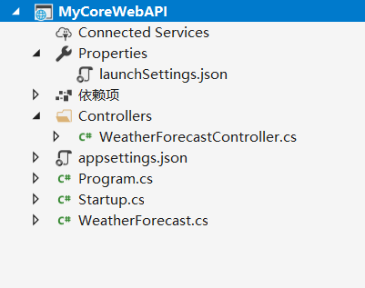
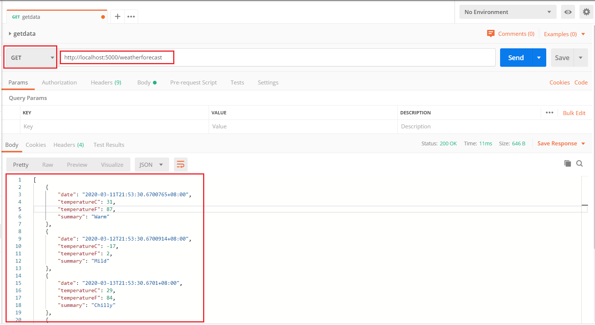
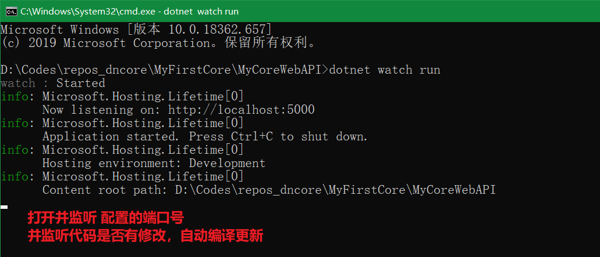
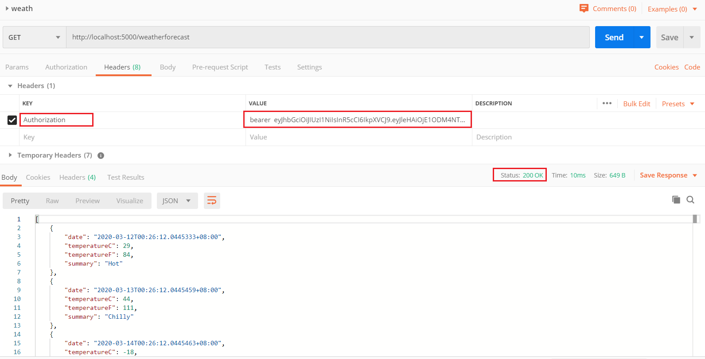
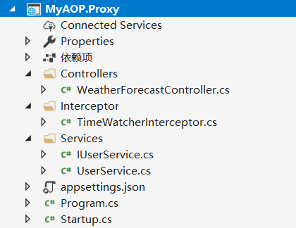
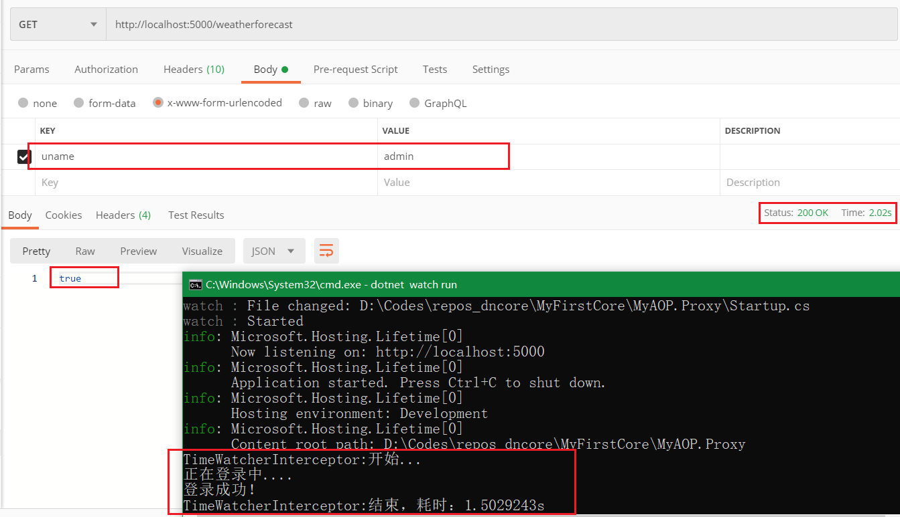

<!-- TOC -->

- [ASP.NET Core WebAPI](#aspnet-core-webapi)
    - [基本配置](#基本配置)
        - [项目初始化修改](#项目初始化修改)
        - [watch_run](#watch_run)
    - [认证与授权](#认证与授权)
        - [认证](#认证)
        - [JWT](#jwt)
        - [JWT组件](#jwt组件)
        - [获取token值](#获取token值)
        - [授权](#授权)
    - [AOP](#aop)
        - [AOP说明](#aop说明)
        - [AOP开源类库](#aop开源类库)
    - [跨域](#跨域)

<!-- /TOC -->

<a id="markdown-aspnet-core-webapi" name="aspnet-core-webapi"></a>
# ASP.NET Core WebAPI

<a id="markdown-基本配置" name="基本配置"></a>
## 基本配置

<a id="markdown-项目初始化修改" name="项目初始化修改"></a>
### 项目初始化修改
新建项目，选择API模板，基于ASP.NET Core3.1的默认模板结构如下图所示：



通常采用控制台方式执行调试，修改项目中【launchSettings.json】配置文件如下：

```js
{
  "$schema": "http://json.schemastore.org/launchsettings.json",
  "profiles": {
    "MyCoreWebAPI": {
      "commandName": "Project",
      "launchBrowser": true,
      "launchUrl": "weatherforecast",
      "applicationUrl": "http://localhost:5000",
      "environmentVariables": {
        "ASPNETCORE_ENVIRONMENT": "Development"
      }
    }
  }
}
```

此时，运行程序会弹出控制台窗口，本机【Kestrel】监听【applicationUrl】配置的端口，并打开浏览器访问


API的调试围绕数据，后续将采用【PostMan】进行测试运行。



<a id="markdown-watch_run" name="watch_run"></a>
### watch_run

dotnet-watch 是 asp.net 项目下的一个工具，用于实时监视项目文件夹中的文件变动，

一旦有文件变动，自动重新编译并运行项目，在调试过程中，你将无需重复：

修改源代码->CTRL+SHIFT+B编译->F5调试->发现问题->修改源代码........

右键当前项目，选择【在文件资源管理器中打开文件夹】，在地址栏输入 `cmd` 进入命令提示符：


命令提示符中输入 `dotnet watch run` 自动监视编译命令，后面修改后端代码也会自动编译，提高效率



<a id="markdown-认证与授权" name="认证与授权"></a>
## 认证与授权

<a id="markdown-认证" name="认证"></a>
### 认证
修改 `WeatherForecastController` 控制器，对 `Get` 接口增加 `[Authorize]`标签

```cs
[HttpGet]
[Authorize] // 新增该标签
public IEnumerable<WeatherForecast> Get()
{
    var rng = new Random();
    return Enumerable.Range(1, 5).Select(index => new WeatherForecast
    {
        Date = DateTime.Now.AddDays(index),
        TemperatureC = rng.Next(-20, 55),
        Summary = Summaries[rng.Next(Summaries.Length)]
    })
    .ToArray();
}
```

通过 `PostMan` 接口测试，返回内容如下：


返回信息提示我们需要添加认证服务，对请求进行身份认证。此处采用JWT令牌认证方式。

<a id="markdown-jwt" name="jwt"></a>
### JWT
`JSON Web Token（JWT）`是目前最流行的跨域身份验证解决方案。

JWT的官网地址：https://jwt.io/

基于token的鉴权机制类似于http协议也是无状态的，它不需要在服务端去保留用户的认证信息或者会话信息。

这就意味着基于token认证机制的应用不需要去考虑用户在哪一台服务器登录了，这就为应用的扩展提供了便利。

流程上是这样的：
1. 用户使用用户名密码来请求服务器
2. 服务器进行验证用户的信息
3. 服务器通过验证发送给用户一个token
4. 客户端存储token，并在每次请求时附送上这个token值
5. 服务端验证token值，并返回数据


<a id="markdown-jwt组件" name="jwt组件"></a>
### JWT组件

通过 `NuGet` 进行安装 `JwtBearer` 组件


修改【Startup】类中注入服务方法 `ConfigureServices` 和配置中间件方法 `Configure` 如下：

```cs
public void ConfigureServices(IServiceCollection services)
{
    services.AddControllers();

    // 加密的秘钥，不能少于16位
    SecurityKey securityKey = new SymmetricSecurityKey(Encoding.ASCII.GetBytes("wangyuanweiwangyuanwei"));

    // 添加认证服务，用于对用户验证，相当于登录拦截
    services.AddAuthentication("Bearer").AddJwtBearer(options =>
    {
        options.TokenValidationParameters = new TokenValidationParameters()
        {
            ValidateIssuerSigningKey = true,
            IssuerSigningKey = securityKey,

            // 是否验证颁发者
            ValidateIssuer = true,
            // 颁发者的名称
            ValidIssuer = "颁发者",

            // 是否验证接收者
            ValidateAudience = true,
            // 接受者名称
            ValidAudience = "接收者",

            // 是否必须具有“过期”值。
            RequireExpirationTime = true,
            // 是否在令牌验证期间验证生存期
            ValidateLifetime = true
        };
    });

}

// This method gets called by the runtime. Use this method to configure the HTTP request pipeline.
public void Configure(IApplicationBuilder app, IWebHostEnvironment env)
{
    if (env.IsDevelopment())
    {
        app.UseDeveloperExceptionPage();
    }

    app.UseRouting();

    // 管道中应用认证中间件
    app.UseAuthentication();

    app.UseAuthorization();

    app.UseEndpoints(endpoints =>
    {
        endpoints.MapControllers();
    });
}
```

此时访问webapi显示为401未授权


<a id="markdown-获取token值" name="获取token值"></a>
### 获取token值
新增控制器 【LoginController】，核心代码如下：

```cs
[Route("[controller]")]
[ApiController]
public class LoginController : ControllerBase
{
    /// <summary>
    /// 获取令牌
    /// </summary>
    /// <returns></returns>
    public string GetToken()
    {
        // 此处秘钥需要和 Startup 中保持一致
        var key = new SymmetricSecurityKey(Encoding.ASCII.GetBytes("wangyuanweiwangyuanwei"));

        SecurityToken securityToken = new JwtSecurityToken(
            issuer: "颁发者",
            audience: "接收者",
            signingCredentials: new SigningCredentials(key, SecurityAlgorithms.HmacSha256),
            expires: DateTime.Now.AddMinutes(20),
            claims: new Claim[] { }
        );

        string jwt = new JwtSecurityTokenHandler().WriteToken(securityToken);
        return jwt;
    }
}
```

【PostMan】中进行测试，返回一个 `token` 值：


这个 token 值可以在官网 `https://jwt.io/` 进行校验：


在【PostMan】中测试 `WeatherForecast` 接口，请求头中附加 `Authorization` 信息【Bearer token】



如上所示，token验证通过。

<a id="markdown-授权" name="授权"></a>
### 授权

前面通过获取 `token` ，我们已经可以认证通过并访问所有接口资源。

但实际业务场景中，经常会有不同角色权限的区分，比如某些接口只允许管理员进行访问。

授权对应的中间件是： `app.UseAuthorization();`

首先，我们针对接口的特性 `Authorize` 增加角色配置，修改【WeatherForecastController】控制器：
```cs
[HttpGet]
[Authorize(Roles = "Admin")]// 角色为Admin用户才有权限访问
public IEnumerable<WeatherForecast> Get()
{
    var rng = new Random();
    return Enumerable.Range(1, 5).Select(index => new WeatherForecast
    {
        Date = DateTime.Now.AddDays(index),
        TemperatureC = rng.Next(-20, 55),
        Summary = Summaries[rng.Next(Summaries.Length)]
    })
    .ToArray();
}
```

此时访问 WeatherForecast 接口，虽然通过了服务器的认证，但未通过该接口的授权


服务端返回的 403 ，并非之前的 401。注意这两个状态码的区分

为了通过 `token` 可以确认当前用户是否可以授权，我们需要在 `token` 中增加更多的 `Claim` 身份信息。

修改【LoginController】中 `GetToken` 方法
```cs
/// <summary>
/// 获取令牌
/// </summary>
/// <returns></returns>
public string GetToken()
{
    // 此处秘钥需要和 Startup 中保持一致
    var key = new SymmetricSecurityKey(Encoding.ASCII.GetBytes("wangyuanweiwangyuanwei"));

    SecurityToken securityToken = new JwtSecurityToken(
        issuer: "颁发者",
        audience: "接收者",
        signingCredentials: new SigningCredentials(key, SecurityAlgorithms.HmacSha256),
        expires: DateTime.Now.AddMinutes(20),
        claims: new Claim[] {
            // 增加身份信息，此处设置角色为 Admin，与标签 [Authorize(Roles = "Admin")] 匹配
            new Claim(ClaimTypes.Role,"Admin")
        }
    );

    string jwt = new JwtSecurityTokenHandler().WriteToken(securityToken);
    return jwt;
}
```

重新获取新的添加有身份信息的 `token` 值，并重新请求前面案例中的 `WeatherForecast` 接口测试。结果略。。。

<a id="markdown-aop" name="aop"></a>
## AOP

<a id="markdown-aop说明" name="aop说明"></a>
### AOP说明
AOP全称 Aspect Oriented Progarmming(面向切面编程)，其实 AOP 对 ASP.NET 程序员来说一点都不神秘，

你也许早就通过Filter来完成一些通用的功能，例如你使用 `Authorization Filter` 来拦截所有的用户请求，

验证 `Http Header` 中是否有合法的token。或者使用 `Exception Filter` 来处理某种特定的异常。

你之所以可以拦截所有的用户请求，能够在期望的时机来执行某些通用的行为，是因为 `ASP.NET Core` 在框架级别预留了一些钩子，

他允许你在特定的时机注入一些行为。对 `ASP.NET Core` 应用程序来说，这个时机就是 HTTP 请求在执行 MVC Action 的中间件时。

显然这个时机并不能满足你的所有求，比如你在 `Repository` 层有一个读取数据库的方法：

```cs
public void GetUser()
{
    //Get user from db
}
```

你试图得到该方法执行的时间，首先想到的方式就是在整个方法外面包一层用来计算时间的代码：

```cs
public void GetUserWithTime()
{
    var stopwatch = Stopwatch.StartNew();
    try
    {
        //Get user from db
    }
    finally
    {
        stopwatch.Stop();
        Trace.WriteLine("Total" + stopwatch.ElapsedMilliseconds + "ms");
    }
}
```

如果仅仅是为了得到这一个方法的执行时间，这种方式可以满足你的需求。

问题在于你有可能还想得到 `DeleteUser` 或者 `UpdateUser` 等方法的执行时间。

修改每一个方法并添加计算时间的代码明显是不合适的。

一个比较优雅的做法是给需要计算时间的方法标记一个Attribute，但只适用于

```cs
[Time]
public void GetUser()
{
    //Get user from db
}
```

把计算时间这个功能当做一个切面(Aspect)注入到了现有的逻辑中，这是一个AOP的典型应用。

<a id="markdown-aop开源类库" name="aop开源类库"></a>
### AOP开源类库
C#中可以用来做AOP的类库有很多，我们以使用率较高的 【Castle.Core】举例说明：

通过 NuGet 程序包管理添加【Castle.Core】组件，并添加 `Service` 和 `Interceptor` 拦截器文件夹，项目结构如下：



创建 `IUserService` 和 `UserService` 模拟具体的业务操作，相当于 `Repository` 层：

```cs
public interface IUserService
{
    bool Login(string uid, string pwd);
    bool Delete(string uid);
}
```

```cs
public class UserService : IUserService
{
    public bool Delete(string uid)
    {
        Console.WriteLine("正在删除中....");
        Thread.Sleep(1000);// 模拟业务耗时操作
        Console.WriteLine("已成功删除！");
        return true;
    }

    public bool Login(string uid, string pwd)
    {
        Console.WriteLine("正在登录中....");
        Thread.Sleep(1500);// 模拟业务耗时操作
        bool success = uid.Equals("admin");
        if (success)
        {
            Console.WriteLine("登录成功！");
        }
        else
        {
            Console.WriteLine("登录成功！");
        }
        return success;
    }
}
```

增加拦截器（代理） `TimeWatcherInterceptor` 类：
```cs
public class TimeWatcherInterceptor : Castle.DynamicProxy.IInterceptor
{
    public void Intercept(IInvocation invocation)
    {
        Stopwatch stopwatch = Stopwatch.StartNew();
        Console.WriteLine($"TimeWatcherInterceptor:开始...");
        stopwatch.Start();

        invocation.Proceed();

        stopwatch.Stop();
        Console.WriteLine($"TimeWatcherInterceptor:结束，耗时：{stopwatch.Elapsed.TotalSeconds}s");
    }
}
```

我们需要在 `Startup` 中进行注入，并且设置接口的实现以及针对接口实现的代理：
```cs
public void ConfigureServices(IServiceCollection services)
{
    services.AddControllers();

    services.AddScoped<UserService>();
    services.AddScoped<TimeWatcherInterceptor>();

    services.AddScoped(provider =>
    {
        var generator = new ProxyGenerator();
        // 服务实例，实际业务操作
        var target = provider.GetService<UserService>();
        // 拦截器(代理)的实例化
        var interceptor = provider.GetService<TimeWatcherInterceptor>();

        // 根据 接口创建对应服务的代理
        return generator.CreateInterfaceProxyWithTarget<IUserService>(target, interceptor);
    });
}
```

在 `WeatherForecastController` 控制器中即可通过构造的注入获取到服务实例，并进行模拟业务操作：

```cs
[ApiController]
[Route("[controller]")]
public class WeatherForecastController : ControllerBase
{
    private readonly IUserService _userService;

    public WeatherForecastController(IUserService userService)
    {
        _userService = userService;
    }

    [HttpGet]
    public bool Get()
    {
        return _userService.Login(HttpContext.Request.Form["uname"], "");
    }
}
```

可以观察到，对于原先的业务接口 `IUserService` 和业务实现 `UserService` 没有任何侵入性

通过拦截（代理）的方式，实现了运行时间的统计，其余的切面操作也是类似。



多个服务可以采用批量注入的方式，todo。。。。


<a id="markdown-跨域" name="跨域"></a>
## 跨域
如果两个 Url 具有相同的方案、主机和端口（RFC 6454），则它们具有相同的源。

对于不同源的请求，通常都会报错，如下：

```
Access to XMLHttpRequest at 'http://localhost:5000/xxxxx' from origin 'null' has been blocked by CORS policy: 
No 'Access-Control-Allow-Origin' header is present on the requested resource.
```

WebAPI 通常都需要进行跨域处理，CORS 中间件处理跨域请求。

修改【Startup】类中 `ConfigureServices` 方法，注入跨域配置：

```cs
public void ConfigureServices(IServiceCollection services)
{
    services.AddControllers();

    // 注入跨域设置
    services.AddCors(opt =>
    {
        // 增加全局跨域规则，global_cors 是规则名称，UseCors需要使用到
        opt.AddPolicy("global_cors", cor =>
        {
            // 允许所有来源的 CORS 请求和任何方案（http 或 https）
            cor.AllowAnyOrigin();
        });
    });
}
```

修改 Configure 方法，启用注入的跨域配置：

```cs
public void Configure(IApplicationBuilder app, IWebHostEnvironment env)
{
    if (env.IsDevelopment())
    {
        app.UseDeveloperExceptionPage();
    }

    // 按照规则名称应用跨域规则
    app.UseCors("global_cors");

    app.UseRouting();

    app.UseAuthorization();

    app.UseEndpoints(endpoints =>
    {
        endpoints.MapControllers();
    });
}
```

按照以上配置即可启用全局的允许所有来源的跨域请求。


---

参考引用：

[什么是Security token? 什么是Claim?](https://www.cnblogs.com/awpatp/archive/2012/07/09/2582402.html)

[.NET Core中实现AOP编程](https://www.cnblogs.com/xiandnc/p/10088159.html)


