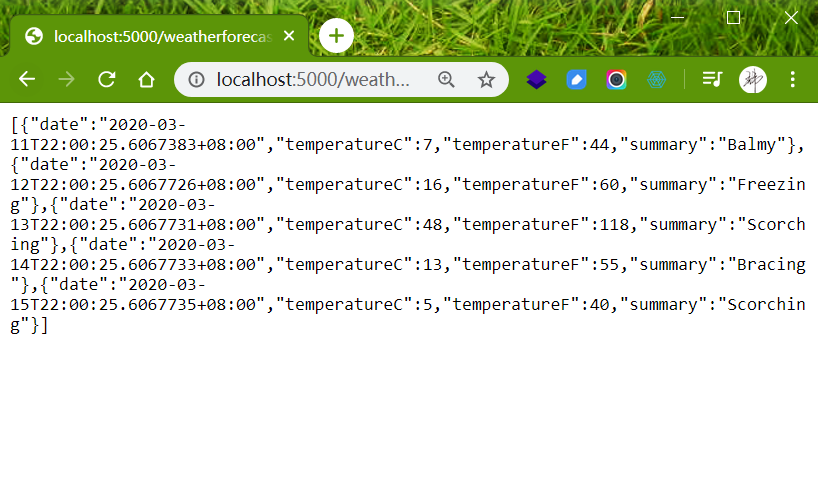
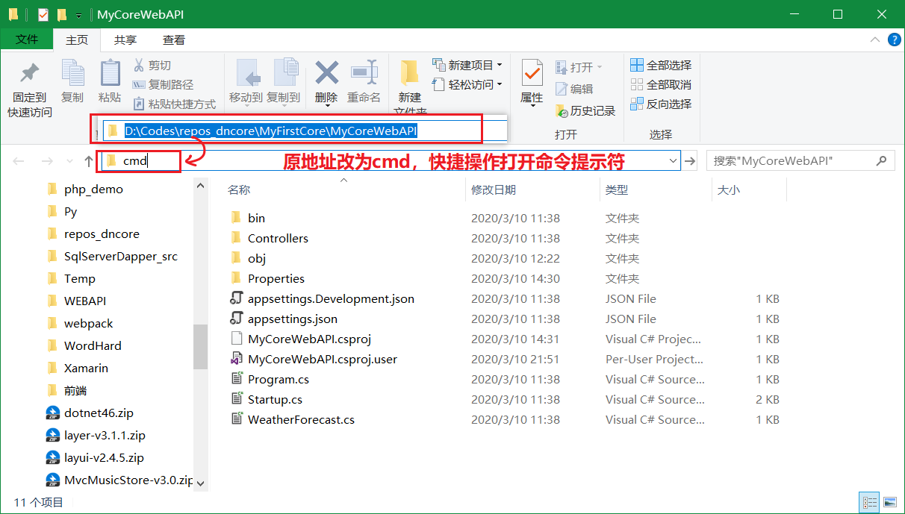
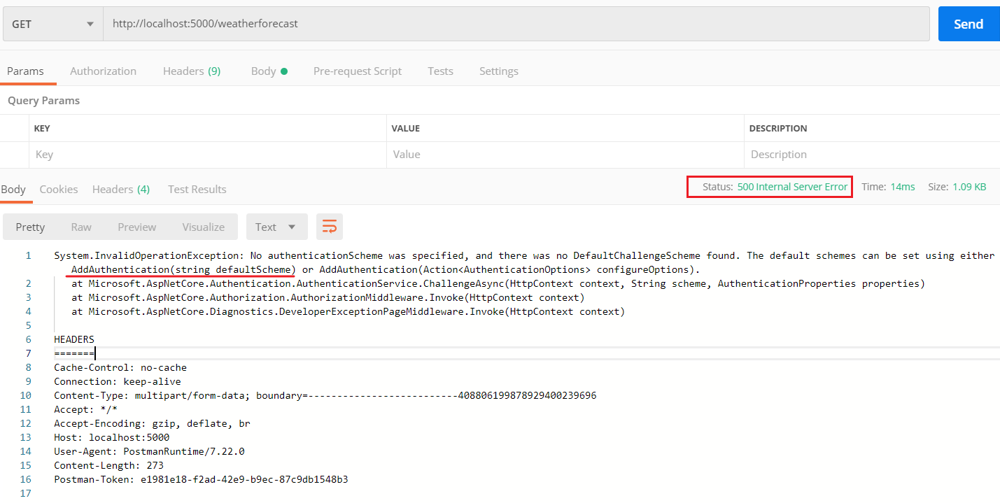
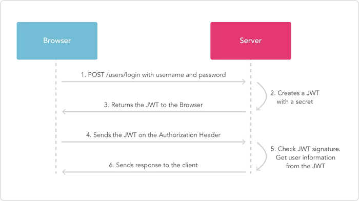
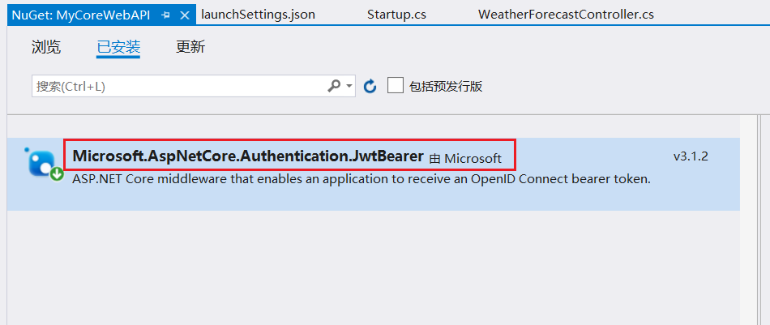
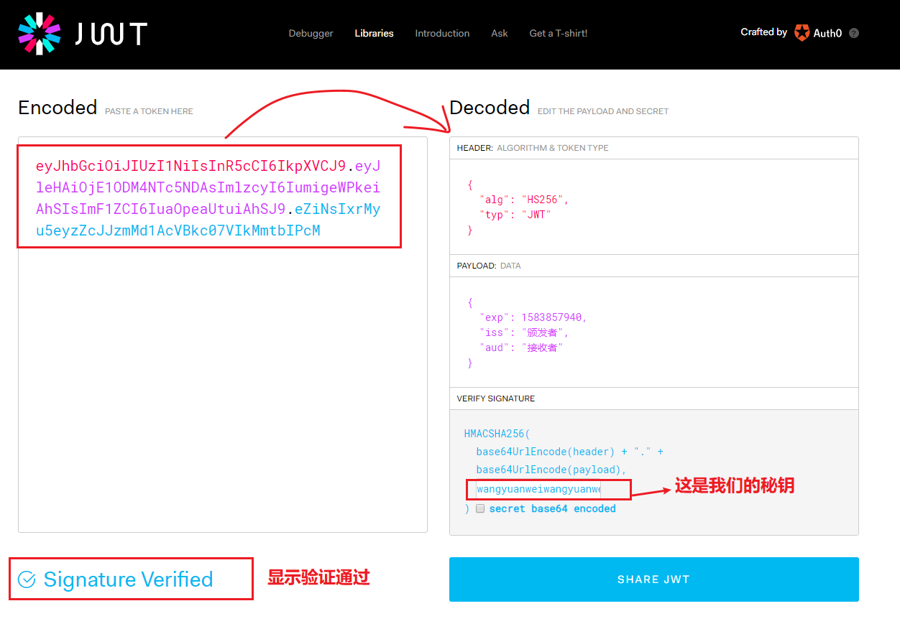

<!-- TOC -->

- [ASP.NET Core WebAPI](#aspnet-core-webapi)
    - [基本配置](#基本配置)
        - [项目初始化修改](#项目初始化修改)
        - [watch_run](#watch_run)
    - [认证与授权](#认证与授权)
        - [认证](#认证)
        - [JWT](#jwt)
        - [JWT组件](#jwt组件)
        - [获取token值](#获取token值)
        - [授权](#授权)

<!-- /TOC -->

<a id="markdown-aspnet-core-webapi" name="aspnet-core-webapi"></a>
# ASP.NET Core WebAPI

<a id="markdown-基本配置" name="基本配置"></a>
## 基本配置

<a id="markdown-项目初始化修改" name="项目初始化修改"></a>
### 项目初始化修改
新建项目，选择API模板，基于ASP.NET Core3.1的默认模板结构如下图所示：


通常采用控制台方式执行调试，修改项目中【launchSettings.json】配置文件如下：

```js
{
  "$schema": "http://json.schemastore.org/launchsettings.json",
  "profiles": {
    "MyCoreWebAPI": {
      "commandName": "Project",
      "launchBrowser": true,
      "launchUrl": "weatherforecast",
      "applicationUrl": "http://localhost:5000",
      "environmentVariables": {
        "ASPNETCORE_ENVIRONMENT": "Development"
      }
    }
  }
}
```

此时，运行程序会弹出控制台窗口，本机【Kestrel】监听【applicationUrl】配置的端口，并打开浏览器访问



API的调试围绕数据，后续将采用【PostMan】进行测试运行。


<a id="markdown-watch_run" name="watch_run"></a>
### watch_run

dotnet-watch 是 asp.net 项目下的一个工具，用于实时监视项目文件夹中的文件变动，

一旦有文件变动，自动重新编译并运行项目，在调试过程中，你将无需重复：

修改源代码->CTRL+SHIFT+B编译->F5调试->发现问题->修改源代码........

右键当前项目，选择【在文件资源管理器中打开文件夹】，在地址栏输入 `cmd` 进入命令提示符：



命令提示符中输入 `dotnet watch run` 自动监视编译命令，后面修改后端代码也会自动编译，提高效率


<a id="markdown-认证与授权" name="认证与授权"></a>
## 认证与授权

<a id="markdown-认证" name="认证"></a>
### 认证
修改 `WeatherForecastController` 控制器，对 `Get` 接口增加 `[Authorize]`标签

```cs
[HttpGet]
[Authorize] // 新增该标签
public IEnumerable<WeatherForecast> Get()
{
    var rng = new Random();
    return Enumerable.Range(1, 5).Select(index => new WeatherForecast
    {
        Date = DateTime.Now.AddDays(index),
        TemperatureC = rng.Next(-20, 55),
        Summary = Summaries[rng.Next(Summaries.Length)]
    })
    .ToArray();
}
```

通过 `PostMan` 接口测试，返回内容如下：



返回信息提示我们需要添加认证服务，对请求进行身份认证。此处采用JWT令牌认证方式。

<a id="markdown-jwt" name="jwt"></a>
### JWT
`JSON Web Token（JWT）`是目前最流行的跨域身份验证解决方案。

JWT的官网地址：https://jwt.io/

基于token的鉴权机制类似于http协议也是无状态的，它不需要在服务端去保留用户的认证信息或者会话信息。

这就意味着基于token认证机制的应用不需要去考虑用户在哪一台服务器登录了，这就为应用的扩展提供了便利。

流程上是这样的：
1. 用户使用用户名密码来请求服务器
2. 服务器进行验证用户的信息
3. 服务器通过验证发送给用户一个token
4. 客户端存储token，并在每次请求时附送上这个token值
5. 服务端验证token值，并返回数据



<a id="markdown-jwt组件" name="jwt组件"></a>
### JWT组件

通过 `NuGet` 进行安装 `JwtBearer` 组件




修改【Startup】类中注入服务方法 `ConfigureServices` 和配置中间件方法 `Configure` 如下：

```cs
public void ConfigureServices(IServiceCollection services)
{
    services.AddControllers();

    // 加密的秘钥，不能少于16位
    SecurityKey securityKey = new SymmetricSecurityKey(Encoding.ASCII.GetBytes("wangyuanweiwangyuanwei"));

    // 添加认证服务，用于对用户验证，相当于登录拦截
    services.AddAuthentication("Bearer").AddJwtBearer(options =>
    {
        options.TokenValidationParameters = new TokenValidationParameters()
        {
            ValidateIssuerSigningKey = true,
            IssuerSigningKey = securityKey,

            // 是否验证颁发者
            ValidateIssuer = true,
            // 颁发者的名称
            ValidIssuer = "颁发者",

            // 是否验证接收者
            ValidateAudience = true,
            // 接受者名称
            ValidAudience = "接收者",

            // 是否必须具有“过期”值。
            RequireExpirationTime = true,
            // 是否在令牌验证期间验证生存期
            ValidateLifetime = true
        };
    });

}

// This method gets called by the runtime. Use this method to configure the HTTP request pipeline.
public void Configure(IApplicationBuilder app, IWebHostEnvironment env)
{
    if (env.IsDevelopment())
    {
        app.UseDeveloperExceptionPage();
    }

    app.UseRouting();

    // 管道中应用认证中间件
    app.UseAuthentication();

    app.UseAuthorization();

    app.UseEndpoints(endpoints =>
    {
        endpoints.MapControllers();
    });
}
```

此时访问webapi显示为401未授权


<a id="markdown-获取token值" name="获取token值"></a>
### 获取token值
新增控制器 【LoginController】，核心代码如下：

```cs
[Route("[controller]")]
[ApiController]
public class LoginController : ControllerBase
{
    /// <summary>
    /// 获取令牌
    /// </summary>
    /// <returns></returns>
    public string GetToken()
    {
        // 此处秘钥需要和 Startup 中保持一致
        var key = new SymmetricSecurityKey(Encoding.ASCII.GetBytes("wangyuanweiwangyuanwei"));

        SecurityToken securityToken = new JwtSecurityToken(
            issuer: "颁发者",
            audience: "接收者",
            signingCredentials: new SigningCredentials(key, SecurityAlgorithms.HmacSha256),
            expires: DateTime.Now.AddMinutes(20),
            claims: new Claim[] { }
        );

        string jwt = new JwtSecurityTokenHandler().WriteToken(securityToken);
        return jwt;
    }
}
```

【PostMan】中进行测试，返回一个 `token` 值：


这个 token 值可以在官网 `https://jwt.io/` 进行校验：



在【PostMan】中测试 `WeatherForecast` 接口，请求头中附加 `Authorization` 信息【Bearer token】


如上所示，token验证通过。

<a id="markdown-授权" name="授权"></a>
### 授权

前面通过获取 `token` ，我们已经可以认证通过并访问所有接口资源。

但实际业务场景中，经常会有不同角色权限的区分，比如某些接口只允许管理员进行访问。

授权对应的中间件是： `app.UseAuthorization();`

首先，我们针对接口的特性 `Authorize` 增加角色配置，修改【WeatherForecastController】控制器：
```cs
[HttpGet]
[Authorize(Roles = "Admin")]// 角色为Admin用户才有权限访问
public IEnumerable<WeatherForecast> Get()
{
    var rng = new Random();
    return Enumerable.Range(1, 5).Select(index => new WeatherForecast
    {
        Date = DateTime.Now.AddDays(index),
        TemperatureC = rng.Next(-20, 55),
        Summary = Summaries[rng.Next(Summaries.Length)]
    })
    .ToArray();
}
```

此时访问 WeatherForecast 接口，虽然通过了服务器的认证，但未通过该接口的授权


服务端返回的 403 ，并非之前的 401。注意这两个状态码的区分

为了通过 `token` 可以确认当前用户是否可以授权，我们需要在 `token` 中增加更多的 `Claim` 身份信息。

修改【LoginController】中 `GetToken` 方法
```cs
/// <summary>
/// 获取令牌
/// </summary>
/// <returns></returns>
public string GetToken()
{
    // 此处秘钥需要和 Startup 中保持一致
    var key = new SymmetricSecurityKey(Encoding.ASCII.GetBytes("wangyuanweiwangyuanwei"));

    SecurityToken securityToken = new JwtSecurityToken(
        issuer: "颁发者",
        audience: "接收者",
        signingCredentials: new SigningCredentials(key, SecurityAlgorithms.HmacSha256),
        expires: DateTime.Now.AddMinutes(20),
        claims: new Claim[] {
            // 增加身份信息，此处设置角色为 Admin，与标签 [Authorize(Roles = "Admin")] 匹配
            new Claim(ClaimTypes.Role,"Admin")
        }
    );

    string jwt = new JwtSecurityTokenHandler().WriteToken(securityToken);
    return jwt;
}
```

重新获取新的添加有身份信息的 `token` 值，并重新请求前面案例中的 `WeatherForecast` 接口测试。结果略。。。


---

参考引用：

[什么是Security token? 什么是Claim?](https://www.cnblogs.com/awpatp/archive/2012/07/09/2582402.html)


