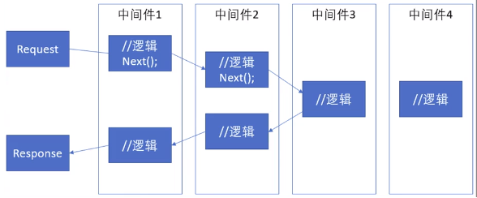
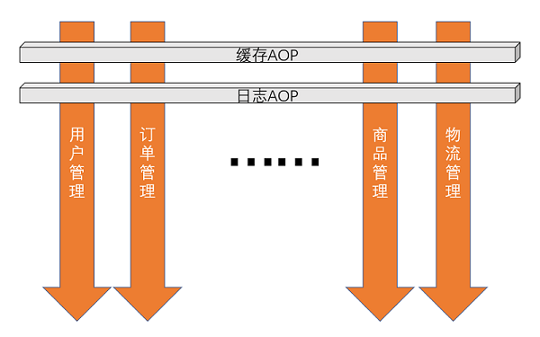
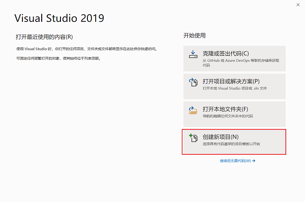
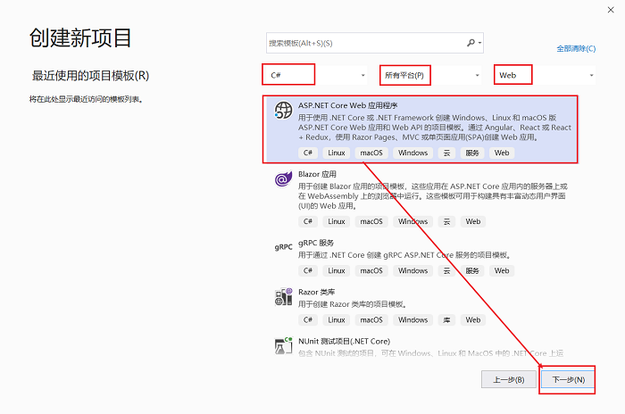
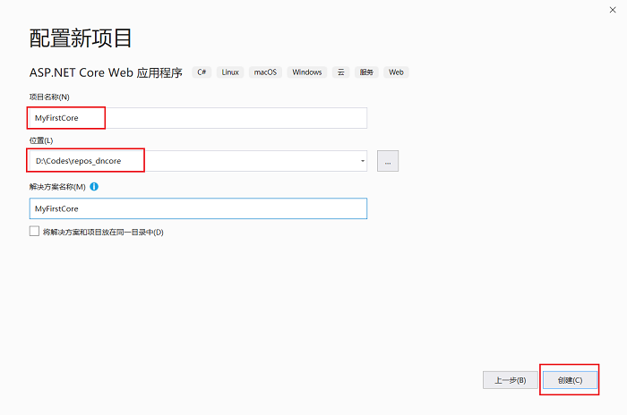
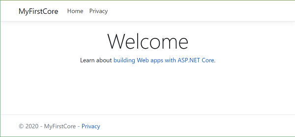

<!-- TOC -->

- [ASP.NET Core MVC](#aspnet-core-mvc)
    - [概述](#概述)
        - [执行过程](#执行过程)
        - [中间件执行过程：](#中间件执行过程)
        - [AOP 切面](#aop-切面)
    - [创建MVC项目](#创建mvc项目)
        - [创建步骤](#创建步骤)
        - [Program](#program)
        - [Startup](#startup)
        - [路由](#路由)
        - [模型绑定](#模型绑定)
        - [模型验证](#模型验证)
        - [依赖关系注入](#依赖关系注入)
        - [筛选器](#筛选器)
        - [Areas](#areas)
        - [Web API](#web-api)
        - [可测试性](#可测试性)
        - [Razor视图引擎](#razor视图引擎)
        - [强类型视图](#强类型视图)
        - [标记帮助程序](#标记帮助程序)
        - [视图组件](#视图组件)

<!-- /TOC -->

<a id="markdown-aspnet-core-mvc" name="aspnet-core-mvc"></a>
# ASP.NET Core MVC

<a id="markdown-概述" name="概述"></a>
## 概述
ASP.NET Core MVC 框架是轻量级、开源、高度可测试的演示框架，并针对 ASP.NET Core 进行了优化。

ASP.NET Core MVC 提供一种基于模式的方式，用于生成可彻底分开管理事务的动态网站。 

<a id="markdown-执行过程" name="执行过程"></a>
### 执行过程


<a id="markdown-中间件执行过程" name="中间件执行过程"></a>
### 中间件执行过程：

启动的时候先执行该中间件类的构造函数，然后一路 Next() ；下去，返回的时候，正好是反向的，执行的是该类的逻辑部分：



<a id="markdown-aop-切面" name="aop-切面"></a>
### AOP 切面




<a id="markdown-创建mvc项目" name="创建mvc项目"></a>
## 创建MVC项目

<a id="markdown-创建步骤" name="创建步骤"></a>
### 创建步骤

选择【创建新项目】



选择对应模板



配置名称和路径信息



选择框架版本并对项目进行配置：


执行应用程序，浏览器中查看如下所示：



<a id="markdown-program" name="program"></a>
### Program

类似于控制台应用程序中的入口方法，web应用程序中【Program.cs】为入口起点

```cs
public class Program
{
    public static void Main(string[] args)
    {
        CreateHostBuilder(args).Build().Run();
    }

    public static IHostBuilder CreateHostBuilder(string[] args) =>
        Host.CreateDefaultBuilder(args)
            .ConfigureWebHostDefaults(webBuilder =>
            {
                // 程序启动时会调用 Startup 类
                webBuilder.UseStartup<Startup>();
            });
}
```

Main方法里面的内容主要是用来配置和运行程序的.

因为我们的web程序需要一个宿主, 所以 BuildWebHost 这个方法就创建了一个 WebHostBuilder. 

我们还需要 Web Server. 

ASP.NET Core 自带了两种 http servers, 一个是 WebListener, 它只能用于windows系统, 另一个是kestrel, 它是跨平台的.

上述【Program.cs】类中 CreateHostBuilder 方法的lambda写法相当于下面的写法：
```cs
public static IHostBuilder CreateHostBuilder(string[] args)
{
    var builder = Host.CreateDefaultBuilder(args)
        .ConfigureWebHostDefaults(web =>
        {
            web.UseStartup<Startup>();
        });
    return builder;
}
```

<a id="markdown-startup" name="startup"></a>
### Startup

其实Startup算是程序真正的切入点.

Startup 类的 执行顺序：`构造 -> ConfigureServices->Configure`

```cs
public class Startup
{
    public Startup(IConfiguration configuration)
    {
        Configuration = configuration;
    }

    public IConfiguration Configuration { get; }

    // This method gets called by the runtime. Use this method to add services to the container.
    public void ConfigureServices(IServiceCollection services)
    {
        services.AddRazorPages();
    }

    // This method gets called by the runtime. Use this method to configure the HTTP request pipeline.
    public void Configure(IApplicationBuilder app, IWebHostEnvironment env)
    {
        if (env.IsDevelopment())
        {
            app.UseDeveloperExceptionPage();
        }
        else
        {
            app.UseExceptionHandler("/Error");
        }

        app.UseStaticFiles();

        app.UseRouting();

        app.UseAuthorization();

        app.UseEndpoints(endpoints =>
        {
            endpoints.MapRazorPages();
        });
    }
}
```

**ConfigureServices**

对于需要大量设置的功能，IServiceCollection 上有 Add{Service} 扩展方法。 

例如，AddControllersWithViews、AddDefaultIdentity、AddEntityFrameworkStores 和 AddRazorPages：

**Configure 方法**


<a id="markdown-路由" name="路由"></a>
### 路由


<a id="markdown-模型绑定" name="模型绑定"></a>
### 模型绑定


<a id="markdown-模型验证" name="模型验证"></a>
### 模型验证


<a id="markdown-依赖关系注入" name="依赖关系注入"></a>
### 依赖关系注入


<a id="markdown-筛选器" name="筛选器"></a>
### 筛选器


<a id="markdown-areas" name="areas"></a>
### Areas


<a id="markdown-web-api" name="web-api"></a>
### Web API


<a id="markdown-可测试性" name="可测试性"></a>
### 可测试性


<a id="markdown-razor视图引擎" name="razor视图引擎"></a>
### Razor视图引擎


<a id="markdown-强类型视图" name="强类型视图"></a>
### 强类型视图


<a id="markdown-标记帮助程序" name="标记帮助程序"></a>
### 标记帮助程序


<a id="markdown-视图组件" name="视图组件"></a>
### 视图组件

---

参考引用：

[](https://docs.microsoft.com/zh-cn/aspnet/core/fundamentals/startup?view=aspnetcore-3.1)