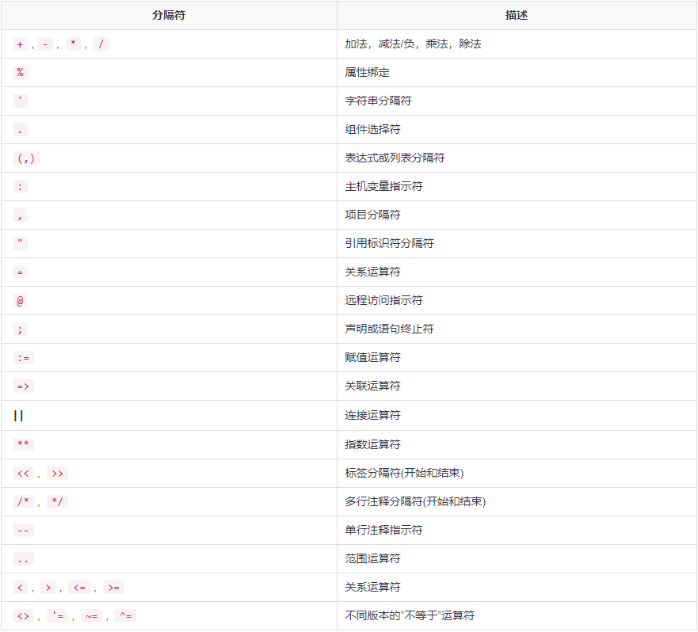

<!-- TOC -->

- [PL/SQL](#plsql)
    - [基本语法](#基本语法)
        - [结构](#结构)
        - [标识符](#标识符)

<!-- /TOC -->

<a id="markdown-plsql" name="plsql"></a>
# PL/SQL
PL/SQL编程语言由Oracle公司在20世纪80年代末由SQL和Oracle关系数据库的程序扩展语言开发。
* PL/SQL是一种完全可移植的，高性能的事务处理语言。
* PL/SQL提供了一个内置的，解释的和独立于操作系统的编程环境。
* 可以从命令行SQL * Plus界面直接调用PL/SQL。
* 直接调用也可以从外部编程语言调用到数据库中的对象(函数或过程等)。
* PL/SQL通用语法基于ADA和Pascal编程语言。
* 除Oracle之外，PL/SQL还可用于TimesTen内存数据库和IBM DB2。

<a id="markdown-基本语法" name="基本语法"></a>
## 基本语法
<a id="markdown-结构" name="结构"></a>
### 结构
PL/SQL是块结构语言; 这意味着PL/SQL程序被划分成几个部分，并在每个部分中写入逻辑代码块

每个块由三个子部分组成：
1. 声明部分 - 此部分是以关键字DECLARE开头。这是一个可选部分，并定义了程序中要使用的所有变量，游标，子程序和其他元素。
2. 可执行命令部分 - 此部分包含在关键字BEGIN和END之间，这是一个强制性部分。它由程序的可执行PL/SQL语句组成。它应该有至少一个可执行代码行，它可以只是一个NULL命令，表示不执行任何操作。
3. 异常处理部分 - 此部分以关键字EXCEPTION开头。这是一个可选部分，它包含处理程序中错误的异常。

每个PL/SQL语句以分号(;)结尾。 使用BEGIN和END可以将PL/SQL块嵌套在其他PL/SQL块中。 以下是PL/SQL块的基本结构 -
```plsql
DECLARE 
   <declarations section> 
BEGIN 
   <executable command(s)>
EXCEPTION 
   <exception handling> 
END;
```

Hello World示例
```plsql
DECLARE
  V_MSG VARCHAR2(32) := 'hello world';
BEGIN
  DBMS_OUTPUT.PUT_LINE(V_MSG);
END; -- 此处分号不可省略
```

<a id="markdown-标识符" name="标识符"></a>
### 标识符
PL/SQL标识符是常量，变量，异常，过程，游标和保留字。

标识符包括一个字母，可选地后跟多个字母，数字，美元符号，下划线和数字符号，不得超过30个字符。

默认情况下，标识符不区分大小写。例如，可以使用integer或INTEGER来表示一个数值。 

分隔符是具有特殊含义的符号。以下是PL/SQL中的分隔符列表 -



---

参考引用：

[PL/SQL教程](http://www.oraok.com/plsql/)

