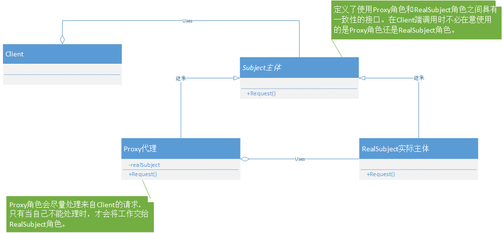
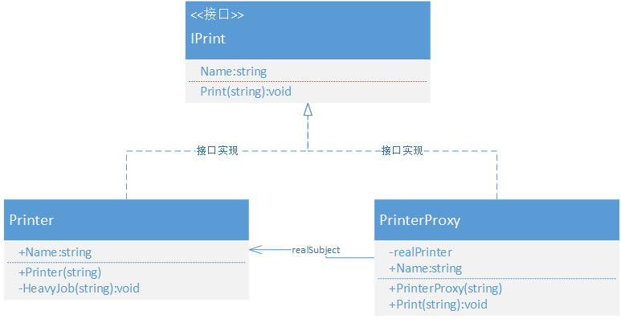
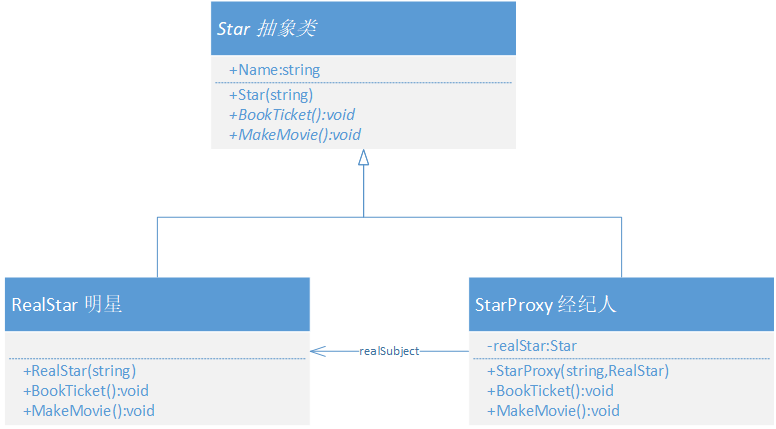
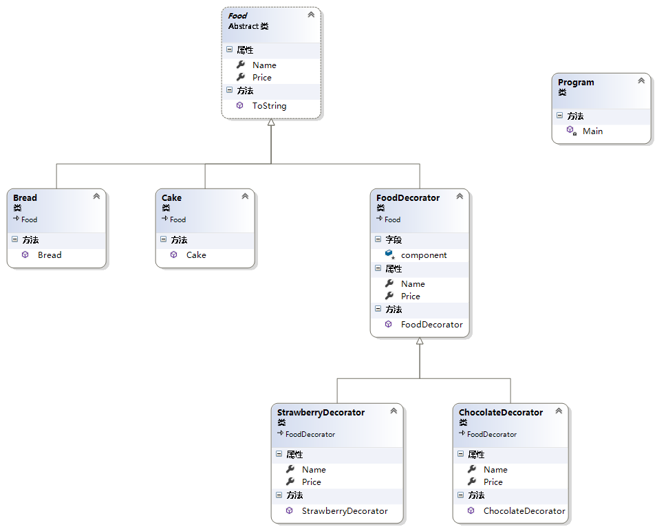
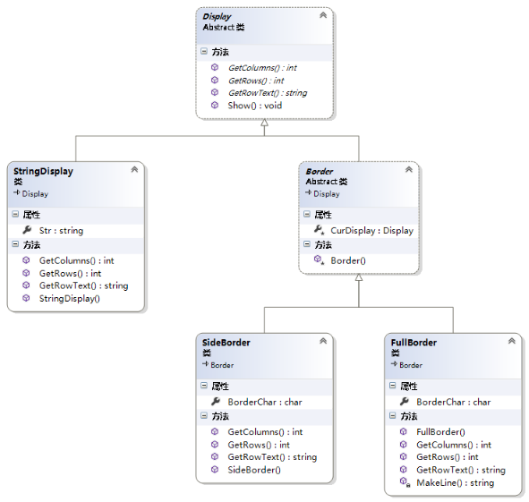
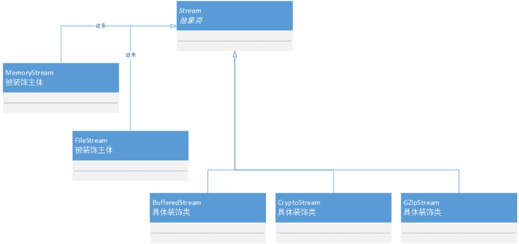

<!-- TOC -->

- [结构型设计模式](#结构型设计模式)
    - [Proxy代理模式-只在必要时生成实例](#proxy代理模式-只在必要时生成实例)
        - [静态代理](#静态代理)
        - [总结](#总结)
    - [Decorator装饰模式-装饰边框与被装饰物的一致性](#decorator装饰模式-装饰边框与被装饰物的一致性)
        - [.NET中装饰者模式的实现](#net中装饰者模式的实现)
        - [接口API的透明性](#接口api的透明性)
        - [总结](#总结-1)
    - [Adapter适配器模式-加个适配器以便复用](#adapter适配器模式-加个适配器以便复用)

<!-- /TOC -->
<a id="markdown-结构型设计模式" name="结构型设计模式"></a>
# 结构型设计模式

<a id="markdown-proxy代理模式-只在必要时生成实例" name="proxy代理模式-只在必要时生成实例"></a>
## Proxy代理模式-只在必要时生成实例
代理模式：为其他对象提供一种代理以便控制对这个对象的访问。

在面向对象系统中，有些对象由于某种原因（比如对象创建的开销很大，或者某些操作需要安全控制，或者需要进程外的访问等），直接访问会给使用者、或者系统结构带来很多麻烦。

如何在不失去透明操作对象的同时来管理/控制这些对象特有的复杂性？增加一层间接层是软件开发中常见的解决方式。

可以详细控制访问某个类(对象)的方法，在调用这个方法前作的前置处理(统一的流程代码放到代理中处理)。调用这个方法后做后置处理。

例如：明星的经纪人，租房的中介等等都是代理。

代理模式分类：

1. 静态代理(静态定义代理类，我们自己静态定义的代理类。比如我们自己定义一个明星的经纪人类)

2. 动态代理(通过程序动态生成代理类，该代理类不是我们自己定义的。而是由程序自动生成)

<a id="markdown-静态代理" name="静态代理"></a>
### 静态代理
Proxy有很多种变化形式，常用的有以下类型：

- Virtual Proxy(虚拟代理)

虚拟代理，是根据需要创建开销很大的对象，通过它来存放实例化需要很长时间的真实对象，使得对象只在需要时才会被真正创建。

例如《图解设计模式》中打印的示例，就是一个虚拟代理的应用。打印机类的实例化需要花费很多时间，所以使用代理进行初始化，需要打印时再进行实例化打印机。

- Remote Proxy(远程代理)

远程代理，也就是为了一个对象在不同的地址空间提供局部代表。这样可以隐藏一个对象存在于不同地址空间的事实。

这个不同的地址空间可以是本电脑中，也可以在另一台电脑中。最典型的例子就是——客户端调用Web服务或WCF服务。

- Access Proxy(安全代理)

安全代理，用来控制真实对象的访问时的权限。可以给不同的用户提供不同级别的使用权限。

- Smart Reference(智能引用代理)

当一个对象被引用时，提供一些额外的操作，比如将对此对象调用的次数记录下来等。

**静态代理模式一般会有三个角色：**

Subject抽象角色：指代理角色(经纪人)和真实角色(明星)对外提供的公共方法，一般为一个接口

RealSubject真实角色：需要实现抽象角色接口，定义了真实角色所要实现的业务逻辑，以便供代理角色调用。也就是真正的业务逻辑在此。

Proxy代理角色：需要实现抽象角色接口，是真实角色的代理，通过真实角色的业务逻辑方法来实现抽象方法，并可以附加自己的操作。

对应类图如下图所示：



《图解设计模式》中的打印示例属于VirtualProxy(虚拟代理)，打印机的开机预热相对而言是一个较慢的过程，也就是打印机类实例化对象的过程很慢。

可以通过虚拟代理的方式将实例化对象需要的等待时间转移到调用打印方法上，在构造时无需等待实例化的过程，只需要在首次打印时进行等待。



实现代码如下：
```cs
/// <summary>
/// 打印接口-Subject主体接口或抽象类
/// </summary>
interface IPrint
{
    string Name { get; set; }
    void Print(string content);
}

/// <summary>
/// 打印机类-主体
/// </summary>
class Printer : IPrint
{
    public string Name { get; set; }
    /// <summary>
    /// 预热，耗时操作
    /// </summary>
    public void HeavyJob()
    {
        Console.Write($"{Name}的打印机正在加载中");
        for (int i = 0; i < 10; i++)
        {
            Thread.Sleep(500);
            Console.Write(".");
        }
        Console.WriteLine("加载完成!!!");
    }

    public Printer(string name)
    {
        Name = name;
        HeavyJob();
    }

    public void Print(string content)
    {
        Console.WriteLine($"==={Name}打印机===");
        Console.WriteLine(content);
    }
}

/// <summary>
/// 代理类
/// </summary>
class PrintProxy : IPrint
{
    Printer realSubject;
    public string Name
    {
        get;
        set;
    }

    public PrintProxy(string name)
    {
        Name = name;
    }

    public void Print(string content)
    {
        if (null == realSubject)
        {
            realSubject = new Printer(Name);
        }
    }
}

class Program
{
    public static void Main()
    {
        // 实例化时非常耗时
        IPrint p1 = new Printer("jack");
        Console.WriteLine("其他业务操作......");
        p1.Print("在你的心上，自由的飞翔");

        // 通过代理方式解决实例化时的耗时操作
        IPrint p2 = new PrintProxy("tom");
        Console.WriteLine("其他业务操作......");
        p2.Print("是谁在敲打我窗");

    }
}
```

以明星与经纪人的代理关系作为示例



静态实现如下：
```cs
class Program
{
    public static void Main()
    {
        Star wangbaoqiang = new RealStar("王宝强");
        Star agent = new StarProxy("经纪人", wangbaoqiang);
        agent.BookTicket();
        agent.MakeMovie();
    }
}

/// <summary>
/// 艺人抽象类
/// </summary>
public abstract class Star
{
    /// <summary>
    /// 姓名
    /// </summary>
    public string Name { get; set; }
    public Star(string name)
    {
        Name = name;
    }
    /// <summary>
    /// 订票，可以由经纪人代理
    /// </summary>
    public abstract void BookTicket();
    /// <summary>
    /// 拍电影，不能由经纪人代理
    /// </summary>
    public abstract void MakeMovie();
}

/// <summary>
/// 真实明星
/// </summary>
public class RealStar : Star
{
    public RealStar(string name) : base(name) { }
    public override void BookTicket()
    {
        Console.WriteLine($"{Name}买票");
    }

    public override void MakeMovie()
    {
        Console.WriteLine($"{Name}电影《hello，Mr.Tree》");
    }
}

/// <summary>
/// 明星代理
/// </summary>
public class StarProxy : Star
{
    Star realStar;
    public StarProxy(string name, Star real) : base(name)
    {
        realStar = real;
    }
    public override void BookTicket()
    {
        Console.WriteLine($"{Name}买票");
    }

    public override void MakeMovie()
    {
        Console.WriteLine($"{Name}不会演戏。。。");
        realStar.MakeMovie();
    }
}
```

<a id="markdown-总结" name="总结"></a>
### 总结
优点：

1. 代理模式能够将调用用于真正被调用的对象隔离，在一定程度上降低了系统的耦合度；
2. 代理对象在客户端和目标对象之间起到一个中介的作用，这样可以起到对目标对象的保护。代理对象可以在对目标对象发出请求之前进行一个额外的操作，例如权限检查等。

缺点：

1. 由于在客户端和真实主题之间增加了一个代理对象，所以会造成请求的处理速度变慢。
2. 实现代理类也需要额外的工作，从而增加了系统的实现复杂度。

<a id="markdown-decorator装饰模式-装饰边框与被装饰物的一致性" name="decorator装饰模式-装饰边框与被装饰物的一致性"></a>
## Decorator装饰模式-装饰边框与被装饰物的一致性
装饰器模式(Decorator Pattern)允许向一个现有的对象添加新的功能，同时又不改变其结构。这种类型的设计模式属于结构型模式，它是作为现有的类的一个包装。

**意图**：动态地给一个对象添加一些额外的职责。就增加功能来说，装饰器模式相比生成子类更为灵活。

**主要解决**：一般的，我们为了扩展一个类经常使用继承方式实现，由于继承为类引入静态特征，并且随着扩展功能的增多，子类会很膨胀。

**何时使用**：在不想增加很多子类的情况下扩展类。

**关键代码**： 1、Component 类充当抽象角色，不应该具体实现。 2、修饰类引用和继承 Component 类，具体扩展类重写父类方法。


针对上图中的基本实现代码如下：
```cs
class Program
{
    static void Main(string[] args)
    {
        // 被装饰物，具体对象
        Component c1 = new ConcreteComponent();
        
        // 装饰器A
        DecoratorA d1 = new DecoratorA(c1);
        // 装饰器B
        DecoratorB d2 = new DecoratorB(d1);

        c1.Operation();

        d1.Operation();

        d2.Operation();
    }
}

/// <summary>
/// 核心角色，定义抽象类
/// </summary>
public abstract class Component
{
    /// <summary>
    /// 定义抽象方法
    /// 规范 被装饰物和装饰器
    /// </summary>
    public abstract void Operation();
}

/// <summary>
/// 具体组件，被装饰物
/// </summary>
public class ConcreteComponent : Component
{
    public override void Operation()
    {
        Console.WriteLine("【Subject】");
    }
}

/// <summary>
/// 装饰父类，相对抽象组件新增了保护成员
/// </summary>
public class Decorator : Component
{
    protected Component component;
    /// <summary>
    /// 自定义构造函数覆盖component组件
    /// 装饰器实际会调用父类中的组件
    /// </summary>
    /// <param name="comp"></param>
    public Decorator(Component comp)
    {
        component = comp;
    }
    public override void Operation()
    {
        component.Operation();
    }
}

/// <summary>
/// 装饰器A
/// </summary>
public class DecoratorA : Decorator
{
    public DecoratorA(Component comp) : base(comp) { }
    public override void Operation()
    {
        Console.WriteLine("DecoratorA start");
        base.Operation();
        Console.WriteLine("DecoratorA end");
    }
}

/// <summary>
/// 装饰器B
/// </summary>
public class DecoratorB : Decorator
{
    public DecoratorB(Component comp) : base(comp) { }
    public override void Operation()
    {
        Console.WriteLine("DecoratorB start");
        base.Operation();
        Console.WriteLine("DecoratorB end");
    }
}
```

利用SetComponent对对象进行包装，这样每个装饰对象的实现就和如何使用对象分离，每个装饰对象只关心自己的功能，不需要关心如何被添加到对象链中。

上面的案例可能较为抽象，以生活中面包和蛋糕为例，假设存在多种口味，并需要支持客户自定义进行搭配，如不使用装饰模式，很难做到灵活的自由搭配。

定义抽象类【Food】，派生出【Cake】蛋糕和【Bread】面包类，并派生出【FoodDecorator】食品装饰器父类

在【FoodDecorator】基础上再派生出对应的不同口味装饰，类图如下所示：



```cs
class Program
{
    static void Main(string[] args)
    {
        // 构造默认蛋糕
        Food food1 = new Cake();
        Console.WriteLine(food1);

        // 巧克力装饰，装饰默认蛋糕
        ChocolateDecorator cakeChocolate = new ChocolateDecorator(food1);
        Console.WriteLine(cakeChocolate);

        // 草莓装饰，针对前一步结果进行装饰
        StrawberryDecorator cakeStraw = new StrawberryDecorator(cakeChocolate);
        Console.WriteLine(cakeStraw);

        // 构造默认面包
        Food food2 = new Bread();
        // 草莓装饰，装饰面包
        StrawberryDecorator breadStraw = new StrawberryDecorator(food2);
        ChocolateDecorator breadChocolate = new ChocolateDecorator(breadStraw);
        Console.WriteLine(breadChocolate);
    }
}

public abstract class Food
{
    /// <summary>
    /// 食品价格，虚属性
    /// </summary>
    public virtual double Price { get; set; }
    /// <summary>
    /// 食品名称，虚属性
    /// </summary>
    public virtual string Name { get; set; }
    /// <summary>
    /// 重写ToString方法，方便打印消息使用
    /// </summary>
    /// <returns></returns>
    public override string ToString()
    {
        return string.Format($"美食：【{Name}】，价格：【{Price}】");
    }
}

public class Cake : Food
{
    public Cake()
    {
        Name = "蛋糕";
        Price = 50;
    }
}

public class Bread : Food
{
    public Bread()
    {
        Name = "面包";
        Price = 5;
    }
}

/// <summary>
/// 食品装饰父类，同样由抽象Food类派生
/// </summary>
public class FoodDecorator : Food
{
    /// <summary>
    /// 保护成员，被装饰对象
    /// </summary>
    protected Food component;
    /// <summary>
    /// 被装饰对象赋值给保护成员component
    /// 以便后续属性重写时调用
    /// </summary>
    /// <param name="food"></param>
    public FoodDecorator(Food food)
    {
        component = food;
    }
    /// <summary>
    /// 重写属性，核心步骤
    /// 实际调用为被装饰物的属性或方法
    /// </summary>
    public override string Name
    {
        get
        {
            return component.Name;
        }
    }
    /// <summary>
    /// 重写属性，核心步骤
    /// 实际调用为被装饰物的属性或方法
    /// </summary>
    public override double Price
    {
        get
        {
            return component.Price;
        }
    }
}

/// <summary>
/// 巧克力口味
/// </summary>
public class ChocolateDecorator : FoodDecorator
{
    public ChocolateDecorator(Food food) : base(food) { }
    public override string Name
    {
        get
        {
            return "巧克力 " + base.Name;
        }
    }
    public override double Price
    {
        get
        {
            return base.Price + 5;
        }
    }
}

/// <summary>
/// 草莓口味
/// </summary>
public class StrawberryDecorator : FoodDecorator
{
    public StrawberryDecorator(Food food) : base(food) { }
    public override string Name
    {
        get
        {
            return "草莓味 " + base.Name;
        }
    }
    public override double Price
    {
        get
        {
            return base.Price + 2;
        }
    }
}
```

《图解设计模式》中关于Decorator的示例如下：



```cs
class Program
{
    static void Main(string[] args)
    {
        Display d1 = new StringDisplay("hello world");
        Display d2 = new FullBorder(d1, '~');
        d2.Show();
    }
}

/// <summary>
/// 显示多行字符串抽象类
/// </summary>
public abstract class Display
{
    /// <summary>
    /// 获取横向字符数
    /// </summary>
    /// <returns></returns>
    public abstract int GetColumns();
    /// <summary>
    /// 获取纵向行数
    /// </summary>
    /// <returns></returns>
    public abstract int GetRows();
    /// <summary>
    /// 获取第index行的字符串
    /// </summary>
    /// <param name="index"></param>
    /// <returns></returns>
    public abstract string GetRowText(int index);
    /// <summary>
    /// 全部显示
    /// </summary>
    public void Show()
    {
        for (int i = 0; i < GetRows(); i++)
        {
            Console.WriteLine(GetRowText(i));
        }
    }
}

/// <summary>
/// 用于显示单行字符串类
/// </summary>
public class StringDisplay : Display
{
    public string Str { get; set; }
    public StringDisplay(string str)
    {
        Str = str;
    }
    public override int GetColumns()
    {
        return Str.Length;
    }

    public override int GetRows()
    {
        //行数为固定的1
        return 1;
    }

    public override string GetRowText(int index)
    {
        //仅有一行，仅当index为0时返回字符串
        if (index == 0)
        {
            return Str;
        }
        else
        {
            return null;
        }
    }
}

/// <summary>
/// 装饰边框抽象类
/// 装饰边框和被装饰物Display有相同的方法
/// </summary>
public abstract class Border : Display
{
    /// <summary>
    /// 被装饰物
    /// </summary>
    protected Display CurDisplay { get; set; }
    protected Border(Display display)
    {
        CurDisplay = display;
    }
}

/// <summary>
/// 左右两侧装饰
/// </summary>
public class SideBorder : Border
{
    /// <summary>
    /// 装饰边框的字符
    /// </summary>
    public char BorderChar { get; set; }
    /// <summary>
    /// 通过构造函数指定display和装饰边框字符
    /// </summary>
    /// <param name="display"></param>
    /// <param name="ch"></param>
    public SideBorder(Display display, char ch) : base(display)
    {
        BorderChar = ch;
    }
    /// <summary>
    /// 字符串长度加上左右边框的长度
    /// </summary>
    /// <returns></returns>
    public override int GetColumns()
    {
        return 1 + CurDisplay.GetColumns() + 1;
    }

    /// <summary>
    /// 左右编程，行数仍保持不变
    /// </summary>
    /// <returns></returns>
    public override int GetRows()
    {
        return CurDisplay.GetRows();
    }

    /// <summary>
    /// 显示时在左右两侧拼接装饰边框
    /// </summary>
    /// <param name="index"></param>
    /// <returns></returns>
    public override string GetRowText(int index)
    {
        return BorderChar + CurDisplay.GetRowText(index) + BorderChar;
    }
}

/// <summary>
/// 全边框装饰
/// </summary>
public class FullBorder : Border
{
    public char BorderChar { get; set; }
    public FullBorder(Display display, char ch) : base(display)
    {
        BorderChar = ch;
    }
    public override int GetColumns()
    {
        return 1 + CurDisplay.GetColumns() + 1;
    }

    public override int GetRows()
    {
        return 1 + CurDisplay.GetRows() + 1;
    }

    public override string GetRowText(int index)
    {
        if (index == 0)//上边框
        {
            return BorderChar + MakeLine(CurDisplay.GetColumns()) + BorderChar;
        }
        else if (index == CurDisplay.GetRows() + 1)
        {
            return BorderChar + MakeLine(CurDisplay.GetColumns()) + BorderChar;
        }
        else
        {
            return BorderChar + CurDisplay.GetRowText(index - 1) + BorderChar;
        }
    }

    private string MakeLine(int length)
    {
        StringBuilder builder = new StringBuilder();
        for (int i = 0; i < length; i++)
        {
            builder.Append(BorderChar);
        }
        return builder.ToString();
    }
}
```

http://blog.csdn.net/qiaoquan3/article/details/78203502

<a id="markdown-net中装饰者模式的实现" name="net中装饰者模式的实现"></a>
### .NET中装饰者模式的实现
在.NET 类库中也有装饰者模式的实现，该类就是System.IO.Stream,下面看看Stream类结构：



```cs
// MemoryStream是内存流,为系统内存提供读写操作。被装饰
MemoryStream memoryStream = new MemoryStream(new byte[] { 95, 96, 97, 98, 99 });

// 添加扩展缓冲的功能
BufferedStream buffStream = new BufferedStream(memoryStream);

// 添加加密的功能
CryptoStream cryptoStream = new CryptoStream(buffStream, new AesManaged().CreateEncryptor(), CryptoStreamMode.Write);

// 添加压缩功能
GZipStream gzipStream = new GZipStream(cryptoStream, CompressionMode.Compress, true);
```


<a id="markdown-接口api的透明性" name="接口api的透明性"></a>
### 接口API的透明性
在Decorator模式中，装饰器和被装饰物具有一致性，也就是装饰类和被装饰类具有相同的接口。如此形成一个对象链，类似于递归结构，就像是剥洋葱一样，以为洋葱心要出来了，结果发现还是一层皮。

<a id="markdown-总结-1" name="总结-1"></a>
### 总结
**优点：**

1. 装饰这模式和继承的目的都是扩展对象的功能，但装饰者模式比继承更灵活
2. 通过使用不同的具体装饰类以及这些类的排列组合，设计师可以创造出很多不同行为的组合
3. 装饰者模式有很好地可扩展性

**缺点：**

装饰者模式会导致设计中出现许多小对象，如果过度使用，会让程序变的更复杂。并且更多的对象会是的差错变得困难，特别是这些对象看上去都很像。

装饰者模式采用对象组合而非继承的方式实现了再运行时动态地扩展对象功能的能力，而且可以根据需要扩展多个功能，避免了单独使用继承带来的 ”灵活性差“和”多子类衍生问题“。同时它很好地符合面向对象设计原则中 ”优先使用对象组合而非继承“和”开放-封闭“原则。


<a id="markdown-adapter适配器模式-加个适配器以便复用" name="adapter适配器模式-加个适配器以便复用"></a>
## Adapter适配器模式-加个适配器以便复用

```cs
/// <summary>
/// 客户端，客户想要把2个孔的插头 转变成三个孔的插头，这个转变交给适配器就好
/// 既然适配器需要完成这个功能，所以它必须同时具体2个孔插头和三个孔插头的特征
/// </summary>
class Client
{
    static void Main(string[] args)
    {
        // 现在客户端可以通过电适配要使用2个孔的插头了
        IThreeHole threehole = new PowerAdapter();
        threehole.Request();
        Console.ReadLine();
    }
}

/// <summary>
/// 三个孔的插头，也就是适配器模式中的目标角色
/// </summary>
public interface IThreeHole
{
    void Request();
}

/// <summary>
/// 两个孔的插头，源角色——需要适配的类
/// </summary>
public abstract class TwoHole
{
    public void SpecificRequest()
    {
        Console.WriteLine("我是两个孔的插头");
    }
}

/// <summary>
/// 适配器类，接口要放在类的后面
/// 适配器类提供了三个孔插头的行为，但其本质是调用两个孔插头的方法
/// </summary>
public class PowerAdapter:TwoHole,IThreeHole
{
    /// <summary>
    /// 实现三个孔插头接口方法
    /// </summary>
    public void Request()
    {
        // 调用两个孔插头方法
        this.SpecificRequest();
    }
}
```

---

参考引用：

[C#设计模式总结](http://www.cnblogs.com/zhili/p/DesignPatternSummery.html)

[C#设计模式之十二代理模式（Proxy Pattern）](https://www.cnblogs.com/PatrickLiu/p/7814004.html)
