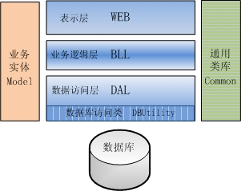
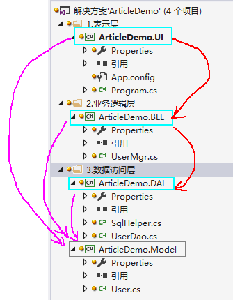

<!-- TOC -->

- [三层架构](#三层架构)
    - [简单三层架构](#简单三层架构)
    - [优缺点](#优缺点)
        - [优点](#优点)
        - [缺点](#缺点)
    - [实体层Entity](#实体层entity)

<!-- /TOC -->

# 三层架构

## 简单三层架构
三层架构(3-tier architecture) 通常意义上的三层架构就是将整个业务应用划分为：

* 界面层（User Interface layer）
* 业务逻辑层（Business Logic Layer）
* 数据访问层（Data access layer）

区分层次的目的即为了“**高内聚低耦合**”的思想。在软件体系架构设计中，分层式结构是最常见，也是最重要的一种结构。

微软推荐的分层式结构一般分为三层，从下至上分别为：数据访问层、业务逻辑层（又或称为领域层）、表示层。

- 表示层：主要表示WEB方式，也可以表示成WINFORM方式，WEB方式也可以表现成：aspx，如果逻辑层相当强大和完善，无论表现层如何定义和更改，逻辑层都能完善地提供服务。
- 业务逻辑层：主要是针对具体的问题的操作，也可以理解成对数据层的操作，对数据业务逻辑处理，如果说数据层是积木，那逻辑层就是对这些积木的搭建。
- 数据访问层：主要是对非原始数据（数据库或者文本文件等存放数据的形式）的操作层，而不是指原始数据，也就是说，是对数据库的操作，而不是数据，具体为业务逻辑层或表示层提供数据服务。

## 优缺点

### 优点

1. 开发人员可以只关注整个结构中的其中某一层；
2. 可以很容易的用新的实现来替换原有层次的实现；
3. 可以降低层与层之间的依赖；
4. 有利于标准化；
5. 利于各层逻辑的复用。
6. 结构更加的明确
7. 在后期维护的时候，极大地降低了维护成本和维护时间

### 缺点

1. 降低了系统的性能。这是不言而喻的。如果不采用分层式结构，很多业务可以直接造访数据库，以此获取相应的数据，如今却必须通过中间层来完成。
2. 有时会导致级联的修改。这种修改尤其体现在自上而下的方向。如果在表示层中需要增加一个功能，为保证其设计符合分层式结构，可能需要在相应的业务逻辑层和数据访问层中都增加相应的代码。
3. 增加了开发成本。

## 实体层Entity

Entity(实体层)：它不属于三层中的任何一层，但是三层每一层都与他关联。

一开始的误区：最初的理解是有多少个表，就最少有多少个实体类，每个实体类的属性为表的字段。

实体类并不是规定死的，按照需求进行定义，符合面向对象设计，利于功能的实现和维护即可。
