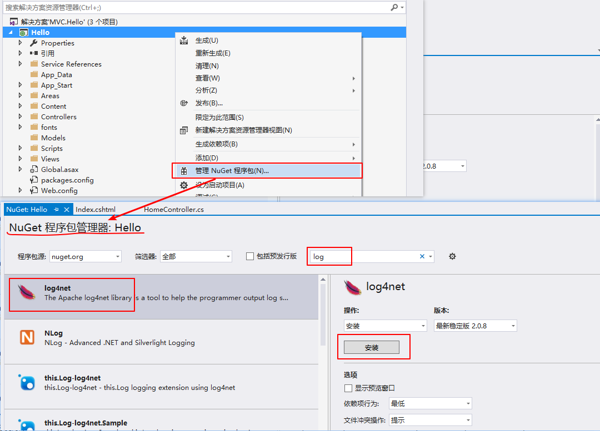
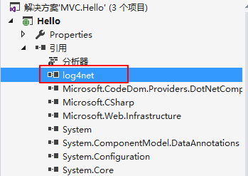

<!-- TOC -->

- [Log4Net](#log4net)
    - [安装](#安装)
    - [组成](#组成)
    - [配置使用](#配置使用)
        - [简单示例](#简单示例)
        - [多个Appender使用](#多个appender使用)

<!-- /TOC -->
<a id="markdown-log4net" name="log4net"></a>
# Log4Net
日志记录往往是软件开发周期中的重要组成部分。

它具有以下几个优点：
* 它可以提供应用程序运行时的精确环境，可供开发人员尽快找到应用程序中的Bug；
* 一旦在程序中加入了Log 输出代码，程序运行过程中就能生成并输出日志信息而无需人工干预。
* 另外，日志信息可以输出到不同的地方（控制台，文件等）以备以后研究之用。

github开源：https://github.com/apache/logging-log4net

<a id="markdown-安装" name="安装"></a>
## 安装
可以通过以下方式获取它：
1. 官网：http://logging.apache.org/log4net/
2. Visual Studio IDE中的NuGet包管理器

在项目上右键选择【管理NuGet程序包...】，添加Log4Net扩展



安装后会自动添加项目引用log4net，如图：



【packages.config】文件中也自动添加log4net对应版本的引用：

```config
  <package id="log4net" version="2.0.8" targetFramework="net45" />
```

以上，就是通过NuGet方式添加Log4Net引用。除此，还可以通过在官网上下载dll手动添加引用的方式进行使用。

<a id="markdown-组成" name="组成"></a>
## 组成
1. Logger：用于记录日志是输出方式和日志的输出级别。log4net支持输出的日志媒介主要有数据库、控制台、文件、邮件等。log4net支持多级别的日志，依次为FATAL>ERROR>WARN>INFO>DEBUG。

2. Appenders：描述日志的输出方式，常见的有AdoNetAppender、ConsoleAppender、FileAppender、SmtpAppender等。

3. Filters：过滤器，可以按照不同的标准（比如级别）控制日志的输出。

4. Layouts：定义日志输出的显示格式，比如："%timestamp [%thread] %-5level %logger - %message%newline"

5. Object Renders：通过它，log4net将按照用户定义的标准输出日志消息。

<a id="markdown-配置使用" name="配置使用"></a>
## 配置使用

<a id="markdown-简单示例" name="简单示例"></a>
### 简单示例
log4net框架会在相对于AppDomain.CurrentDomain.BaseDirectory 属性定义的目录路径下查找配置文件，在配置文件里要查找的唯一标识是<log4net>标签。

我们也可以自定义log4net配置单独文件存放，创建log4net帮助类：
```cs
/// <summary>
/// log4net实例获取
/// 单例模式的应用
/// </summary>
public class Log4Helper
{
    /// <summary>
    /// lock对象
    /// </summary>
    private static object lockLog = new object();

    /// <summary>
    ///  日志记录器
    /// </summary>
    private static ILog _log = null;

    /// <summary>
    /// 日志记录接口
    /// </summary>
    public static ILog Log
    {
        get
        {
            if (_log == null)
            {
                // 初始化配置，从当前项目下读取log4net.config配置文件
                string configFile = AppDomain.CurrentDomain.BaseDirectory + "log4net.config";
                log4net.Config.XmlConfigurator.Configure(new FileInfo(configFile));

                lock (lockLog)
                {
                    _log = LogManager.GetLogger("WebLogger");
                }
            }
            return _log;
        }
    }
}
```

一个基本的【log4net.config】配置如下：
```xml
<?xml version="1.0" encoding="utf-8"?>
<configuration>
  <!--log4net配置文件-->
  <log4net>
    <!-- 级别Level： NONE, FATAL, ERROR, WARN, INFO, DEBUG, ALL -->
    <!-- Print only messages of level DEBUG or above in the packages -->
    <!--预定义了一个具体日志对象的设置，可以设置多个。通过调用LogManager.GetLogger("xxx")方法，你可以检索具有该名字的日志。-->
    <logger name="WebLogger">
      <!--记录日志级别-->
      <level value="DEBUG"/>
      <!--记录到什么介质中-->
      <appender-ref ref="InfoFileAppender"/>
    </logger>

    <!--文本方式记录日志 -->
    <appender name="InfoFileAppender" type="log4net.Appender.RollingFileAppender" >
      <!-- 最小锁定模型 允许多个进程可以写入同一个文件 -->
      <lockingModel type="log4net.Appender.FileAppender+MinimalLock" />
      <!-- 输出到什么目录-->
      <param name="File" value="Logs\" />
      <!-- 是否覆写到文件中-->
      <param name="AppendToFile" value="true" />
      <!--创建方式，此处是日期，即每天创建一个日志文件 -->
      <param name="RollingStyle" value="Date" />
      <!-- 日志文件名，单引号包含字符串 拼接日期格式【yyyy-MM-dd】-->
      <param name="DatePattern" value="'log_'yyyy-MM-dd'.log'" />
      <!--是否静态文件名，即名称是否都是一样的-->
      <param name="StaticLogFileName" value="false" />
      <!--设置编码，否则中文可能会乱码-->
      <encoding value="utf-8" />
      <!--布局-->
      <layout type="log4net.Layout.PatternLayout">
        <!--ConversionPattern 日志文件格式-->
        <param name="ConversionPattern" value="%d %-5p %F - %m%n" />
      </layout>
    </appender>
  </log4net>
</configuration>

```

应用：
```cs
//即可进行写日志操作
Log4Helper.Log.Debug("日志测试");
```

<a id="markdown-多个appender使用" name="多个appender使用"></a>
### 多个Appender使用
将异常和消息显示分开写日志，还可以控制日志文件为html格式，方便查阅：

【log4net.config】配置文件：
```config
<?xml version="1.0" encoding="utf-8"?>
<configuration>
  <configSections>
    <section name="log4net" type="log4net.Config.Log4NetConfigurationSectionHandler,log4net-net-4.0" />
  </configSections>

  <log4net>
    <!-- 错误日志类-->
    <logger name="logerror">
      <level value="ALL" />
      <appender-ref ref="ErrorAppender" />
    </logger>
    <!-- 信息日志类 -->
    <logger name="loginfo">
      <level value="ALL" />
      <appender-ref ref="InfoAppender" />
    </logger>
    <!-- 错误日志附加介质-->
    <appender name="ErrorAppender" type="log4net.Appender.RollingFileAppender">
      <param name="File" value="Logs\\LogError\\" />
      <param name="AppendToFile" value="true" />
      <param name="StaticLogFileName" value="false" />
      <param name="DatePattern" value="yyyyMMdd&quot;.html&quot;" />
      <param name="RollingStyle" value="Date" />
      <!--布局-->
      <layout type="log4net.Layout.PatternLayout">
        <param name="ConversionPattern" value="&lt;HR COLOR=red&gt;%n【异常时间】：%d [%t] &lt;BR&gt;%n【异常级别】：%-5p &lt;BR&gt;%n【异 常 类】：%c [%x] &lt;BR&gt;%n%m &lt;BR&gt;%n &lt;HR Size=1&gt;"  />
      </layout>
    </appender>
    <!-- 信息日志附加介质-->
    <appender name="InfoAppender" type="log4net.Appender.RollingFileAppender">
      <param name="File" value="Logs\\LogInfo\\" />
      <param name="AppendToFile" value="false" />
      <param name="StaticLogFileName" value="false" />
      <param name="DatePattern" value="yyyyMMdd&quot;.html&quot;" />
      <param name="RollingStyle" value="Date" />
      <!-- 信息日志布局-->
      <layout type="log4net.Layout.PatternLayout">
        <param name="ConversionPattern" value="&lt;HR COLOR=blue&gt;%n日志时间：%d [%t] &lt;BR&gt;%n日志级别：%-5p &lt;BR&gt;%n日 志 类：%c [%x] &lt;BR&gt;%n%m &lt;BR&gt;%n &lt;HR Size=1&gt;"  />
      </layout>
    </appender>
  </log4net>
</configuration>
```

【Log4Helper.cs】封装类：
```cs
    public class Log4Helper
    {
        /// <summary>
        /// 静态构造函数
        /// </summary>
        static Log4Helper()
        {
            // 初始化配置，从当前项目下读取log4net.config配置文件
            string configFile = AppDomain.CurrentDomain.BaseDirectory + "log4net.config";
            XmlConfigurator.Configure(new FileInfo(configFile));
        }

        public static ILog InfoLog
        {
            get
            {
                return LogManager.GetLogger("loginfo");
            }
        }

        public static ILog ErrorLog
        {
            get
            {
                return LogManager.GetLogger("logerror");
            }
        }
    }
```

调用很简单，如下：
```cs
Log4Helper.InfoLog.Info("过程消息：xxxxxx" + name);
Log4Helper.ErrorLog.Info("发生异常：。。。。。" + name);
```

结合ASP.NET MVC，统一记录异常信息，新增自定义【BaseController】类
```cs
public abstract class BaseController : Controller
{
    protected override void OnException(ExceptionContext filterContext)
    {
        base.OnException(filterContext);
        Log4Helper.ErrorLog.Error(filterContext.Exception);
    }
}

public class XXXController : BaseController
{
    public ActionResult Index()
    {
        // 发生异常进入 OnException ，父类中重写记录日志
        return View();
    }
}
```

更多配置参考：http://logging.apache.org/log4net/release/config-examples.html

参考引用：

[Log4Net使用指南](http://www.cnblogs.com/dragon/archive/2005/03/24/124254.html)

[在C#代码中应用Log4Net系列教程(附源代码)](http://www.cnblogs.com/kissazi2/p/3393595.html)

