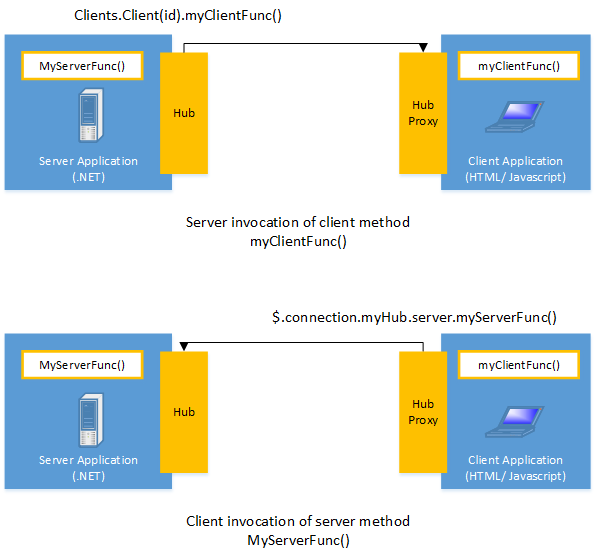
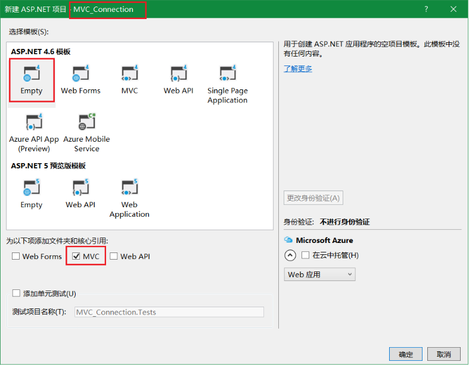
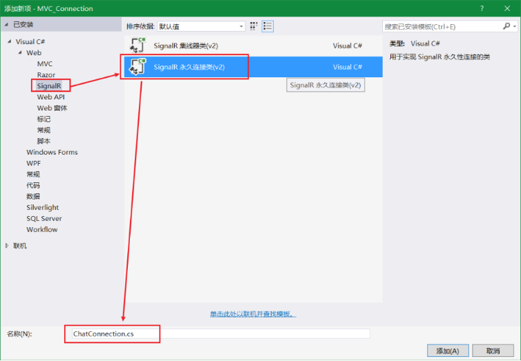
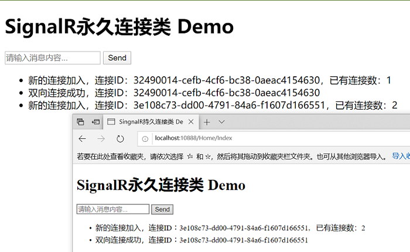
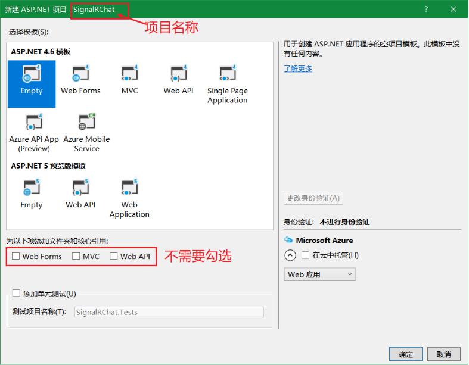
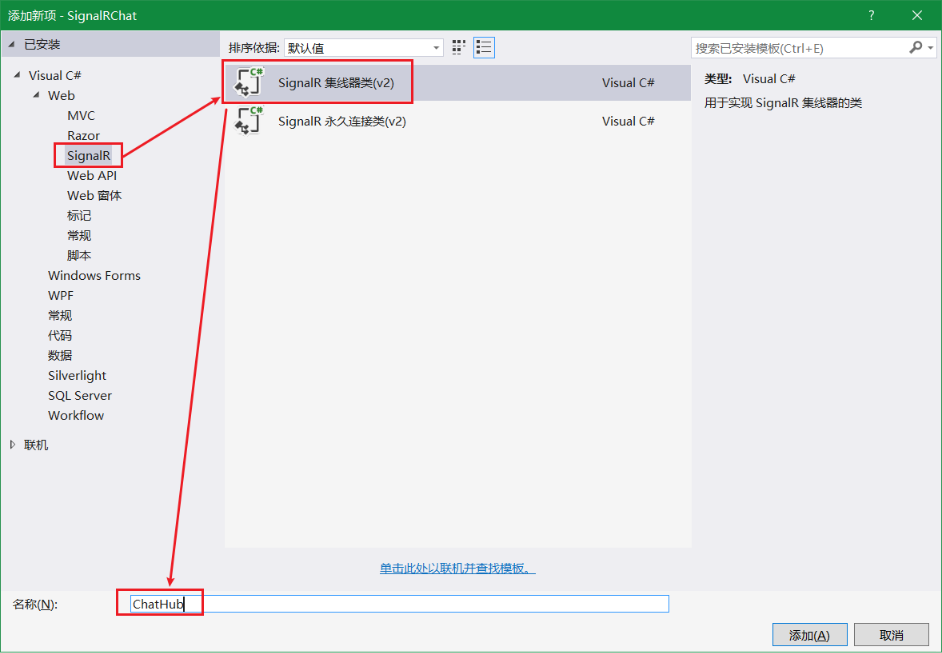
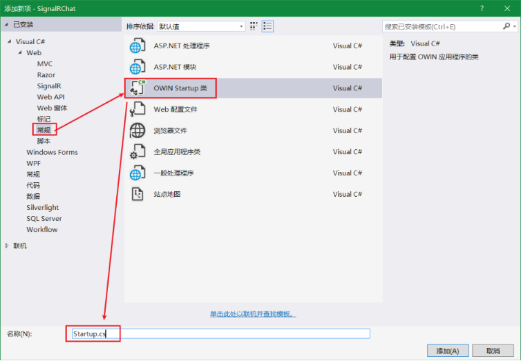
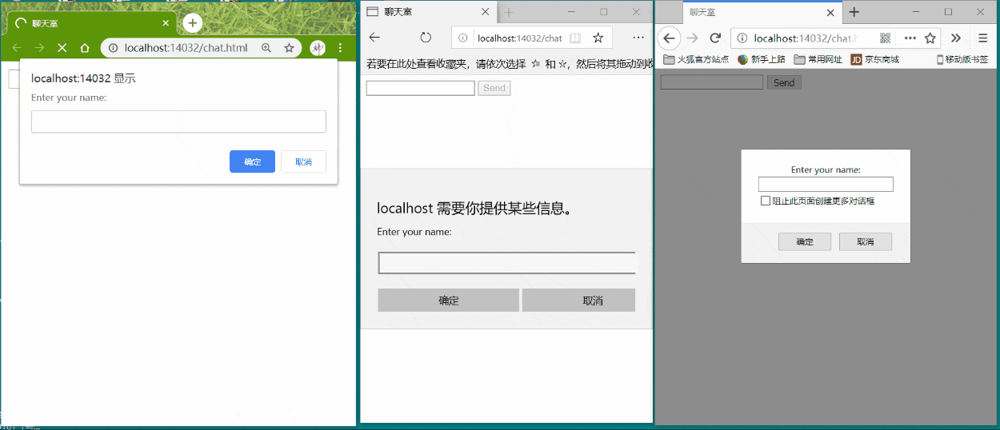
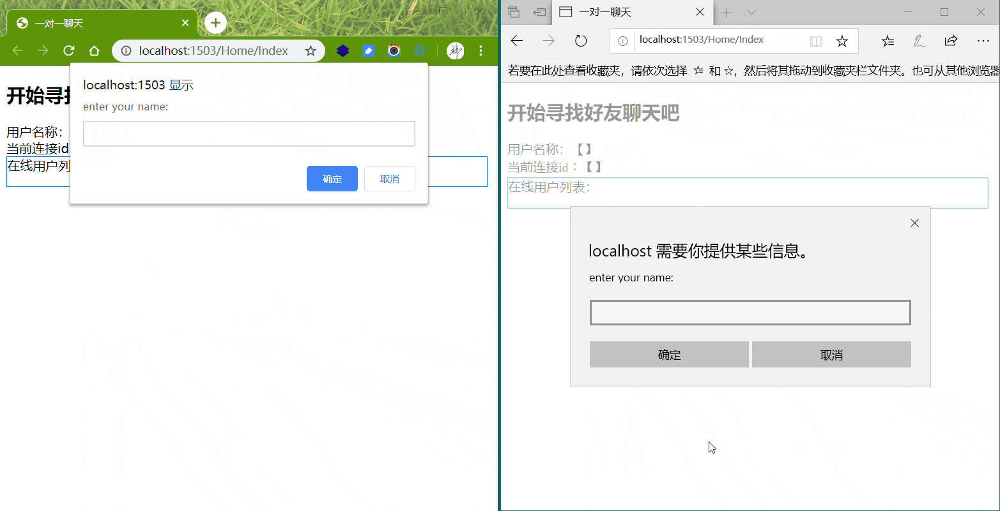

<!-- TOC -->

- [SignalR](#signalr)
    - [SignalR 简介](#signalr-简介)
    - [SignalR和WebSocket](#signalr和websocket)
        - [WebSocket](#websocket)
        - [对比](#对比)
    - [通信模型](#通信模型)
        - [Connection连接](#connection连接)
            - [创建MVC项目](#创建mvc项目)
            - [持久连接类](#持久连接类)
            - [启动路由注册](#启动路由注册)
            - [组件更新](#组件更新)
            - [界面处理](#界面处理)
            - [建立持久连接](#建立持久连接)
        - [Hub聊天应用](#hub聊天应用)
            - [应用程序](#应用程序)
            - [Hub集线器](#hub集线器)
            - [注册SignalR](#注册signalr)
            - [组件更新](#组件更新-1)
            - [Hub前端调用](#hub前端调用)
            - [多浏览器测试](#多浏览器测试)
            - [MVC中Hub应用](#mvc中hub应用)
    - [通信案例](#通信案例)
        - [一对一通信](#一对一通信)
            - [用户实体类](#用户实体类)
            - [OneToOne集线器](#onetoone集线器)
            - [用户列表及聊天窗口](#用户列表及聊天窗口)
            - [聊天演示](#聊天演示)

<!-- /TOC -->

<a id="markdown-signalr" name="signalr"></a>
# SignalR

<a id="markdown-signalr-简介" name="signalr-简介"></a>
## SignalR 简介

ASP.NET SignalR 是 ASP.NET 开发人员的库，可简化将实时 web 功能添加到应用程序的过程。 

实时 web 功能使服务器代码能够在可用时立即将内容推送到连接的客户端，而不是让服务器等待客户端请求新的数据。

SignalR 可用于将任何种类的 "实时" web 功能添加到 ASP.NET 应用程序。

通常以【聊天通讯】作为示例，其实可以做更多操作，比如监视应用程序、协作应用程序（如同步编辑文档）、作业进度更新和实时窗体

SignalR 提供了一个简单的 API，用于创建从服务器端 .NET 代码调用客户端浏览器中的JS函数。

SignalR 还包括用于连接管理的 API （例如，连接和断开连接事件）以及对连接进行分组。



SignalR 自动处理连接管理，让你可同时向所有连接的客户端广播消息，就像聊天室一样。

SignalR 支持 "服务器推送" 功能，在此功能中，服务器代码可以使用远程过程调用（RPC），而不是 web 上常见的请求-响应模型，在浏览器中调用客户端代码。


<a id="markdown-signalr和websocket" name="signalr和websocket"></a>
## SignalR和WebSocket

<a id="markdown-websocket" name="websocket"></a>
### WebSocket
WebSocket是一种在单个TCP连接上进行全双工通信的协议。

WebSocket使得客户端和服务器之间的数据交换变得更加简单，允许服务端主动向客户端推送数据。

在WebSocket API中，浏览器和服务器只需要完成一次握手，两者之间就直接可以创建持久性的连接，并进行双向数据传输。

<a id="markdown-对比" name="对比"></a>
### 对比
SignalR 使用新的 WebSocket 传输（如果可用），并在必要时回退到较旧的传输（前端ajax轮询）。

当然，可以直接使用 WebSocket 编写应用，但使用 SignalR 意味着你需要实现的很多额外功能都已完成。 

最重要的是，这意味着您可以对应用程序进行编码，以便利用 WebSocket，而不必担心为较旧的客户端创建单独的代码。 

<a id="markdown-通信模型" name="通信模型"></a>
## 通信模型
SignalR 的实现机制与.NET WCF 或 Remoting 是相似的，都是使用远程代理来实现。

在具体使用上，有两种不同通信模型：PersistentConnection 和 Hubs

通信模型 | 说明
-----|---
Persistent Connections | Persistent Connections表示一个发送单个，编组，广播信息的简单终结点。开发人员通过使用持久性连接Api，直接访问SignalR公开的底层通信协议。
Hubs | Hubs是基于连接Api的更高级别的通信管道，它允许客户端和服务器上彼此直接调用方法，SignalR能够很神奇地处理跨机器的调度，使得客户端和服务器端能够轻松调用在对方端上的方法。使用Hub还允许开发人员将强类型的参数传递给方法并且绑定模型

SignalR 将整个连接，信息交换过程封装得非常漂亮，客户端与服务器端全部使用 JSON 来交换数据。

<a id="markdown-connection连接" name="connection连接"></a>
### Connection连接

<a id="markdown-创建mvc项目" name="创建mvc项目"></a>
#### 创建MVC项目
Connection连接的方式和Hub集线器非常类似，创建过程如下：



<a id="markdown-持久连接类" name="持久连接类"></a>
#### 持久连接类

添加连接类



修改默认生成的【ChatConnection.cs】如下：

```cs
public class ChatConnection : PersistentConnection
{
    /// <summary>
    /// 当前连接用户数
    /// </summary>
    static int _connectionCount = 0;

    protected override Task OnConnected(IRequest request, string connectionId)
    {
        /*
        Interlocked 为多个线程共享的变量提供原子操作，保障多线程操作时同步
        Increment() 用于递增，同样的也有 Decrement() 方法
        https://docs.microsoft.com/zh-cn/dotnet/api/system.threading.interlocked?view=netframework-4.8
        */
        Interlocked.Increment(ref _connectionCount);
        // 广播消息
        Connection.Broadcast($"新的连接加入，连接ID：{connectionId}，已有连接数：{_connectionCount}");
        return Connection.Send(connectionId, $"双向连接成功，连接ID：{connectionId}");
    }

    protected override Task OnDisconnected(IRequest request, string connectionId, bool stopCalled)
    {
        Interlocked.Decrement(ref _connectionCount);
        return Connection.Broadcast($"{connectionId} 退出连接，也有连接数：{_connectionCount}");
    }

    protected override Task OnReceived(IRequest request, string connectionId, string data)
    {
        var message = $"{connectionId} 发送内容>> {data}";

        return Connection.Broadcast(data);
    }
}
```

<a id="markdown-启动路由注册" name="启动路由注册"></a>
#### 启动路由注册
新增【Owin Startup】类，进行路由注册

```cs
public class Startup
{
    public void Configuration(IAppBuilder app)
    {
        app.MapSignalR<ChatConnection>("/Connections/ChatConnection");
    }
}
```

<a id="markdown-组件更新" name="组件更新"></a>
#### 组件更新
由于默认添加的SignalR版本并不是最新的，在升级jQuery版本时，也需要一并升级SignalR。

打开项目的 "Nuget程序包" 管理器，对【jQuery】和【Microsoft.AspNet.SignalR】进行更新


<a id="markdown-界面处理" name="界面处理"></a>
#### 界面处理
新增Home控制器，在默认Index视图中修改代码如下：

```html
@{
    Layout = null;
}

<!DOCTYPE html>
<html>
<head>
    <title>SingnalR持久连接类 Demo</title>
</head>
<body>
    <h1>SignalR永久连接类 Demo</h1>
    <div>
        <input type="text" id="message" placeholder="请输入消息内容..." />
        <button id="btnSend">Send</button>
        <ul id="discussion"></ul>
    </div>

    <script src="~/Scripts/jquery-3.4.1.min.js"></script>
    <script src="~/Scripts/jquery.signalR-2.4.1.min.js"></script>
    <script>
        const conn = $.connection('/Connections/ChatConnection');
        conn.logging = true;

        // 客户端接收消息处理
        conn.received(function (data) {
            $('#discussion').append(`<li>${data}</li>`);
        });

        // 连接错误处理
        conn.error(function (err) {
            console.error(`与服务器连接异常：${err}`);
        });

        conn.start().done(function () {
            $('#btnSend').click(function () {
                // 向服务端发送消息
                conn.send($('#message').val());
            });
        });

    </script>
</body>
</html>

```

<a id="markdown-建立持久连接" name="建立持久连接"></a>
#### 建立持久连接



通过多个浏览器进行测试，关闭浏览器标签会同步显示对应connection退出连接。

需要注意的是，如果是刷新页面，需要一定的时间才能响应退出连接。//TODO


<a id="markdown-hub聊天应用" name="hub聊天应用"></a>
### Hub聊天应用

<a id="markdown-应用程序" name="应用程序"></a>
#### 应用程序
在 Visual Studio 中，创建一个 ASP.NET Web 应用程序，选择空模板，如下所示：



<a id="markdown-hub集线器" name="hub集线器"></a>
#### Hub集线器
在解决方案资源管理器中，右键单击项目，然后选择 "添加 > 新项"，选择" SignalR Hub 类（v2） "



添加SignalR类后，vs会自动将相关程序集引用至该项目，可以从引用中查看新增了SignalR相关的程序集。

将新的ChatHub.cs类文件中的代码替换为以下代码：

```cs
using System;
using System.Web;
using Microsoft.AspNet.SignalR;
namespace SignalRChat
{
    public class ChatHub : Hub
    {
        public void Send(string name, string message)
        {
            // Call the broadcastMessage method to update clients.
            Clients.All.broadcastMessage(name, message);
        }
    }
}
```

Send 方法演示了几个中心概念：

* 在中心声明公共方法，使客户端可以调用它们。
* 使用 Microsoft.AspNet.SignalR.Hub.Clients 动态属性与连接到此集线器的所有客户端通信。
* 在客户端上调用一个函数（如 broadcastMessage 函数）以更新客户端。


<a id="markdown-注册signalr" name="注册signalr"></a>
#### 注册SignalR

在 "添加新项"-SignalRChat选择 "安装 > Visual C# > Web "，然后选择 " OWIN Startup 类"，如下图所示：



将Startup类【Configuration】方法中添加SignalR的注册代码`app.MapSignalR();`，类如下所示：

```cs
[assembly: OwinStartup(typeof(SignalRChat.Startup))]
namespace SignalRChat
{
    public class Startup
    {
        public void Configuration(IAppBuilder app)
        {
            // 注册 SignalR 中间件
            app.MapSignalR();
        }
    }
}
```

<a id="markdown-组件更新-1" name="组件更新-1"></a>
#### 组件更新
由于默认添加的SignalR版本并不是最新的，在升级jQuery版本时，也需要一并升级SignalR。

打开项目的 "Nuget程序包" 管理器，对【jQuery】和【Microsoft.AspNet.SignalR】进行更新


<a id="markdown-hub前端调用" name="hub前端调用"></a>
#### Hub前端调用

在项目中新增html页面【chat.html】：
```html
<!DOCTYPE html>
<html>
<head>
    <meta http-equiv="Content-Type" content="text/html; charset=utf-8" />
    <title>聊天室</title>
    <meta charset="utf-8" />
</head>
<body>
    <div class="container">
        <input type="text" id="message" />
        <input type="button" id="sendmessage" value="Send" />
        <input type="hidden" id="displayname" />
        <ul id="discussion"></ul>
    </div>

    <script src="Scripts/jquery-3.4.1.min.js"></script>
    <script src="Scripts/jquery.signalR-2.4.1.min.js"></script>
    <script src="signalr/hubs"></script>

    <script>
        $(function () {
            // 创建服务端hub引用的代理
            var chat = $.connection.chatHub;
            // 创建客户端的回调方法，broadcastMessage方法由服务端远程调用，将消息广播至每个客户端
            chat.client.broadcastMessage = (name, message) => {
                $('#discussion').append(`
                    <li>
                    <strong>${name}</strong>:
                    <em>${message}</em>
                    </li>
                    `);
            };

            // 设置隐藏域的名称，通过prompt弹框输入
            $('#displayname').val(prompt('Enter your name:'));
            $('#message').focus();

            // 打开连接后进行发送事件的注册
            $.connection.hub.start().done(function () {
                $('#sendmessage').click(() => {
                    // 远程调用hub上的Send方法
                    chat.server.send($('#displayname').val(), $('#message').val());
                    $('#message').val('').focus();
                });

            });
        })
    </script>
</body>
</html>
```

代码示例显示了如何使用 SignalR jQuery 库与 SignalR 中心通信。

运用代理的思想，chat对象用于代理服务端的chatHub集线器。

```js
var chat = $.connection.chatHub;
```

> 在 JavaScript 中，对服务器类及其成员的引用必须是 camelCase。 

此代码示例引用C#中的ChatHub类作为 chatHub，同样的【ChatHub.cs】类中Send()方法在js中对应chat.server.send()


<a id="markdown-多浏览器测试" name="多浏览器测试"></a>
#### 多浏览器测试
设置【chat.html】为起始页面，开启多浏览器进行聊天测试：



<a id="markdown-mvc中hub应用" name="mvc中hub应用"></a>
#### MVC中Hub应用
在MVC项目中Hub应用类似，在MVC模板中添加Owin启动类【Startup】，注册集线器的连接。

具体可以参考微软案例：

[教程： SignalR 2 和 MVC 5 的实时聊天](https://docs.microsoft.com/zh-cn/aspnet/signalr/overview/getting-started/tutorial-getting-started-with-signalr-and-mvc)

<a id="markdown-通信案例" name="通信案例"></a>
## 通信案例

<a id="markdown-一对一通信" name="一对一通信"></a>
### 一对一通信

新建一个空的ASP.NET Mvc项目，取名为：SignalROneToOne。

添加Hub集线器，命名为：【OneToOneHub.cs】。

关于SignalR组件更新过程省略。

以下给出关键步骤

<a id="markdown-用户实体类" name="用户实体类"></a>
#### 用户实体类

在Model文件夹中创建用户实体类【User】：
```cs
/// <summary>
/// 用户实体类
/// </summary>
public class User
{
    /// <summary>
    /// 连接ID
    /// </summary>
    public string ConnectionID { get; set; }

    public string Name { get; set; }

    public User(string name, string connectionId)
    {
        Name = name;
        ConnectionID = connectionId;
    }
}
```

<a id="markdown-onetoone集线器" name="onetoone集线器"></a>
#### OneToOne集线器

整体实现思路：
1. 先实现在线用户列表的展示
2. 实现聊天窗口的添加
3. 聊天消息的发送和接收，接收方默认自动打开聊天窗口

【OneToOneHub】集线器代码如下：
```cs
/// <summary>
/// 点对点聊天
/// </summary>
[HubName("chat")]
public class OneToOneHub : Hub
{
    /// <summary>
    /// 在线用户列表
    /// </summary>
    public static List<User> userList = new List<User>();

    /// <summary>
    /// 重写连接事件
    /// </summary>
    /// <returns></returns>
    public override Task OnConnected()
    {
        // 根据connectionId判断用户是否已在用户列表中
        var user = userList.FirstOrDefault(t => t.ConnectionId == Context.ConnectionId);
        if (null == user)
        {
            // 首次建立连接时无姓名信息，需要后面再设置姓名
            user = new User("", Context.ConnectionId);
            userList.Add(user);
        }

        return base.OnConnected();
    }

    /// <summary>
    /// 重写断开连接事件
    /// </summary>
    /// <param name="stopCalled"></param>
    /// <returns></returns>
    public override Task OnDisconnected(bool stopCalled)
    {
        // 断开连接后从用户列表移除
        var user = userList.FirstOrDefault(t => t.ConnectionId == Context.ConnectionId);
        if (null != user)
        {
            userList.Remove(user);
        }

        UpdateOnlineUser();

        return base.OnDisconnected(stopCalled);
    }

    /// <summary>
    /// 更新在线用户列表中用户姓名
    /// </summary>
    /// <param name="name"></param>
    public void UpdateUserName(string name)
    {
        var currentUser = userList.FirstOrDefault(t => t.ConnectionId == Context.ConnectionId);
        if (null != currentUser)
        {
            // 更新姓名
            currentUser.Name = name;
        }
        UpdateOnlineUser();
    }

    /// <summary>
    /// 通知所有客户端更新 在线用户列表
    /// </summary>
    private void UpdateOnlineUser()
    {
        var list = userList.Select(t => new { t.Name, t.ConnectionId }).ToList();

        string jsonUsers = JsonConvert.SerializeObject(list);
        Clients.All.updateOnlineUser(jsonUsers);
    }

    /// <summary>
    /// 发送消息
    /// </summary>
    /// <param name="targetConnId">对方ConnectionId</param>
    /// <param name="message">消息内容</param>
    public void SendMessage(string targetConnId, string message)
    {
        var targetUser = userList.FirstOrDefault(t => t.ConnectionId == targetConnId);
        var currentUser = userList.FirstOrDefault(t => t.ConnectionId == Context.ConnectionId);

        if (null != targetUser && null != currentUser)
        {
            // 发给接收方
            Clients.Client(targetConnId).addMessage(message, currentUser.Name, currentUser.ConnectionId);

            // 给自己发送，表示消息已送达
            Clients.Client(Context.ConnectionId).addMessage(message, targetUser.Name, targetUser.ConnectionId);
        }
    }

}
```

<a id="markdown-用户列表及聊天窗口" name="用户列表及聊天窗口"></a>
#### 用户列表及聊天窗口

前端页面代码如下：
```html
@{
    Layout = null;
}

<!DOCTYPE html>
<html>
<head>
    <title>一对一聊天</title>
    <style>
        div.chat-window {
            margin: 5px 0;
            width: 700px;
            border: 1px solid red;
        }
    </style>
</head>
<body>
    <h2>开始寻找好友聊天吧</h2>

    <div>
        <div>用户名称：【<strong id="userName"></strong>】</div>
        <div>当前连接id：【<label id="connId"></label>】</div>

        <div style="width:600px;border:1px solid #007acc">
            <div>在线用户列表：</div>
            <ul id="onlineUser"></ul>
        </div>

        <div id="discussion">
        </div>
    </div>

    <script src="~/Scripts/jquery-1.10.2.min.js"></script>
    <script src="~/Scripts/jquery.signalR-2.1.2.min.js"></script>
    <script src="~/signalr/hubs"></script>
    <script>
        // 当前用户
        var currentUser = {
            name: '',
            connectionId: ''
        };
        var chat;

        $(function () {
            chat = $.connection.chat;
            registerClientWork();

            // done() 建立连接成功回调
            $.connection.hub.start().done(function () {
                // 连接成功就有 connectionid，和服务端 Context.ConnectionId 一致
                currentUser.connectionId = $.connection.hub.id;
                currentUser.name = prompt('enter your name:');

                $('#userName').text(currentUser.name);
                $('#connId').text(currentUser.connectionId);

                // 通知服务端更新当前用户名
                chat.server.updateUserName(currentUser.name);
            });
        })

        // 注册客户端方法
        function registerClientWork() {
            // 当有用户接入(更新名称时)或者断开时需要更新列表
            chat.client.updateOnlineUser = function (data) {
                let userArray = JSON.parse(data);
                if (userArray.length > 0) {
                    $('#onlineUser').empty();
                    for(let uu of userArray) {
                        let chatButton = '';
                        if (uu.ConnectionId != currentUser.connectionId) {
                            // 当前用户不显示聊天按钮
                            chatButton = `<button class="chat-button"
                                data-connid="${uu.ConnectionId}"
                                data-name="${uu.Name}" >聊天</button>`;
                        }
                        $('#onlineUser').append(`<li>用户名：【${uu.Name}】${chatButton}</li>`);
                    }
                }
            }

            // 收到服务端消息，插入到聊天窗口中显示
            chat.client.addMessage = function (message, targetName, targetConnId) {
                //debugger;
                // 在聊天窗口中根据 targetConnId 寻找聊天窗口，找不到则创建
                if ($(`#${targetConnId}`).length == 0) {
                    showChatWindow(targetConnId, targetName);
                }
                $(`#${targetConnId}`).find('ul.chat-content').append(`<li>${message}</li>`);
            }

            bindChat();
            bindMessageSend();
        }

        // 委托方式绑定聊天事件
        function bindChat() {
            $('#onlineUser').on('click', 'button.chat-button', function (e) {
                // debugger;
                let targetConnId = $(e.target).attr('data-connid');
                let targetName = $(e.target).attr('data-name');
                console.log('targetConnId:' + targetConnId);
                showChatWindow(targetConnId, targetName);
            });
        }

        // 新增聊天窗口
        function showChatWindow(connid, uname) {
            // 避免重复创建聊天窗口
            if ($(`#${connid}`).length > 0) {
                return;
            }
            let html = `
                <div class="chat-window" id="${connid}">
                <div><span>正在与【${uname}】聊天中...</span></div>
                <ul class="chat-content"></ul>
                <div>
                    <input type="text" />
                    <button data-connid="${connid}" class="btn-send">send</button>
                </div>
                </div>
                `;
            $('#discussion').append(html);
        }

        // 绑定消息发送事件
        function bindMessageSend() {
            $('#discussion').on('click', 'button.btn-send', function (e) {
                let targetConnId = $(e.target).attr('data-connid');
                let message = $(e.target).prev().val();
                message = `${currentUser.name}：${message}`;
                console.log(`targetConnId:${targetConnId},msg:${message}`);
                // 调用服务端方法，指定对方connid发送消息
                chat.server.sendMessage(targetConnId, message);
                // 清空输入框
                $(e.target).prev().val('');
            });
        }

    </script>
</body>
</html>

```

<a id="markdown-聊天演示" name="聊天演示"></a>
#### 聊天演示




