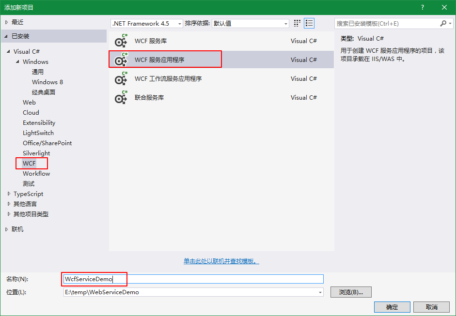
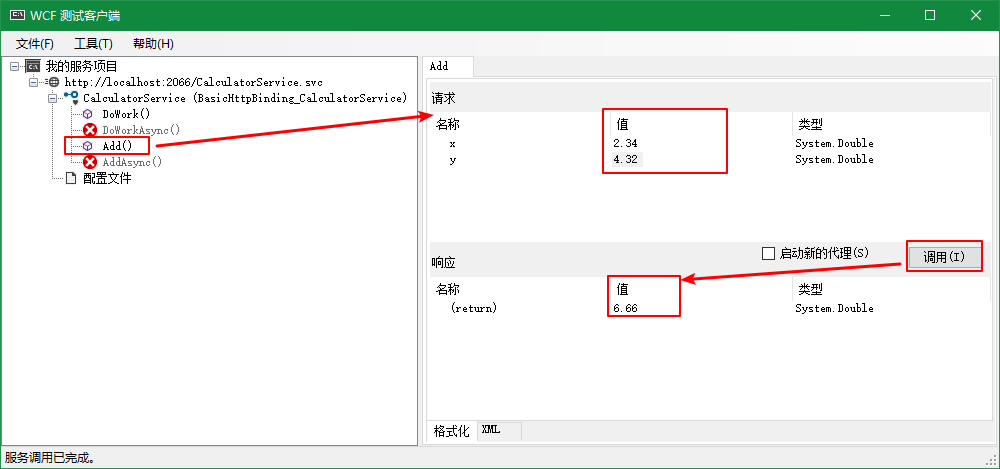
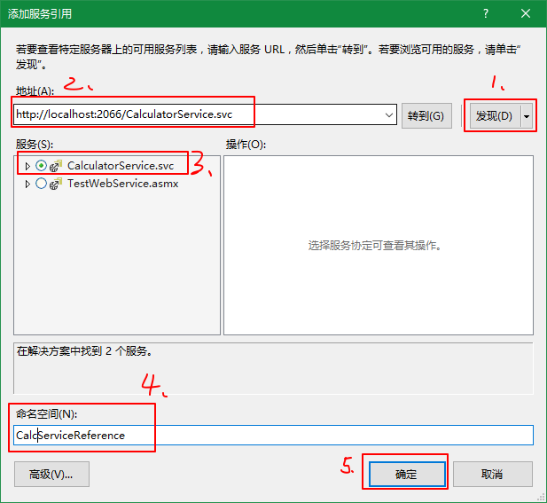
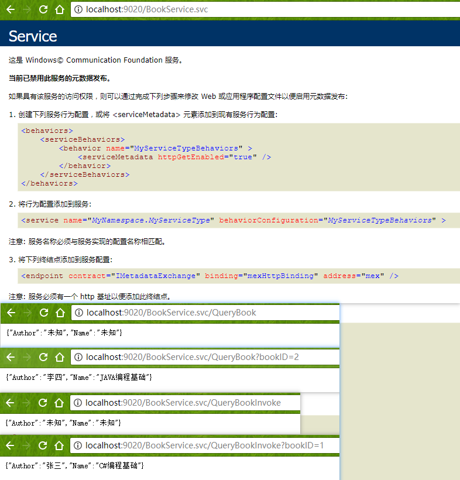

<!-- TOC -->

- [WCF](#wcf)
    - [创建一个WCF程序](#创建一个wcf程序)
        - [创建服务](#创建服务)
        - [客户端调用](#客户端调用)
        - [Rest服务](#rest服务)

<!-- /TOC -->
<a id="markdown-wcf" name="wcf"></a>
# WCF
WCF（Windows Communication Foundation）是由微软发展的一组数据通信的应用程序开发接口，它是.NET框架的一部分，从 .NET Framework 3.0 开始引入。

利用WCF可以创建面向服务的应用程序。它整合了ASP.NET Web service、.NET Remoting、Message Queuing和Enterprise Services等现有的Web服务技术。

WCF宿主与客户端的通信建立在一系列基本要素之上，两端都必须遵循一定的规则才能通信无阻。这些基本要素包括：
* 地址（Address）：服务所处的位置。在代码中，是通过System.Uri类型的变量来代表，这个值也可以存储在.config文件中。
* 绑定（Binding）：需要指明WCF服务是通过何种网络协议、编码机制和传输层。通常WCF会寄宿在宿主上，而“绑定”就是告诉客户端怎样去与宿主进行通信。
* 契约（Contract）：WCF向外提供的方法以及数据是如何组织的。契约是WCF代码的关键，我们编写服务代码实际上就是在订立和完成契约。它包括两种：

```
a、数据契约：指定数据的存储格式。
    定义在System.Runtime.Serialization命名空间下，通过[DataContract]、[DataMember]属性来设置
    
b、服务契约：指定方法的调用方式。
    定义在System.ServiceModel命名空间下，通过[ServiceContract]、[OperationContract]属性来设置
```

<a id="markdown-创建一个wcf程序" name="创建一个wcf程序"></a>
## 创建一个WCF程序

<a id="markdown-创建服务" name="创建服务"></a>
### 创建服务
WCF服务可以寄宿在很多宿主类型中，常见的有控制台、IIS和Windows服务等三种。

我们接下来以IIS（以一个WebSite的形式）作为宿主来介绍WCF服务的创建流程：

新建项目，选择【WCF服务应用程序】，如下：



在新建的项目中添加新的服务【CalculatorService】，添加后解决方案资源管理器中会自动创建【CalculatorService.svc】和【ICalculatorService.cs】文件，如下：


服务契约ICalculatorService.cs：
```cs
/// <summary>
/// 服务契约
/// 通过在接口上应用System.ServiceModel.ServiceContractAttribute特性将一个接口定义成服务契约
/// 服务契约的成员方法并不会自动成为服务，我们须要在相应的方法上面显式地应用OperationContractAttribute特性。
/// </summary>
[ServiceContract(Name = "CalculatorService")]
public interface ICalculatorService
{
    [OperationContract]
    double Add(double x, double y);
}
```

服务实现CalculatorService.svc：
```cs
/// <summary>
/// 实现服务契约
/// </summary>
public class CalculatorService : ICalculatorService
{
    public double Add(double x, double y)
    {
        return x + y;
    }
}
```

<a id="markdown-客户端调用" name="客户端调用"></a>
### 客户端调用
最简单的测试调用，启动调试，即可进行服务测试客户端查看调用情况：



以下是在ASP.NET应用程序中的调用，以MVC的控制器中为例。先在项目中添加服务引用，可以手动写入服务地址也可以点击【发现】按钮，自动识别项目中服务：



调用代码：
```cs
//通过服务地址引用的方式
using (CalcServiceReference.CalculatorServiceClient proxy = new CalcServiceReference.CalculatorServiceClient())
{
    var res = proxy.Add(2.34, 4.32);
}
```

客户端通过服务代理对象进行服务的调用，上面的例子通过创建自动生成的、继承自ClientBase<T>的类型对象【CalculatorServiceClient】进行服务调用。

在客户端与服务端进行数据交互时，WCF采用新的序列化器——数据契约序列化器（DataContractSerializer）进行基于数据契约的序列化于反序列化操作。

基于数据契约的自定义特性主要包含以下两个：DataContractAttribute和DataMemberAttribute


将WebService示例中的QueryBook用WCF方式实现：
```cs
/// <summary>
/// 图书类
/// 数据契约
/// </summary>
[DataContract]
public class Book
{
    //如果没有 [DataMember]特性标签，则不会进行序列化
    [DataMember]
    public string Name { get; set; }
    [DataMember]
    public string Author { get; set; }
}

/// <summary>
/// 服务契约
/// 通过在接口上应用System.ServiceModel.ServiceContractAttribute特性将一个接口定义成服务契约
/// 服务契约的成员方法并不会自动成为服务，我们须要在相应的方法上面显式地应用OperationContractAttribute特性。
/// </summary>
[ServiceContract(Name = "CalculatorService")]
public interface ICalculatorService
{
    [OperationContract]
    Book QueryBook(int bookID);
}

/// <summary>
/// 实现服务契约
/// </summary>
public class CalculatorService : ICalculatorService
{
    public Book QueryBook(int bookID)
    {
        if (bookID == 1)
        {
            return new Book() { Name = "C#编程基础", Author = "张三" };
        }
        if (bookID == 2)
        {
            return new Book() { Name = "JAVA编程基础", Author = "李四" };
        }
        return new Book() { Name = "未知", Author = "未知" };
    }
}
```

在客户端更新服务引用后，即可调用更新后的服务。

<a id="markdown-rest服务" name="rest服务"></a>
### Rest服务
基于REST的服务与基于SOAP的服务相比，性能、效率和易用性上都更高，而SOAP协议非常的复杂和不透明。REST受到越来越多的Web服务供应商欢迎。目前大部分供应商，如yahoo、google、Amazon等都提供REST风格的服务。

REST是基于Http协议的，任何对资源的操作行为都是通过Http协议来实现。Http把对一个资源的操作限制在4个方法以内：GET、POST、PUT和DELETE，这正是对资源CRUD操作的实现。

REST的资源表述形式可以是XML、HTML、JSON，或者其他任意的形式，这取决于服务提供商和消费服务的用户。

同样在上述示例基础上进行rest服务的实现
实体类Book：
```cs
/// <summary>
/// 图书类
/// </summary>
[DataContract]
public class Book
{
    [DataMember]
    public string Name { get; set; }
    [DataMember]
    public string Author { get; set; }
}
```

服务契约IBookService：
```cs
// 注意: 使用“重构”菜单上的“重命名”命令，可以同时更改代码和配置文件中的接口名“IBookService”。
[ServiceContract]
public interface IBookService
{
    [OperationContract]
    //对应url：localhost:xxxx/BookService.svc/QueryBook/xxx
    //[WebGet(UriTemplate = "/QueryBook/{bookID}", ResponseFormat = WebMessageFormat.Json)]
    //默认url：localhost:xxxx/BookService.svc/QueryBook?bookID=xxx
    [WebGet(ResponseFormat = WebMessageFormat.Json)]//即 UriTemplate="QueryBook?bookID={bookID}"
    Book QueryBook(string bookID);

    [OperationContract]
    [WebInvoke(Method = "GET", UriTemplate = "/QueryBookInvoke?bookID={bookID}"
        , RequestFormat = WebMessageFormat.Json, ResponseFormat = WebMessageFormat.Json)]
    Book QueryBookInvoke(string bookID);
}
```

服务BookService：
```cs
public class BookService : IBookService
{

    public Book QueryBook(string bookID)
    {
        return Query(bookID);
    }

    public Book QueryBookInvoke(string bookID)
    {
        return Query(bookID);
    }

    private Book Query(string bookID)
    {
        if (bookID == "1")
        {
            return new Book() { Name = "C#编程基础", Author = "张三" };
        }
        if (bookID == "2")
        {
            return new Book() { Name = "JAVA编程基础", Author = "李四" };
        }
        return new Book() { Name = "未知", Author = "未知" };
    }
}
```

另外服务端的配置文件很重要，主要在`<system.serviceModel>`节点中配置`services`和`behaviors`节点，web.config文件如下：
```config
<?xml version="1.0" encoding="utf-8"?>
<configuration>

  <appSettings>
    <add key="aspnet:UseTaskFriendlySynchronizationContext" value="true" />
  </appSettings>
  <system.web>
    <compilation debug="true" targetFramework="4.5" />
    <httpRuntime targetFramework="4.5"/>
  </system.web>
  <system.serviceModel>
    <bindings>
      <webHttpBinding>
        <binding name="webBinding"></binding>
      </webHttpBinding>
    </bindings>
    <services>
      <!-- !!! 
      service name="WcfRestService.BookService" 为对应的svc名称，包含命名空间.
      behaviorConfiguration="testServiceBehavior" 与后面服务端serviceBehaviors节点配置对应
      behaviorConfiguration="webBehavior" 与终端endpointBehaviors节点配置对应
       -->
      <service name="WcfRestService.BookService" behaviorConfiguration="testServiceBehavior">
        <endpoint address="" behaviorConfiguration="webBehavior"
                  binding="webHttpBinding" bindingConfiguration="webBinding"
                  contract="WcfRestService.IBookService"></endpoint>
      </service>
    </services>
    <behaviors>
      <!-- !!! 终端行为配置 -->
      <endpointBehaviors>
        <behavior name="webBehavior">
          <!-- !!! 这里必须设置 webHttp -->
          <webHttp/>
        </behavior>
      </endpointBehaviors>
      <!-- !!! 服务端行为配置 -->
      <serviceBehaviors>
        <behavior name="testServiceBehavior"></behavior>
        <behavior name="">
          <serviceMetadata httpGetEnabled="true" httpsGetEnabled="true" />
          <serviceDebug includeExceptionDetailInFaults="false" />
        </behavior>
      </serviceBehaviors>
    </behaviors>
    <protocolMapping>
      <add binding="basicHttpsBinding" scheme="https" />
    </protocolMapping>
    <serviceHostingEnvironment aspNetCompatibilityEnabled="true"
      multipleSiteBindingsEnabled="true" />
  </system.serviceModel>
  <system.webServer>
    <modules runAllManagedModulesForAllRequests="true"/>
    <!--
        若要在调试过程中浏览 Web 应用程序根目录，请将下面的值设置为 True。
        在部署之前将该值设置为 False 可避免泄露 Web 应用程序文件夹信息。
      -->
    <directoryBrowse enabled="true"/>
  </system.webServer>

</configuration>
```

客户端访问：



---

参考引用：

[Windows Communication Foundation MSDN中文](https://msdn.microsoft.com/zh-cn/library/ms735119.aspx)

[我的WCF之旅](http://www.cnblogs.com/artech/archive/2007/02/26/656901.html)

[WCF实现REST服务](http://www.cnblogs.com/wuhong/archive/2011/01/13/1934492.html)

扩展，有兴趣的可以了解下：

[ServiceStack](https://servicestack.net/)

[使用ServiceStack构建Web服务](http://www.cnblogs.com/yangecnu/p/Introduce-ServiceStack.html)