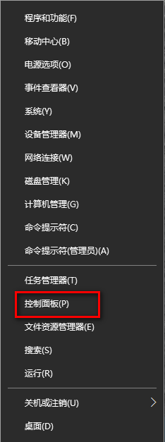

# 安装
## 启用或关闭windows应用

### 打开控制面板

 

### 选择程序


### 打开或关闭windows功能


## 启用IIS功能

### 如下图所示勾选功能


### 启用功能成功


# 打开IIS

## 方法1 开始菜单-管理工具-IIS


## 方法2 运行命令中输入 inetmgr（推荐，高逼格）


## 方法3 桌面上右键点击此电脑，管理


## 进入IIS管理器


# 简单测试

## 默认Default Web Site

默认网站的端口为80，可在浏览器中测试：
>http://localhost

>http://localhost:80

>http://127.0.0.1

出现如下界面表示启用IIS成功


## 简单静态页面测试

### 新建html页面
新建一个html静态页面，内容如下：
``` html
<!DOCTYPE html>
<html>
<head>
    <meta charset="utf-8" />
    <title>测试页面</title>
    <style type="text/css">
        .center {
            text-align: center;
        }
    </style>
</head>
<body>

    <header class="center">HTML测试页面</header>
    <h1>标题一</h1>
    <hr />
    <p>段落</p>
    <footer class="center">Copyright</footer>
</body>
</html>

```

文件保存物理路径为 D:\release\myWeb\1.html

### 添加网站

IIS管理器添加一个网站


网站名称随意，与文件目录名称无关，应用程序池可新建也可使用默认添加的。

物理路径一定要选择上一步保存的【D:\release\myWeb\】。

端口号默认80已经被默认网站占用，需要重新设置，简单引申下【端口号】。

 从1-65535，其中从1-1023叫知名端口号，也叫源端口号。这些端口是被tcp和udp定义了的端口，从1024-49151叫做已注册端口号，被一些公司用于自己的某种协议。49152-65535叫动态分配端口号，是我们随便可以用的。


### 添加默认文档

IIS管理器中选择刚刚添加的网站，添加默认文档


添加文件名称，与添加的静态页面文件名称保持一致


### 浏览测试

浏览器中输入地址测试

>http://localhost:8081

返回默认文档 1.html成功！


