<!-- TOC -->

- [EntityFramework](#entityframework)
    - [三种开发方式](#三种开发方式)
    - [CodeFirst](#codefirst)
        - [理解CodeFirst的约定和配置](#理解codefirst的约定和配置)
        - [ADO.NET 实体数据模型](#adonet-实体数据模型)
        - [数据的操作](#数据的操作)
        - [查询](#查询)
    - [DatabaseFirst](#databasefirst)
        - [EF创建](#ef创建)
        - [更新模型](#更新模型)
        - [Entity Client 方式](#entity-client-方式)
        - [Object Context 方式](#object-context-方式)
        - [Linq to Entities 方式](#linq-to-entities-方式)
        - [在三层架构中的应用](#在三层架构中的应用)
    - [EF应用](#ef应用)
        - [添加数据](#添加数据)
        - [修改数据](#修改数据)
        - [删除数据](#删除数据)
        - [事务](#事务)
    - [在EntityFramework6中执行SQL语句](#在entityframework6中执行sql语句)
        - [ExecuteSqlCommand](#executesqlcommand)
        - [SqlQuery](#sqlquery)
        - [DbSet下的SqlQuery](#dbset下的sqlquery)
        - [EF存储过程](#ef存储过程)
    - [其他](#其他)
        - [命令更新](#命令更新)
        - [ObjectDisposedException](#objectdisposedexception)

<!-- /TOC -->

<a id="markdown-entityframework" name="entityframework"></a>
# EntityFramework
ADO.NET EntityFramework框架是一组内建于ADO.NET的用于支持开发基于数据软件应用的技术。

它使得开发人员通过特定的领域对象及属性来使用数据，而不需要关心他们存储在底层数据库时用的表以及列的信息。

EF是一种ORM（Object-relational mapping）框架，它能把我们在编程时使用对象映射到底层的数据库结构。

比如，你可以在数据库中建立一个Order表，让它与程序中的Order类建立映射关系，这样一来，程序中的每个Order对象都对应着Order表中的一条记录，

ORM框架负责把从数据库传回的记录集转换为对象，也可以依据对象当前所处的具体状态生成相应的SQL命令发给数据库，

完成数据的存取工作（常见的数据存取操作可简称为CRUD：Create、Read、Update、Delete）。

<a id="markdown-三种开发方式" name="三种开发方式"></a>
## 三种开发方式
* Code First 先设计实体类，执行后既有底层库表。即先有代码再有数据库。推荐！！！
* Database First 先设计并建好数据库，然后使用VS的向导创建EF数据模型并生成实体类代码。
* Model First 在可视化设计器中创建实体和它们间的关联，再生成SQL脚本，然后执行SQL脚本完成数据库的创建。

<a id="markdown-codefirst" name="codefirst"></a>
## CodeFirst

<a id="markdown-理解codefirst的约定和配置" name="理解codefirst的约定和配置"></a>
### 理解CodeFirst的约定和配置
我们需要搞清楚的第一件事就是约定大于配置的概念。

CodeFirst方式期望模型类遵守一些约定，这样的话数据库持久化逻辑就可以从模型中提取出来。

比如，如果我们给一个模型定义了一个Id属性，那么它就会映射到数据库中该类所对应的那张表的主键。

这种基于约定的方式的好处在于，如果我们遵守了这些约定，那么我们就不必写额外的代码来管理数据库持久逻辑。

缺点在于，如果没有遵守某个约定，那么EF就不会从模型中提取到需要的信息，运行时会抛异常。

> EF使用模型类的复数的约定来创建数据表名，创建的列名和该类的属性名是一样的。

EF这个ORM工具就是用来解决.NET 类型和SQL Server列类型之间的阻抗失配的问题。

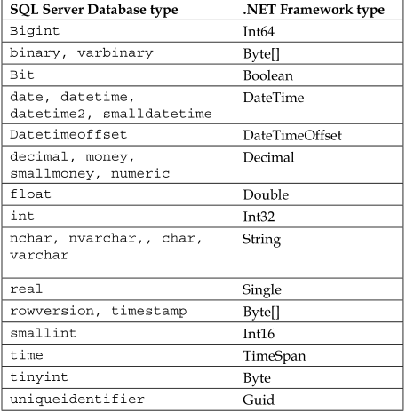

<a id="markdown-adonet-实体数据模型" name="adonet-实体数据模型"></a>
### ADO.NET 实体数据模型
新建Empty MVC模板项目，以【CompanySales】数据库为例，添加实体数据模型：

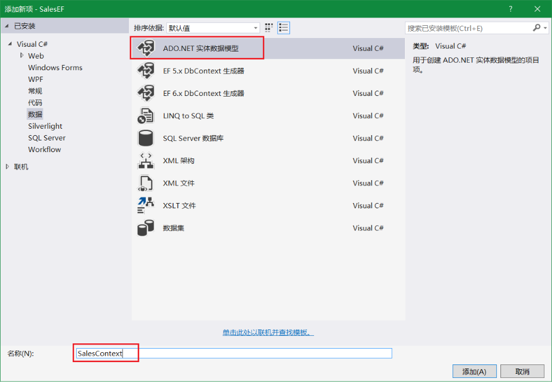


选择模型包含【来自数据库的CodeFirst】内容，如下：

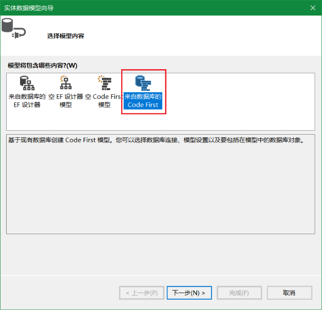

创建数据库连接：

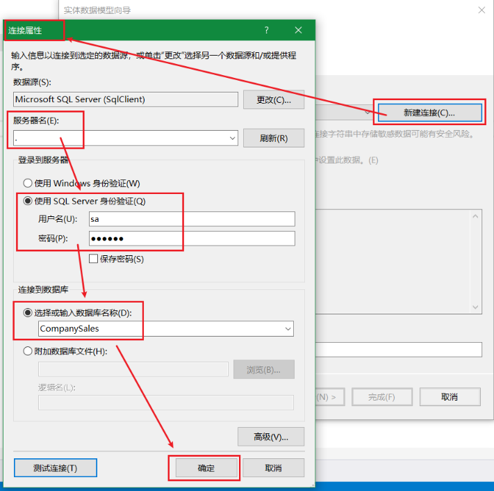

选择与在第一部分中创建的数据库的连接，然后单击 "下一步"

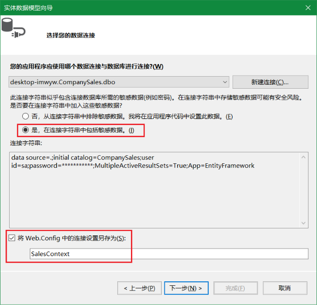

单击 "表" 旁边的复选框以导入所有表，然后单击 "完成"

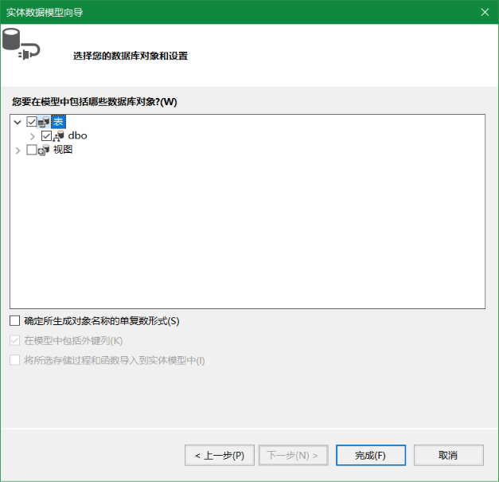

项目结构、数据库上下文context如下：

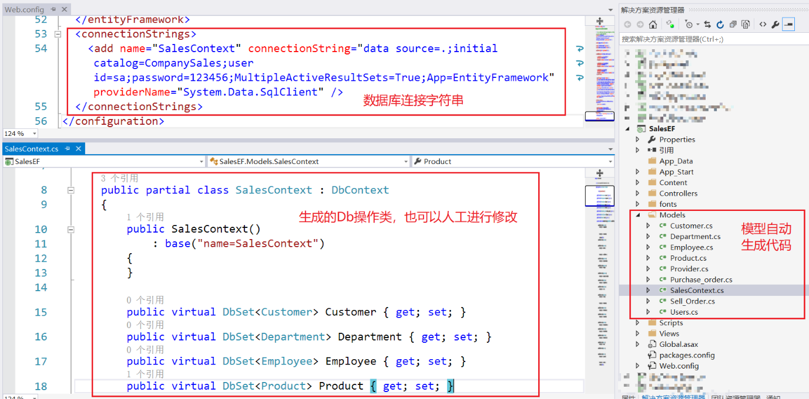

<a id="markdown-数据的操作" name="数据的操作"></a>
### 数据的操作

上下文表示与数据库的会话，从而使我们能够查询并保存数据。 

上下文公开模型中每个类型的DbSet<TEntity> 

你还会注意到，默认构造函数使用名称 = 语法调用基构造函数。 

这会告知 Code First 应从配置文件加载要用于此上下文的连接字符串。

```cs
public partial class SalesContext : DbContext
{
    public SalesContext()
        : base("name=SalesContext")
    {
    }

    public virtual DbSet<Customer> Customer { get; set; }
    public virtual DbSet<Department> Department { get; set; }
    public virtual DbSet<Employee> Employee { get; set; }
    public virtual DbSet<Product> Product { get; set; }
    public virtual DbSet<Provider> Provider { get; set; }
    public virtual DbSet<Purchase_order> Purchase_order { get; set; }
    public virtual DbSet<Sell_Order> Sell_Order { get; set; }
    public virtual DbSet<Users> Users { get; set; }
}
```

<a id="markdown-查询" name="查询"></a>
### 查询
**基本查询**

直接DbSet属性ToList()即可，以Controller中代码为例：
```cs
/// <summary>
///  显示所有产品
/// </summary>
/// <returns></returns>
public JsonResult GetAllProducts()
{
    using (SalesContext db = new SalesContext())
    {
        var list = db.Product.ToList();
        return Json(list);
    }
}
```

前端调用如下：
```js
$.post('/Home/GetAllProducts', null, function (resp) {
    console.table(resp);
});
```
在浏览器调试窗口中查看即可。

**复杂条件查询**

```cs
using (SalesContext db = new SalesContext())
{
    var list = db.Product
        .Where(t => t.ProductName.Contains("笔") && t.Price > 4)
        .ToList();
    return Json(list);
}
```

**使用LINQ查询**

查询所有记录行：
```cs
using (SalesContext db = new SalesContext())
{
    var list = from row in db.Product
                select row;
    return Json(list.ToList());
}
```

多条件筛选：
```cs
using (SalesContext db = new SalesContext())
{
    var list = from row in db.Product
                where row.ProductName.Contains("笔")
                && row.Price < 20
                select row;
    return Json(list.ToList());
}
```

多表关联LINQ快速查询：
领域模型类【SellOrderDomain】
```cs
public class SellOrderDomain
{
    public int SellOrderID { get; set; }
    public int? ProductID { get; set; }
    public string ProductName { get; set; }
    public int? EmpID { get; set; }
    public string EmpName { get; set; }
    public int? CustomerID { get; set; }
    public string CompanyName { get; set; }
}
```

三张表关联查询如下：

```cs
using (SalesContext db = new SalesContext())
{
    var query = from sell in db.Sell_Order
                join prod in db.Product on sell.ProductID equals prod.ProductID
                join cus in db.Customer on sell.CustomerID equals cus.CustomerID
                join emp in db.Employee on sell.EmployeeID equals emp.EmployeeID
                where prod.Price > 5
                select new SellOrderDomain
                {
                    SellOrderID = sell.SellOrderID,
                    ProductID = sell.ProductID,
                    ProductName = prod.ProductName,
                    EmpID = sell.EmployeeID,
                    EmpName = emp.EmployeeName,
                    CustomerID = sell.CustomerID,
                    CompanyName = cus.CompanyName
                };
    var list = query.ToList();
    return Json(list);
}
```

或者以匿名对象的方式进行查询也可以，这样就不需要提前定义一个模型类：
```cs
using (SalesContext db = new SalesContext())
{
    var query = from sell in db.Sell_Order
                join prod in db.Product on sell.ProductID equals prod.ProductID
                join cus in db.Customer on sell.CustomerID equals cus.CustomerID
                join emp in db.Employee on sell.EmployeeID equals emp.EmployeeID
                where prod.Price > 5
                select new
                {
                    SellOrderID = sell.SellOrderID,
                    ProductName = prod.ProductName,
                    EmpName = emp.EmployeeName,
                    CompanyName = cus.CompanyName
                };
    var list = query.ToList();
    return Json(list);
}
```


<a id="markdown-databasefirst" name="databasefirst"></a>
## DatabaseFirst

<a id="markdown-ef创建" name="ef创建"></a>
### EF创建
以我们数据库中现存的数据库为例，创建实体数据模型的步骤如下：

在项目上右键新建项，新增【ADO.NET 实体数据模型】。

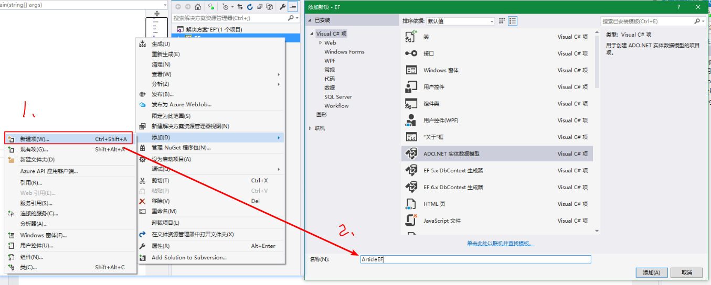

选择【来自数据库的EF设计器】


如果已经存在需要连接数据库的连接可以直接使用。否则可以进行新建连接进行创建，在【连接属性】窗口中填入对应服务器名称、验证方式、数据库名称，如下：

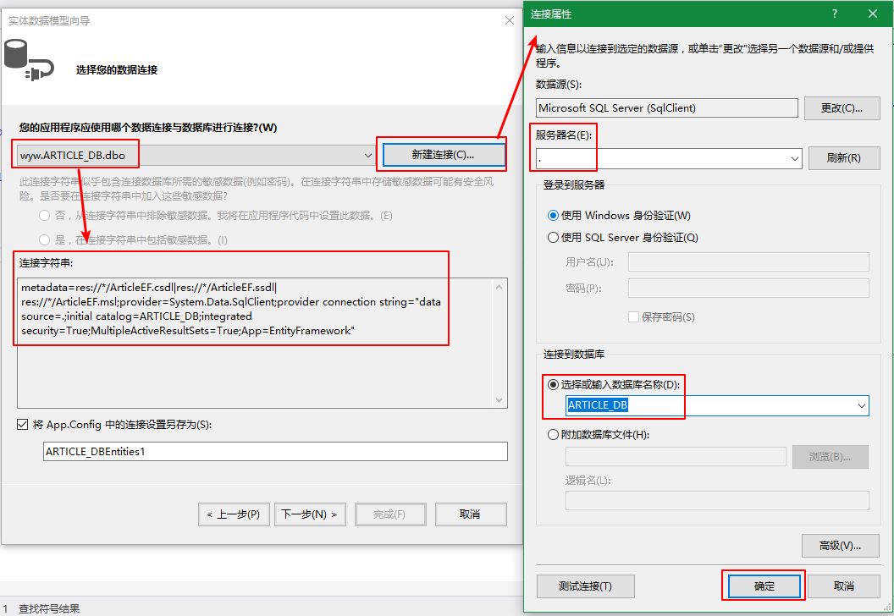

设置实体数据模型，如下：

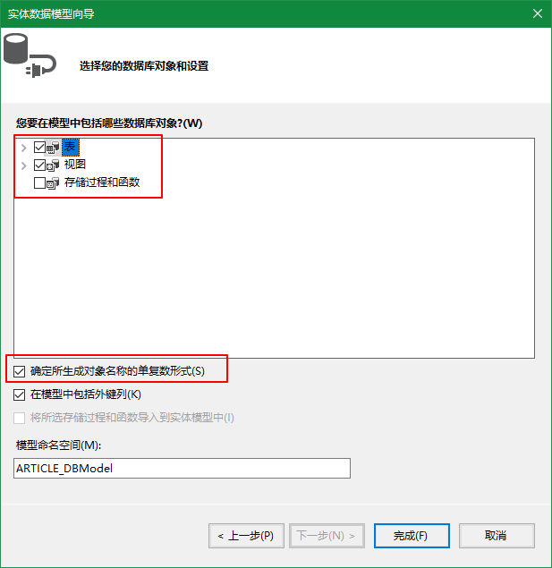

项目中会自动生成对应的数据模型，如下：

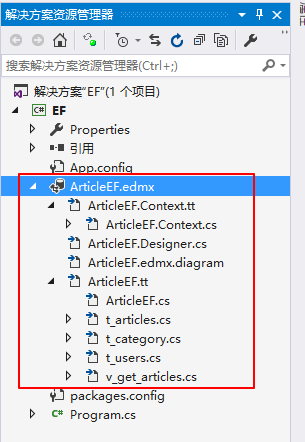

以上，针对Database First这种创建方式就完成了。

**有一点需要特别注意，EF只能映射具有主键的表，无主键的表是无法映射的。**

<a id="markdown-更新模型" name="更新模型"></a>
### 更新模型

以Database First为例，当底层库表结构发生变化时，需要更新模型，操作也很简单，

在Diagram界面右键选择【从数据库更新模型...】即可，如下：

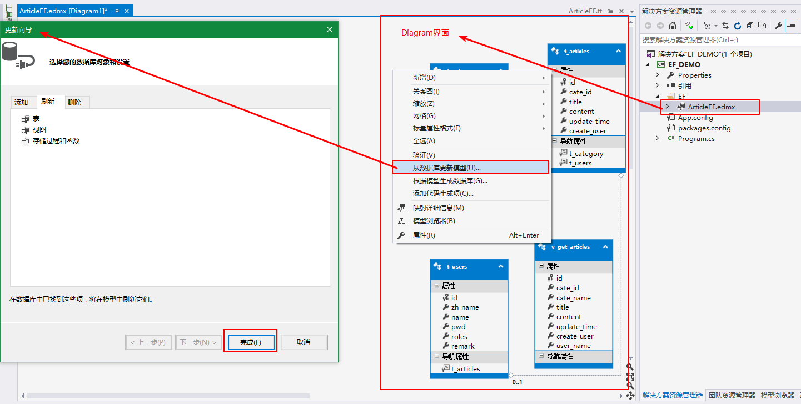

完成更新后，就会将底层最新的库表结构转换为实体类。

<a id="markdown-entity-client-方式" name="entity-client-方式"></a>
### Entity Client 方式
它是 ADO.NET Entity Framework 中的本地用户端 (Native Client)，它的对象模型和 ADO.NET 的其他用户端非常相似：

一样有 Connection, Command, DataReader 等对象，但最大的差异就是，

它有自己的 SQL 指令 (Entity SQL)，可以用 SQL 的方式访问 EDM。

实质上，还是把 EDM 当成一个实体数据库。

```cs
// 创建并打开连接
EntityConnection conn = new EntityConnection();

//ARTICLE_DBEntities 对应app.config中的配置
conn.ConnectionString = System.Configuration.ConfigurationManager.ConnectionStrings["ARTICLE_DBEntities"].ConnectionString;
conn.Open();
// 创建并执行命令
EntityCommand cmd = new EntityCommand();
cmd.Connection = conn;
cmd.CommandType = CommandType.Text;
/*
注意此处特别！！！注意以下两点：
1、不支持直接使用 *
2、表名前需要添加EDM名称，此处是 ARTICLE_DBEntities
*/
cmd.CommandText = "SELECT T.ID ,T.ZH_NAME ,T.NAME ,T.PWD ,T.ROLES FROM ARTICLE_DBENTITIES.T_USERS AS T";
EntityDataReader reader = cmd.ExecuteReader(CommandBehavior.SequentialAccess);
// 输出
while (reader.Read())
{
    for (int i = 0; i < reader.FieldCount; i++)
    {
        Console.Write(reader[i].ToString() + "\t");
    }
    Console.WriteLine();
}
// 关闭连接
conn.Close();
```

EF的重点和精华都不在Entity Client 方式，当然也不推荐这种用法，不如封装ADO.NET操作来的畅快自在。

<a id="markdown-object-context-方式" name="object-context-方式"></a>
### Object Context 方式
它是微软在 Entity Client 的上层加上了一个供编程语言直接访问的界面。实质上，是把 EDM 当成对象集合的访问。

DbContext的派生类【`ARTICLE_DBEntities`】相当于一个数据库，

之后实例化【`ARTICLE_DBEntities`】就相当于打开了一次数据库，跟数据库建立了一次连接。

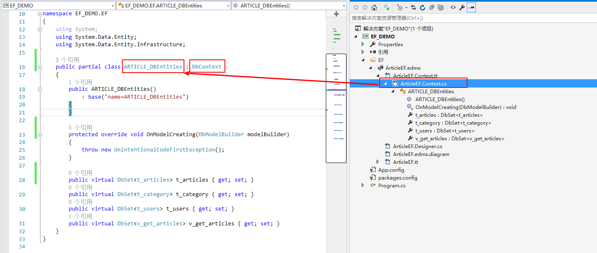

自定义构造方法的传参
```cs
//partial class 部分类
public partial class ARTICLE_DBEntities : DbContext
{
    /*
    自定义构造方法 其中的 name=ARTICLE_DBEntities 关联的是 app.config中connectionStrings节点下配置
    */
    public ARTICLE_DBEntities()
        : base("name=ARTICLE_DBEntities")
    {
    }
    
    //....
}
```

直接返回数据集合：
```cs
/// <summary>
/// v_get_article 为db中视图名称
/// 查询视图，返回泛型集合
/// </summary>
/// <returns></returns>
public static List<v_get_article> GetList()
{
    // 实例化EMD对象ARTICLE_DBEntities，数据库上下文
    using (ARTICLE_DBEntities context = new ARTICLE_DBEntities())
    {
        return context.v_get_article.ToList();
    }
}
```

通过lambda表达式 读取数据
```cs
//实例化EMD对象ARTICLE_DBEntities，数据库上下文
using (ARTICLE_DBEntities context = new ARTICLE_DBEntities())
{
    /*
    创建一个查询 lambda表达式的方式。
    可以理解为是一个SQL的封装，并没有执行查询
    */
    var query = context.v_get_articles
        .Where(t => t.cate_id == 2)
        .Select(t =>
            new
            {
                uname = t.user_name,
                uid = t.id,
                utitle = t.title,
                ucontent = t.content
            }
        );

    // ToList 将查询执行，并返回集合
    var res1 = context.t_users.Where(t => t.name == "w").ToList();

    //遍历打印 才会调用query查询
    foreach (var item in query)
    {
        //Console.WriteLine(item.title + "\t" + item.content);
        Console.WriteLine(item);
    }
}
```

<a id="markdown-linq-to-entities-方式" name="linq-to-entities-方式"></a>
### Linq to Entities 方式
因为EDM 的访问改变为一种对对象集合的访问方式，所以可以利用 LINQ 来访问 EDM。

```cs
//实例化EMD对象ARTICLE_DBEntities，数据库上下文
using (ARTICLE_DBEntities context = new ARTICLE_DBEntities())
{
    /* 创建一个查询 linq方式   
    */
    var query = from t in context.v_get_articles
                where t.user_name == "w"
                select new { a = t.title, b = t.content, c = t.user_name };

    //在调用时，才会真正的执行该查询，即从数据库进行实际查询操作
    foreach (var item in query)
    {
        Console.WriteLine(item);
    }
}
```

<a id="markdown-在三层架构中的应用" name="在三层架构中的应用"></a>
### 在三层架构中的应用

需要特别注意，通常将EntityFramework实体数据模型(edmx)放置在Model层，DAL层和UI层均需要添加对EntityFramework的引用。

可以使用NuGet程序包管理器添加EntityFramework的引用。

并且UI层MVC项目中的web.config文件需要添加EntityFramework的connectionStrings配置项，如下图所示：


<a id="markdown-ef应用" name="ef应用"></a>
## EF应用

<a id="markdown-添加数据" name="添加数据"></a>
### 添加数据
向数据库中添加数据就跟往List<>集合添加数据一样，不过最后需要调用SaveChanges()向数据库保存一下数据。

```cs
/// <summary>
/// t_article类 对应db中表结构
/// 可以直接在集合上进行添加，调用保存SaveChanges()即可
/// 保存后，自增序列主键也可以返回
/// </summary>
/// <param name="entity"></param>
/// <returns>自增序列的主键值</returns>
public static int Add(t_article entity)
{
    using (ARTICLE_DBEntities context = new ARTICLE_DBEntities())
    {
        context.t_article.Add(entity);
        context.SaveChanges();
        return entity.id;
    }
}
```

```cs
/// <summary>
/// t_article类 对应db中表结构
/// 可以直接在集合上进行添加，调用保存SaveChanges()即可
/// 保存后，自增序列主键也可以返回
/// </summary>
/// <param name="entity"></param>
/// <returns>自增序列的主键值</returns>
public static int Add(t_article entity)
{
    using (ARTICLE_DBEntities context = new ARTICLE_DBEntities())
    {
        // 使用 context.Entry() 方法进行修改
        context.Entry(entity).State = System.Data.Entity.EntityState.Added;
        context.SaveChanges();
        return entity.id;
    }
}
```

<a id="markdown-修改数据" name="修改数据"></a>
### 修改数据
先查询出你要修改的那条数据，之后直接更改其中的值就可以了。以上一节中新添加的数据为示例修改，如下：

```cs
//实例化EMD对象ARTICLE_DBEntities，数据库上下文
using (ARTICLE_DBEntities context = new ARTICLE_DBEntities())
{
    var cate = context.t_category.FirstOrDefault(t => t.name == "EntityFramework");
    if (null != cate)
    {
        cate.name = "EntityFramework_new";
        context.SaveChanges();
    }
}
```

基于实体对象，也可以使用`context.Entry()`方法进行修改：
```cs
/// <summary>
/// t_article类 为实体类
/// </summary>
/// <param name="entity"></param>
/// <returns></returns>
public static int Update(t_article entity)
{
    using (ARTICLE_DBEntities context = new ARTICLE_DBEntities())
    {
        // 设置对象状态为修改
        context.Entry(entity).State = System.Data.Entity.EntityState.Modified;

        int res = context.SaveChanges();
        return res;
    }
}
```

<a id="markdown-删除数据" name="删除数据"></a>
### 删除数据
使用EF删除数据就和在List<>集合中删除元素一样

```cs
/// <summary>
/// 根据ID删除
/// </summary>
/// <param name="id"></param>
/// <returns></returns>
public static int DeleteByID(int id)
{
    using (ARTICLE_DBEntities context = new ARTICLE_DBEntities())
    {
        t_article entity = context.t_article.FirstOrDefault(t => t.id == id);
        if (null == entity)
        {
            return -1;
        }
        context.t_article.Remove(entity);
        return context.SaveChanges();
    }
}
```

使用Entry()方法设置状态进行删除：
```cs
using (ARTICLE_DBEntities context = new ARTICLE_DBEntities())
{
    // 构造对象，删除业务只需要id即可
    t_article entity = new t_article() { id = id };
    context.Entry(entity).State = System.Data.Entity.EntityState.Deleted;

    return context.SaveChanges();
}
```

<a id="markdown-事务" name="事务"></a>
### 事务
在EF使用事务有两种方案，一种是EF自带的.BeginTransaction()方法，另一种是使用TransactionScope类。

使用BeginTransaction：
```cs
//实例化EMD对象ARTICLE_DBEntities，数据库上下文
using (ARTICLE_DBEntities context = new ARTICLE_DBEntities())
{
    //开始事务
    var tran = context.Database.BeginTransaction();

    try
    {
        var user = context.t_users.FirstOrDefault(t => t.name == "w");
        context.t_users.Remove(user);

        context.SaveChanges();

        //进行提交，否则开始事务后的操作在数据库并不会生效
        tran.Commit();
    }
    catch (Exception ex)
    {
        //发生异常则进行回滚
        tran.Rollback();
    }
}
```

使用TransactionScope，不需要手动进行回滚，当异常发生时会自动进行回滚，前提需要引用System.Transactions.dll，如下：
```cs
//实例化EMD对象ARTICLE_DBEntities，数据库上下文
using (ARTICLE_DBEntities context = new ARTICLE_DBEntities())
{
    //开始事务，有异常发生会跳出using TransactionScope代码块，TransactionScope 将自行释放并回滚该事务。
    using (var trans = new System.Transactions.TransactionScope())
    {
        var user = context.t_users.FirstOrDefault(t=>t.name=="w");
        context.t_users.Remove(user);

        context.SaveChanges();

        //提交操作
        trans.Complete();
    }
}
```

<a id="markdown-在entityframework6中执行sql语句" name="在entityframework6中执行sql语句"></a>
## 在EntityFramework6中执行SQL语句
前面的内容除了Entity Client 方式我们了SQL脚本，其余方式我们都没有写任何SQL脚本。

但不可避免的需要在EF中写SQL，比如需要根据条件更新/删除数据，使用集合Predicate方式就显得效率低下并且麻烦了。

使用EF执行SQL又比ADO.NET方便，特别是在执行查询语句的时候，EF会把查询到的数据自动保存到数据实体中，省去了使用DataReader的麻烦。

同时查询出来的数据还会进行跟踪，如果你修改了查询出的值，之后就可以很方便的使用.SaveChanges()直接更新到数据库了。

在数据上下文DBModel的实例中有个Database属性，其中有两组方法.ExecuteSqlCommand()和.SqlQuery()。它们都可以执行SQL语句。

<a id="markdown-executesqlcommand" name="executesqlcommand"></a>
### ExecuteSqlCommand
ExecuteSqlCommand()是不返回结果的，只返回受影响的行数，所以.ExecuteSqlCommand()更适合执行创建、更新、删除操作。

```cs
//实例化EMD对象ARTICLE_DBEntities，数据库上下文
using (ARTICLE_DBEntities context = new ARTICLE_DBEntities())
{
    //同步的方式执行SQL，并返回受影响的行数
    int result = context.Database.ExecuteSqlCommand(@"CREATE TABLE `test`.`test` (
        `id` INT NOT NULL,
        PRIMARY KEY(`id`)); ");

    //使用SqlParameter传值可以避免SQL注入
    var p_name = new SqlParameter("@name", "萝莉");
    var p_age = new SqlParameter("@age", 13);

    //更改学生年龄
    result = context.Database.ExecuteSqlCommand(@"UPDATE `test`.`student`
                                SET `age` = @age
                                WHERE `name` = @name;", p_age, p_name);

    //异步的方式执行SQL，并返回受影响的行数
    Task<int> result2 = context.Database.ExecuteSqlCommandAsync("DROP TABLE `test`.`test`;");
}
```

```cs
//实例化EMD对象ARTICLE_DBEntities，数据库上下文
using (ARTICLE_DBEntities context = new ARTICLE_DBEntities())
{
    string sql = "INSERT INTO T_ARTICLE (TITLE,CATEGORY) VALUES (@TITLE,@CATEGORY)";
    SqlParameter[] sqlParams = new SqlParameter[] {
        new SqlParameter("@TITLE",entity.title),
        new SqlParameter("@CATEGORY",entity.category),
    };

    // 执行sql，和SqlHelper的操作非常相似
    int res = context.Database.ExecuteSqlCommand(sql, sqlParams);
    return res;
}
```

<a id="markdown-sqlquery" name="sqlquery"></a>
### SqlQuery
SqlQuery()返回查询到的结果，并将结果保存在数据实体中，所以更适合执行查询操作。

从名字就看的出来.SqlQuery()是用来执行查询的。

.SqlQuery()使用前需指定返回值的数据类型，比如我查询寻一条学生的完整信息，类型就可以指定为student类型。

如果是统计有多少个学生，返回值是个整数，就以设置为int。

**注意：不仅返回值的个数必须与传入类型中属性值的个数相同，而且名称还必须一样，不然会出错。**

那么如果我只想获取姓名和年龄，那就得单独定义一个类（其中包含一个string类型的name和int类型的age），来保存数据了。

```cs
//实例化EMD对象ARTICLE_DBEntities，数据库上下文
using (ARTICLE_DBEntities context = new ARTICLE_DBEntities())
{
    /*
    按条件返回集合，以下两种方式均可。
    注意，如果没有ToList()，查询并不会执行
    */
    var list = context.Database.SqlQuery<t_users>("SELECT * FROM T_USERS").ToList();

    /*
    按条件查询返回实体，如果没有符合条件的数据，则返回为null
    注意，如果没有FirstOrDefault()的调用，查询并不会执行
    */
    var res1 = context.Database.SqlQuery<t_users>("SELECT  * FROM T_USERS WHERE NAME = 'www'").FirstOrDefault();

    /*
    统计数目
    注意，如果没有FirstOrDefault()的调用，查询并不会执行
    */
    var result2 = context.Database.SqlQuery<int>("SELECT  COUNT(*) FROM T_USERS");
    Console.WriteLine(result2.FirstOrDefault());

    /*
    按条件返回自定义对象
    注意，如果没有FirstOrDefault()的调用，查询并不会执行
    */
    var result3 = context.Database.SqlQuery<SimpleUser>("SELECT NAME,PWD FROM T_USERS").ToList();

    /*
    SqlQuery同样也支持 SqlParameter传参，以防止sql注入危险
    */
    //使用SqlParameter传值可以避免SQL注入
    var sqlpams = new SqlParameter[] { 
        new SqlParameter("@NAME", "admin");
    };
    var result4 = context.Database.SqlQuery<SimpleUser>("SELECT NAME,PWD FROM T_USERS WHERE NAME = @NAME", sqlpams).ToList();
}
```

<a id="markdown-dbset下的sqlquery" name="dbset下的sqlquery"></a>
### DbSet下的SqlQuery
在每个数据实体集合DbSet<T>下也有一个.SqlQuery()，功能与上面介绍的一样，只不过DbSet<T>下的.SqlQuery()只能返回DbSet<T>中包含的类型。

但DbSet<T>下的.SqlQuery()在返回数据的同时还会让数据库上下文（DBModel）跟踪返回数据的状态，

如果返回的数据发生了修改，就可以使用.SaveChanges()将结果直接保存回数据库。

而.Database.SqlQuery()查出的结果则是做不到的。

```cs
//实例化EMD对象ARTICLE_DBEntities，数据库上下文
using (ARTICLE_DBEntities context = new ARTICLE_DBEntities())
{
    //查询一个用户实体
    t_users user = context.t_users.SqlQuery("SELECT * FROM T_USERS WHERE NAME = 'w'").FirstOrDefault();

    //存在该用户则进行修改
    if (null != user)
    {
        //实体集合下获取数据，修改后是可以再保存到数据库的
        user.zh_name = "悔创阿里杰克马";

        context.SaveChanges();
    }
}
```

<a id="markdown-ef存储过程" name="ef存储过程"></a>
### EF存储过程

基于前面章节所提到的存储过程`sp_paged_data`参见[sp_paged_data](../DB/SQLServer_Program.md)

分页类Pager参见[Pager](./ADO.NET.md)

以分页查询为例，封装方法如下：

```cs
/// <summary>
/// 分页查询 调用存储过程
/// </summary>
/// <typeparam name="T">实体类</typeparam>
/// <param name="sqlTable">关系表名</param>
/// <param name="sqlColumns">投影列，如*</param>
/// <param name="sqlWhere">条件子句(可为空)，eg：and id=1 </param>
/// <param name="sqlSort">排序语句(不可为空，必须有排序字段)，eg：id</param>
/// <param name="pageIndex">当前页码索引号，从0开始</param>
/// <param name="pageSize">每页显示的记录条数</param>
/// <returns>分页对象</returns>
public static Pager<T> QueryPager<T>(string sqlTable, string sqlColumns, string sqlWhere
    , string sqlSort, int pageIndex, int pageSize)
{
    using (db_ArticleEntities context = new db_ArticleEntities())
    {
        // 需要执行的sql和参数
        string sql = @"
sp_paged_data @sqlTable,@sqlColumns,@sqlWhere,@sqlSort,@pageIndex,@pageSize,@rowTotal out
";
        // output 参数，单独定义是为了查询后方便获取存储返回的值
        SqlParameter parTotal = new SqlParameter("@rowTotal", System.Data.SqlDbType.Int)
        {
            Direction = System.Data.ParameterDirection.Output
        };
        SqlParameter[] sqlps = new SqlParameter[] {
            new SqlParameter("@sqlTable",sqlTable),
            new SqlParameter("@sqlColumns",sqlColumns),
            new SqlParameter("@sqlWhere",sqlWhere),
            new SqlParameter("@sqlSort",sqlSort),
            new SqlParameter("@pageIndex",pageIndex),
            new SqlParameter("@pageSize",pageSize),
            parTotal
        };

        Pager<T> pager = new Pager<T>();
        pager.Rows = context.Database.SqlQuery<T>(sql, sqlps).ToList();
        pager.Total = int.Parse(parTotal.Value.ToString());

        return pager;
    }
}
```

封装调用如下：
```cs
// 分页查询视图 v_get_article 第3页 每页10条记录
var res = ArticleMgr.Manager.QueryPager<V_GET_ARTICLE>("v_get_article", "*", "", "id", 2, 10);
```


<a id="markdown-其他" name="其他"></a>
## 其他
<a id="markdown-命令更新" name="命令更新"></a>
### 命令更新
> https://github.com/aspnetboilerplate/aspnetboilerplate-samples/tree/master/PlugInDemo

git上ABP项目PlugInDemo为例，运行前需要执行Update-Database迁移Entity Framework。如下图


<a id="markdown-objectdisposedexception" name="objectdisposedexception"></a>
### ObjectDisposedException

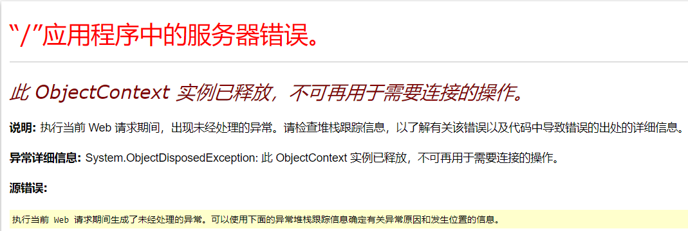

关闭延迟加载，不加载关联实体。

或删除外键，并更新实体类即可。实体类中需要移除关联属性，否则仍然无法加载。

```cs
[Table("Employee")]
public partial class Employee
{
    [DatabaseGenerated(DatabaseGeneratedOption.None)]
    public int EmployeeID { get; set; }

    [StringLength(50)]
    public string EmployeeName { get; set; }

    [StringLength(2)]
    public string Sex { get; set; }

    [Column(TypeName = "smalldatetime")]
    public DateTime? BirthDate { get; set; }

    [Column(TypeName = "smalldatetime")]
    public DateTime? HireDate { get; set; }

    [Column(TypeName = "money")]
    public decimal? Salary { get; set; }

    public int? DepartmentID { get; set; }

    // 需要注释，否则仍无法加载
    //public virtual Department Department { get; set; }
}
```


---

参考引用：

[初识EntityFramework6](http://www.cnblogs.com/wujingtao/p/5401132.html)

[.NET Entity Framework(EF)使用SqlQuery直接操作SQL查询语句或者执行过程](https://www.ofnhkb1.com/chenmo/128.html)

[8天掌握EF的Code First开发系列之动手写第一个Code First应用](https://www.cnblogs.com/farb/p/FirstCodeFirstApp.html)

[Code First开发系列之领域建模和管理实体关系](https://www.cnblogs.com/farb/p/CodeFirstDomainModeling.html)

[Code First开发系列之数据库迁移](https://www.cnblogs.com/farb/p/DBMigration.html)

[Code First 到现有数据库](https://docs.microsoft.com/zh-cn/ef/ef6/modeling/code-first/workflows/existing-database#3-reverse-engineer-model)

[Code First Data Annotations数据注解](https://docs.microsoft.com/zh-cn/ef/ef6/modeling/code-first/data-annotations)

