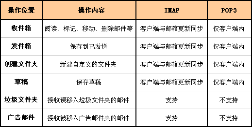

<a id="markdown-socket" name="socket"></a>
# Socket

<a id="markdown-socket编程" name="socket编程"></a>
## Socket编程

网络上的两个程序通过一个双向的通信连接实现数据的交换，这个连接的一端称为一个socket。

建立网络通信连接至少要一对端口号(socket)。

socket本质是编程接口(API)，对TCP/IP的封装，TCP/IP也要提供可供程序员做网络开发所用的接口，这就是Socket编程接口；

HTTP是轿车，提供了封装或者显示数据的具体形式；Socket是发动机，提供了网络通信的能力。

<a id="markdown-网络通讯协议" name="网络通讯协议"></a>
### 网络通讯协议
关于网络通讯协议模型，通常会说到两种：OSI和TCP/IP

开放式系统互联通信参考模型（英语：Open System Interconnection Reference Model，缩写为OSI），简称为OSI模型（OSI model），一种概念模型，由国际标准化组织（ISO）提出，一个试图使各种计算机在世界范围内互连为网络的标准框架。被TCP/IP淘汰，没有大规模应用。

Transmission Control Protocol/Internet Protocol的简写，中译名为传输控制协议/因特网互联协议，又名网络通讯协议，是Internet最基本的协议、Internet国际互联网络的基础，由网络层的IP协议和传输层的TCP协议组成。

OSI七层和TCP/IP四层的关系：
1. OSI引入了服务、接口、协议、分层的概念，TCP/IP借鉴了OSI的这些概念建立TCP/IP模型。
2. OSI先有模型，后有协议，先有标准，后进行实践；而TCP/IP则相反，先有协议和应用再提出了模型，且是参照的OSI模型。
3. OSI是一种理论下的模型，而TCP/IP已被广泛使用，成为网络互联事实上的标准。


<a id="markdown-tcp和udp" name="tcp和udp"></a>
### TCP和UDP
TCP与UDP基本区别:
1. TCP面向连接（如打电话要先拨号建立连接）;UDP是无连接的，即发送数据之前不需要建立连接
2. TCP提供可靠的服务。也就是说，通过TCP连接传送的数据，无差错，不丢失，不重复，且按序到达;UDP尽最大努力交付，即不保   证可靠交付
3. TCP面向字节流，实际上是TCP把数据看成一连串无结构的字节流;UDP是面向报文的UDP没有拥塞控制，因此网络出现拥塞不会使源主机的发送速率降低（对实时应用很有用，如IP电话，实时视频会议等）
4. 每一条TCP连接只能是点到点的;UDP支持一对一，一对多，多对一和多对多的交互通信
5. TCP首部开销20字节;UDP的首部开销小，只有8个字节
6. TCP的逻辑通信信道是全双工的可靠信道，UDP则是不可靠信道

UDP应用场景：
1. 面向数据报方式
2. 网络数据大多为短消息 
3. 拥有大量Client
4. 对数据安全性无特殊要求
5. 网络负担非常重，但对响应速度要求高

具体编程时的区别:
1. socket()的参数不同 
2. UDP Server不需要调用listen和accept 
3. UDP收发数据用sendto/recvfrom函数 
4. TCP：地址信息在connect/accept时确定 
5. UDP：在sendto/recvfrom函数中每次均 需指定地址信息 
6. UDP：shutdown函数无效

```cs
// TCP协议，创建基于流的tcp协议套接字对象
Socket tcpClient = new Socket(AddressFamily.InterNetwork, SocketType.Stream, ProtocolType.Tcp);

// UDP协议，创建基于数据报的udp套接字对象
Socket udpClient = new Socket(AddressFamily.InterNetwork, SocketType.Dgram, ProtocolType.Udp);
```

相关类及方法：

类/方法 | 说明
-----|-----
IPAddress类 | 包含了一个IP地址
IPEndPoint类 | 包含了一对IP地址和端口号
socket.Bind() | 绑定一个本地的IP和端口号(IPEndPoint)
socket.Listen() | 让 Socket侦听传入的连接尝试，并指定侦听队列容量
socket.Connect() | 初始化与另一个Socket的连接
socket.Accept() | 接收连接并返回一个新的socket
socket.Send() | 输出数据到Socket
socket.Receive() | 从Socket中读取数据
socket.Close() | 关闭Socket

<a id="markdown-udp" name="udp"></a>
#### UDP
客户端代码：
```cs
class Program
{
    // 服务端 ip地址
    static IPAddress ipServer = IPAddress.Parse("127.0.0.1");
    // 服务端 监听端口
    static int port = 10050;

    static void Main(string[] args)
    {
        // 创建客户端基于数据报的UDP套接字对象。
        using (Socket client = new Socket(AddressFamily.InterNetwork, SocketType.Dgram, ProtocolType.Udp))
        {
            // 建立远程服务端的地址，用于将消息发送到该地址上（端口要和服务端监听的端口保持一致，此例中端口号为10050）。
            IPEndPoint serverEp = new IPEndPoint(ipServer, port);

            while (true)
            {
                Console.WriteLine("发送消息：");
                string msg = Console.ReadLine();

                if (msg.ToLower() == "exit")
                {
                    break;
                }

                // 发送消息给远程服务端。
                byte[] buffer = Encoding.UTF8.GetBytes(msg);
                client.SendTo(buffer, serverEp);
            }
        }
    }
}
```

服务端代码：
```cs
class Program
{
    // 服务端 ip地址
    static IPAddress ipServer = IPAddress.Any;
    // 服务端 监听端口
    static int port = 10050;

    static void Main(string[] args)
    {
        Thread thReceive = new Thread(new ThreadStart(Receive));
        thReceive.IsBackground = true;
        thReceive.Start();

        Console.ReadLine();
    }

    static void Receive()
    {
        // 创建服务端基于数据报的UDP套接字对象。
        using (Socket server = new Socket(AddressFamily.InterNetwork, SocketType.Dgram, ProtocolType.Udp))
        {
            // 将该套接字对象绑定到本机端口上。
            IPEndPoint serverEp = new IPEndPoint(ipServer, port);
            server.Bind(serverEp);

            while (true)
            {
                // 创建空的IP节点，用于保存发给本机消息的远程客户端
                EndPoint clientEp = new IPEndPoint(IPAddress.Any, 0);

                // 循环监听该端口，如果有客户端发来的消息则直接显示，关键代码见下面。
                byte[] buffer = new byte[1024];
                int count = server.ReceiveFrom(buffer, ref clientEp);
                string msg = Encoding.UTF8.GetString(buffer, 0, count);

                // 消息输出
                Console.WriteLine((clientEp as IPEndPoint).Address.ToString() + ">>" + msg);
            }
        }
    }
}
```

将服务端程序拷贝至另外一台机器进行模拟测试，使用远程登录查看通讯，结果如下：


以上只需设置好本地和远程的IP和端口号，很容易就实现了UDP的通信,同理，双向通讯也是一样的。

虽然UDP数据包不能保证可靠传输，网络繁忙、拥塞等因素，都有可能阻止数据包到达指定的目的地。

在即时通信上常有应用，如QQ就是是利用UDP进行即时通信的。

<a id="markdown-tcp" name="tcp"></a>
#### TCP
服务器端的步骤如下：
1. 建立服务器端的Socket，开始侦听整个网络中的连接请求。
2. 当检测到来自客户端的连接请求时，向客户端发送收到连接请求的信息，并建立与客户端之间的连接。
3. 当完成通信后，服务器关闭与客户端的Socket连接。

客户端的步骤如下：
1. 建立客户端的Socket，确定要连接的服务器的主机名和端口。
2. 发送连接请求到服务器，并等待服务器的回馈信息。
3. 连接成功后，与服务器进行数据的交互。
4. 数据处理完毕后，关闭自身的Socket连接。

服务端代码如下：
```cs
class Program
{
    // 服务端ip地址，或者设置为一个固定的ip地址
    /*
    static string ip = "127.0.0.1";
    static IPAddress ipServer = IPAddress.Parse(ip);
    */

    // 指示服务器必须侦听所有网络接口上的客户端活动。
    static IPAddress ipServer = IPAddress.Any;
    // 服务端监听端口
    static int port = 10050;
    // 字节数据 1KB大小 1024字节
    static byte[] buffer = new byte[1024];
    // 服务端socket，用于监听是否有客户端连接
    static Socket serverSocket;

    static void Main(string[] args)
    {
        // 实例化tcp socket连接
        serverSocket = new Socket(AddressFamily.InterNetwork, SocketType.Stream, ProtocolType.Tcp);
        // 绑定IP地址：端口
        serverSocket.Bind(new IPEndPoint(ipServer, port));
        //设定最多32个排队连接请求
        serverSocket.Listen(32);

        Console.WriteLine($"启动监听{serverSocket.LocalEndPoint}成功");

        Thread thListen = new Thread(new ThreadStart(ListenClientConnect));
        thListen.Start();

        Console.ReadLine();
    }

    /// <summary>
    /// 监听客户端是否有连接请求
    /// </summary>
    static void ListenClientConnect()
    {
        while (true)
        {
            // 一旦发现有客户端连接，实例化一个该通信的套接字
            Socket clientSocket = serverSocket.Accept();
            // 向连接的客户端问好
            clientSocket.Send(Encoding.UTF8.GetBytes("Server Say Hello To U"));
            // 开辟线程，循环监听接受数据
            Thread receiveThread = new Thread(ReceiveMessage);
            receiveThread.Start(clientSocket);

            // 每500ms监听一次是否有客户端请求
            Thread.Sleep(500);
        }
    }

    static void ReceiveMessage(object clientSocket)
    {
        Socket myClientSocket = (Socket)clientSocket;
        while (myClientSocket.Connected)
        {
            try
            {
                //通过myClientSocket接收数据
                int length = myClientSocket.Receive(buffer);
                if (length > 0)
                {
                    Console.WriteLine($"接收客户端{myClientSocket.RemoteEndPoint}消息{Encoding.UTF8.GetString(buffer, 0, length)}");
                }
                else
                {
                    //  当length为0时，为关闭连接
                    Console.WriteLine($"客户端{myClientSocket.RemoteEndPoint}已断开连接。。。");
                    myClientSocket.Shutdown(SocketShutdown.Both);
                    myClientSocket.Close();
                }
            }
            catch (Exception ex)
            {
                Console.WriteLine(ex.Message);
                myClientSocket.Shutdown(SocketShutdown.Both);
                myClientSocket.Close();
            }
        }
    }
}
```

客户端代码：
```cs
class Program
{
    // 服务端ip地址
    static IPAddress ipServer = IPAddress.Parse("127.0.0.1");

    // 服务端监听端口
    static int port = 10050;
    // 字节数据 1KB大小 1024字节
    static byte[] buffer = new byte[1024];

    static void Main(string[] args)
    {
        Socket clientSocket = new Socket(AddressFamily.InterNetwork, SocketType.Stream, ProtocolType.Tcp);
        try
        {
            clientSocket.Connect(new IPEndPoint(ipServer, port));
            Console.WriteLine("连接服务器成功");
        }
        catch (SocketException ex)
        {
            Console.WriteLine(ex);
        }

        //通过clientSocket接收数据
        int receiveLength = clientSocket.Receive(buffer);
        Console.WriteLine("接收服务器消息：{0}", Encoding.UTF8.GetString(buffer, 0, receiveLength));

        try
        {
            while (true)
            {
                Console.Write("发送消息：");
                string message = Console.ReadLine();
                if (message == "exit")
                {
                    break;
                }
                clientSocket.Send(Encoding.UTF8.GetBytes(message));
            }
        }
        catch (Exception ex)
        {
            Console.WriteLine(ex);
        }
        finally
        {
            // 关闭连接
            clientSocket.Shutdown(SocketShutdown.Both);
            clientSocket.Close();
        }
    }
}
```

运行效果如下：


<a id="markdown-邮件发送" name="邮件发送"></a>
## 邮件发送
Internet电子邮件系统是基于客户机/服务器方式：
1. 客户端，即用户代理，负责邮件的编写、发送和接收。
2. 服务器端，即传输代理，负责邮件的传输。

<a id="markdown-协议" name="协议"></a>
### 协议
电子邮件在发送和接收的过程中还要遵循一些基本协议和标准，这些协议主要有SMTP、POP3、IMAP、MIME等。

SMTP（Simple Mail Transfer Protocol，简单邮件传输协议）用于主机与主机之间的电子邮件交换。

如果想要从邮件服务器读取或下载邮件时必须要有邮件读取协议。现在常用的邮件读取协议有两个：

1. POP3协议（Post Office Protocol 3，邮局协议的第三版本），但是在客户端的操作（如移动邮件、标记已读等），不会反馈到服务器上。
2. IMAP协议（Internet Mail Access Protocol，交互式邮件访问协议），客户端的操作都会反馈到服务器上，对邮件进行的操作，服务器上的邮件也会做相应的动作。



简单来说，SMTP协议主要是用于发邮件，POP和IMAP协议用于读取、删除、下载邮件。

<a id="markdown-邮件发送-1" name="邮件发送-1"></a>
### 邮件发送
首先需要添加引用【using System.Net.Mail;】

```cs
// 创建一封邮件对象
MailMessage mail = new MailMessage();
// 发件人地址，发件人需要与设置的邮件发送服务器的邮箱一致
mail.From = new MailAddress("flycoder@126.com", "飞翔的代码");
// 邮件主题
mail.Subject = "C# smtp 发送邮件测试";
// 邮件正文
mail.Body = $@"
    {DateTime.Now.ToString()}
    using System;
    using System.Collections.Generic;
    using System.Configuration;
    using System.IO;
    using System.Linq;
    using System.Net.Mail;
    using System.Runtime.Serialization.Formatters.Binary;
    using System.Text;
    using System.Threading;
    using System.Threading.Tasks;
    using System.Xml;
    using System.Xml.Linq;
    ";

// 添加接收人，接收人是一个列表 （收件人：你邮件里的话就是直接讲给这个人听的）
mail.To.Add(new MailAddress("ywwang5@iflytek.com"));

// 添加抄送人，接收人是一个列表 （抄送人：只是让被抄送人知悉这件事情，但被抄送人无需做任何动作）
mail.CC.Add(new MailAddress("now_way@126.com"));

// 网易的SMTP校验很严格，有时候会报 DT:SPM 发送的邮件内容包含了未被许可的信息，或被系统识别为垃圾邮件。
// 添加对自己的抄送即可
mail.CC.Add(new MailAddress("flycoder@126.com"));

using (SmtpClient client = new SmtpClient())
{
    // 设置用于 SMTP 事务的主机的名称，此处为126邮箱。qq邮箱则为 smtp.qq.com
    client.Host = "smtp.126.com";
    // 这里才是真正的邮箱登陆名和密码，比如我的邮箱地址是 flycoder@126.com， 我的用户名为 flycoder ，客户端授权密码为 flycoder666
    client.Credentials = new System.Net.NetworkCredential("flycoder", "flycoder666");
    // 邮件处理方式
    client.DeliveryMethod = SmtpDeliveryMethod.Network;

    client.Send(mail);

    Console.WriteLine("发送成功！");
}
```

<!-- TOC -->

- [Socket](#socket)
    - [Socket编程](#socket编程)
        - [网络通讯协议](#网络通讯协议)
        - [TCP和UDP](#tcp和udp)
            - [UDP](#udp)
            - [TCP](#tcp)
    - [邮件发送](#邮件发送)
        - [协议](#协议)
        - [邮件发送](#邮件发送-1)

<!-- /TOC -->


同时，不要忘记开启服务，如下：


网易邮箱的SMTP发送校验较为严格，关于发送邮件的相关帮助如下：

> http://help.163.com/09/1224/17/5RAJ4LMH00753VB8.html


---

参考引用：

[c#Socket Tcp服务端编程](https://www.cnblogs.com/kellen451/p/7127670.html)

[C#使用Socket实现服务器与多个客户端通信(简单的聊天系统)](https://blog.csdn.net/luming666/article/details/79125453)

[C# socket连接断开问题](https://blog.csdn.net/u014722754/article/details/51318583)

[Socket 与 WebSocket](http://www.cnblogs.com/ederwin/articles/5315422.html)

[在 Asp.NET MVC 中使用 SignalR 实现推送功能](http://blog.csdn.net/kesalin/article/details/8166925)

