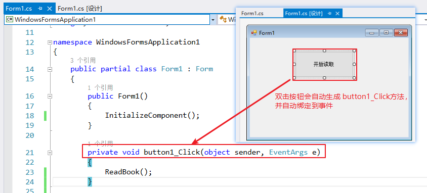

<!-- TOC -->

- [多线程](#多线程)
    - [同步异步](#同步异步)
        - [概念](#概念)
        - [区别体现](#区别体现)
        - [同步案例](#同步案例)
        - [异步案例](#异步案例)
    - [多线程](#多线程-1)
        - [什么是进程？](#什么是进程)
        - [什么是线程？](#什么是线程)
        - [线程创建](#线程创建)
        - [线程状态及属性](#线程状态及属性)
            - [Sleep()](#sleep)
            - [Join()](#join)
        - [前台线程与后台线程](#前台线程与后台线程)
        - [线程安全](#线程安全)

<!-- /TOC -->

<a id="markdown-多线程" name="多线程"></a>
# 多线程

<a id="markdown-同步异步" name="同步异步"></a>
## 同步异步
<a id="markdown-概念" name="概念"></a>
### 概念

**同步方法**调用一旦开始，调用者必须等到方法调用返回后，才能继续后续的行为。

**异步方法**调用更像一个消息传递，一旦开始，方法调用就会立即返回，调用者就可以继续后续的操作。

异步方法通常会在另外一个线程中，“真实”地执行着。整个过程，不会阻碍调用者的工作。

举个生活中烧开水的案例，用普通铁锅和用电热水壶的区别体现：

用铁锅进行烧水，我们在锅前坐等水烧开，这种方式就是同步通信方式。

用电热水壶烧水，按下开关后则不会管了，等水烧开会有提示并自动断电，这体现了异步通信方式。

<a id="markdown-区别体现" name="区别体现"></a>
### 区别体现
了体现同步和异步的区别，准备一本10MB的小说，以文件流的方式进行读取并打印在控制台显示

<a id="markdown-同步案例" name="同步案例"></a>
### 同步案例

新建【Windows窗体应用程序】，并修改属性输出类型为【控制台应用程序】，在窗体【Form1.cs】中添加按钮，如下：



```cs
private void button1_Click(object sender, EventArgs e)
{
    // 同步方式调用
    ReadBook();
}

void ReadBook()
{
    using (StreamReader sr = new StreamReader(@"..\..\斗破苍穹.txt", Encoding.Default))
    {
        string content;
        while ((content = sr.ReadLine()) != null)
        {
            Console.WriteLine(content);
        }
        Console.WriteLine("读完了！！！");
    }
}
```

运行程序，点击【开始读取】按钮，在小说打印显示完成之前，窗体是无法进行拖动和操作的。

这种方式体现了同步通信的方式，前台线程会一直在【button1_Click】方法中执行等待。。。

<a id="markdown-异步案例" name="异步案例"></a>
### 异步案例
在上述案例中，修改【button1_Click】方法中执行【ReadBook】的方式，如下：

```cs
private void button1_Click(object sender, EventArgs e)
{
    // 多线程方式进行异步调用
    Thread thBook = new Thread(new ThreadStart(ReadBook));
    thBook.Start();
}

void ReadBook()
{
    using (StreamReader sr = new StreamReader(@"..\..\斗破苍穹.txt", Encoding.Default))
    {
        string content;
        while ((content = sr.ReadLine()) != null)
        {
            Console.WriteLine(content);
        }
        Console.WriteLine("读完了！！！");
    }
}
```

以异步的方式进行执行耗时的操作时，UI主线程并不会因为执行耗时操作而卡死，可以带来更好的体验。

<a id="markdown-多线程-1" name="多线程-1"></a>
## 多线程
<a id="markdown-什么是进程" name="什么是进程"></a>
### 什么是进程？
当一个程序开始运行时，它就是一个进程，进程包括运行中的程序和程序所使用到的内存和系统资源。而一个进程又是由多个线程所组成的。

<a id="markdown-什么是线程" name="什么是线程"></a>
### 什么是线程？
线程是程序中的一个执行流，每个线程都有自己的专有寄存器(栈指针、程序计数器等)，但代码区是共享的，即不同的线程可以执行同样的函数。

在【任务管理器】中我们可以明显的看到：


线程初体验：
```cs
static void Main(string[] args)
{
    //设置当前线程名称，默认为null
    Thread.CurrentThread.Name = "My Thread Demo";
    Console.WriteLine(Thread.CurrentThread.Name);//打印当前线程名称
    Console.WriteLine(Thread.CurrentThread.ThreadState);//打印当前线程状态
}
```

多线程的优点：
* 可以同时完成多个任务；
* 可以使程序的响应速度更快；
* 可以让占用大量处理时间的任务或当前没有进行处理的任务定期将处理时间让给别的任务；
* 可以随时停止任务；
* 可以设置每个任务的优先级以优化程序性能。

然而，多线程虽然有很多优点，但是也必须认识到多线程可能存在影响系统性能的不利方面，才能正确使用线程。弊端主要有如下几点：
* 线程也是程序，所以线程需要占用内存，线程越多，占用内存也越多。
* 多线程需要协调和管理，所以需要占用CPU时间以便跟踪线程[时间空间转换，简称时空转换]。
* 线程之间对共享资源的访问会相互影响，必须解决争用共享资源的问题。
* 线程太多会导致控制太复杂，最终可能造成很多程序缺陷。

<a id="markdown-线程创建" name="线程创建"></a>
### 线程创建
调用线程Thread类的构造函数进行创建：
```cs
static void Main(string[] args)
{
    /*
    ThreadStart是一个线程委托，可以理解为一个方法指针，指向一个方法的地址
    注意这个ThreadStart委托是无返回值无参，传递的方法也应该无返回值无参
    public delegate void ThreadStart();
    */
    Thread threadVoid = new Thread(new ThreadStart(Say));
    //启动该线程
    threadVoid.Start();

    /*
    同样的，ParameterizedThreadStart也是一个线程委托，无返回值，参数为object，传递的方法也需要满足这个条件
    public delegate void ParameterizedThreadStart(object obj);
    */
    Thread threadParam = new Thread(new ParameterizedThreadStart(Talk));
    //启动有参数线程
    threadParam.Start("王富贵");
}

static void Say()
{
    for (int i = 0; i < 100; i++)
    {
        Console.WriteLine("Say Hi,time:" + DateTime.Now.ToString("mm:ss.fff"));
    }
}

static void Talk(object obj)
{
    for (int i = 0; i < 100; i++)
    {
        Console.WriteLine(obj.ToString() + "'s Talk Show,time:" + DateTime.Now.ToString("mm:ss.fff"));
    }
}
```

上述线程的执行结果反映了线程的无序性质。

通过执行结果我们会看到，主线程和子线程不是一味的执行，是兼续的。也就是说主线程和子线程在执行过程中是互相抢CPU资源进行计算的。

一旦开始，一个线程的IsAlive属性返回true,直到这个线程结束。

当传递给线程的构造函数的委托完成执行时，这个线程结束。一旦结束，该线程无法重新启动。

<a id="markdown-线程状态及属性" name="线程状态及属性"></a>
### 线程状态及属性
线程常用属性：

属性名称 | 说明
-----|---
CurrentContext | 获取线程正在其中执行的当前上下文。
CurrentThread | 获取当前正在运行的线程。
ExecutionContext | 获取一个 ExecutionContext 对象，该对象包含有关当前线程的各种上下文的信息。
IsAlive | 获取一个值，该值指示当前线程的执行状态。
IsBackground | 获取或设置一个值，该值指示某个线程是否为后台线程。
IsThreadPoolThread | 获取一个值，该值指示线程是否属于托管线程池。
ManagedThreadId | 获取当前托管线程的唯一标识符。
Name | 获取或设置线程的名称。
Priority | 获取或设置一个值，该值指示线程的调度优先级。
ThreadState | 获取一个值，该值包含当前线程的状态。

Thread 中包括了多个方法来控制线程的创建、挂起、停止、销毁

方法名称 | 说明
-----|---
Abort()　　　　 | 终止本线程。
GetDomain() | 返回当前线程正在其中运行的当前域。
GetDomainId() | 返回当前线程正在其中运行的当前域Id。
Interrupt() | 中断处于 WaitSleepJoin 线程状态的线程。
Join() | 已重载。 阻塞调用线程，直到某个线程终止时为止。
Resume() | 继续运行已挂起的线程。
Start()　　 | 执行本线程。
Suspend() | 挂起当前线程，如果当前线程已属于挂起状态则此不起作用
Sleep()　　 | 把正在运行的线程挂起一段时间。

<a id="markdown-sleep" name="sleep"></a>
#### Sleep()
Thread.Sleep暂停当前线程一段指定的时间：

```cs
static void Main()
{
    for (int i = 0; i < 5; i++)
    {
        Console.WriteLine("Sleep for 2 seconds.");
        Thread.Sleep(2000);
    }

    Console.WriteLine("Main thread exits.");
}

/* This example produces the following output:

Sleep for 2 seconds.
Sleep for 2 seconds.
Sleep for 2 seconds.
Sleep for 2 seconds.
Sleep for 2 seconds.
Main thread exits.
 */
```

<a id="markdown-join" name="join"></a>
#### Join()
Join() 实例方法，阻塞调用线程，直到某个线程终止时为止。

```cs
static void Main(string[] args)
{
    Thread th1 = new Thread(new ThreadStart(HearBeat));
    Console.WriteLine("Start...");
    th1.Start();

    // 调用Join()方法，阻塞调用线程，直到子线程执行完成
    th1.Join();

    Console.WriteLine("Done!");
    Console.ReadLine();
}

static void HearBeat()
{
    int index = 0;
    while (index < 10)
    {
        Thread.Sleep(500);
        Console.WriteLine(index + "我还活着。。。");
        index++;
    }
}
```

结果如图所示：


主线程会被阻塞， 直到子线程执行完成。如果去掉Join()方法，主线程则不会阻塞，如图：


<a id="markdown-前台线程与后台线程" name="前台线程与后台线程"></a>
### 前台线程与后台线程
线程本身并不是任何高级语言的概念，本身是计算机的概念，只是高级语言给予封装了一层。

前台线程：窗体Ui主线程退出（销毁）以后，子线程必须计算完成才能退出。

后台线程：窗体Ui主线程退出（销毁）以后，子线程就会退出。

新建一个Windows窗体应用程序，打开项目中【Properties】属性窗口，将项目的输出类型修改为【控制台应用程序】，如下图示例：


Form1中添加一个按钮，并且新增处理事件，代码如下：
```cs
private void button1_Click(object sender, EventArgs e)
{
    Console.WriteLine("开始心跳...");
    Thread th1 = new Thread(new ThreadStart(HeartBeat));
    /* 
    是否设置为后台线程
    默认为false，即主线程退出后会等待子线程执行结束
    为true时，关闭主线程则子线程也会退出
    */
    th1.IsBackground = true;
    th1.Start();
}

void HeartBeat()
{
    int index = 0;
    while (index < 10)
    {
        Thread.Sleep(1000);
        Console.WriteLine(index + "我还活着。。。");
        index++;
    }
}
```

是否设置为后台线程，如下图所示：


后台线程一般用于处理不重要的事情，应用程序结束时，后台线程是否执行完成对整个应用程序没有影响。

如果要执行的事情很重要，需要将线程设置为前台线程。

<a id="markdown-线程安全" name="线程安全"></a>
### 线程安全
```cs
/// <summary>
/// 用于多线程操作时锁，火车票有余票100张，多个线程同时进行买票操作，如何保证同时操作的时候余票的显示正确的
/// </summary>
static object lockObj = new object();

static int ticketCount = 100;

//随机对象，用于随机买票
static Random random = new Random();

static void Main(string[] args)
{
    Thread buyWork1 = new Thread(BuyTicket);
    buyWork1.Name = "王富贵";
    Thread buyWork2 = new Thread(BuyTicket);
    buyWork2.Name = "赵有才";
    Thread buyWork3 = new Thread(BuyTicket);
    buyWork3.Name = "郑钱花";

    buyWork1.Start();
    buyWork2.Start();
    buyWork3.Start();
}

/// <summary>
/// 买票操作，用于多线程委托
/// </summary>
static void BuyTicket()
{
    /*
    每个线程循环买票，一直买到没票为止
    while包含lock，每次循环间隙其他线程可以介入操作共享资源
    */
    while (ticketCount > 0)
    {
        lock (lockObj)
        {
            //生成一个[1,5]的随机数
            int cnt = random.Next(1, 5);
            Console.WriteLine("{0}需要购买{1}张票", Thread.CurrentThread.Name, cnt);
            if (ticketCount < cnt)
            {
                Console.WriteLine("!!!系统余票不足，请重新输入需要购买的票数!!!");
                return;
            }
            ticketCount -= cnt;
            Console.WriteLine("##余票提示##购买{0}张，剩余{1}张", cnt, ticketCount);
        }
    }
}
```


注意：在多线程中，共享数据是造成复杂原因的主要，而且会产生让人费解的错误。尽管很基本但还是要尽可能保持简单。

---

参考引用：

[Microsoft-“锁定”语句(C# 参考)](https://docs.microsoft.com/zh-cn/dotnet/csharp/language-reference/keywords/lock-statement)

[5天不再惧怕多线程系列](http://www.cnblogs.com/huangxincheng/archive/2012/03/14/2395279.html)

[.net 多线程的使用（Thread）](https://www.cnblogs.com/wangbaicheng1477865665/p/async2.html)

[C#多线程之旅](http://www.cnblogs.com/jackson0714/p/5100372.html#_label0)
