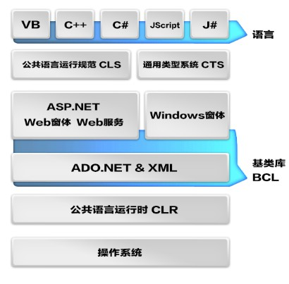
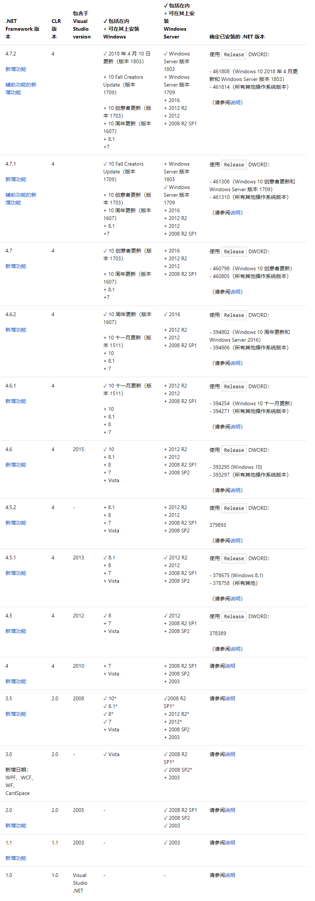
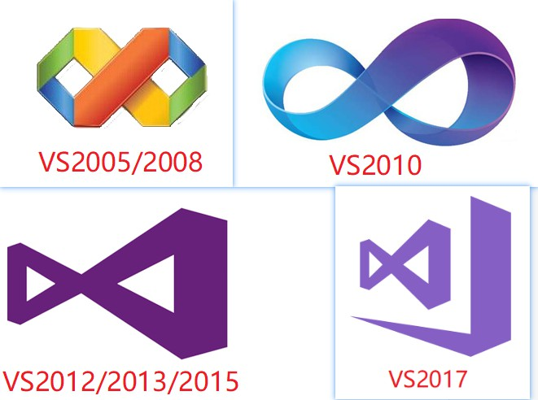
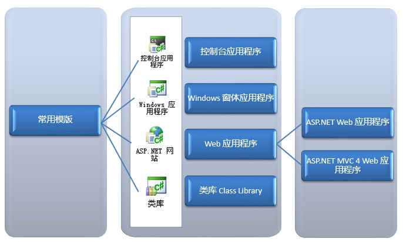
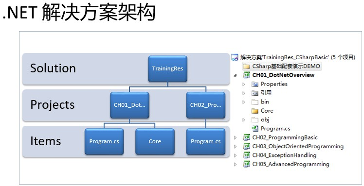
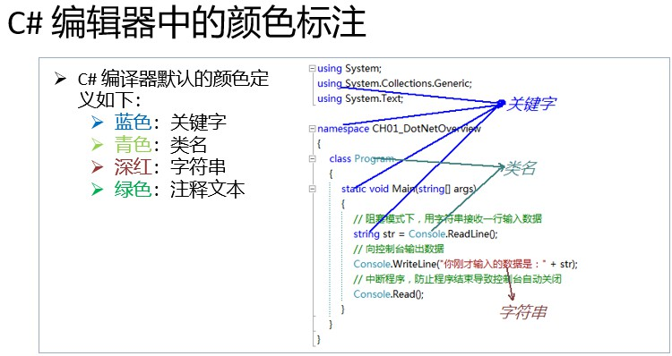
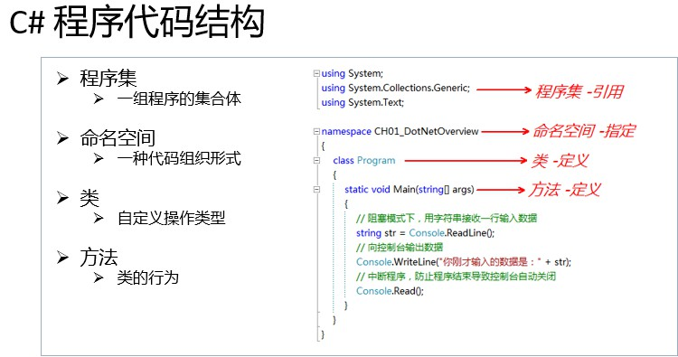

<!-- TOC -->

- [1. NET概述](#1-net概述)
    - [.NET Framework](#net-framework)
        - [什么是 .NET Framework？](#什么是-net-framework)
        - [框架体系结构](#框架体系结构)
        - [CLR（Common Language Runtime）](#clrcommon-language-runtime)
        - [.NET Framework Class Library](#net-framework-class-library)
        - [中间语言（MSIL）](#中间语言msil)
        - [应用和服务](#应用和服务)
    - [.NET版本说明](#net版本说明)
    - [.NET Core](#net-core)
    - [`C#`语言](#c语言)
    - [VisualStudio2015](#visualstudio2015)
        - [vs版本变迁](#vs版本变迁)
        - [工程模板](#工程模板)
        - [解决方案结构](#解决方案结构)
        - [面板](#面板)
        - [快捷操作](#快捷操作)
        - [疑难解答](#疑难解答)
            - [ActivityLog.xml异常](#activitylogxml异常)
    - [Help Doc](#help-doc)

<!-- /TOC -->

# 1. NET概述

## .NET Framework

.NET Framework 是管理面向 .NET Framework 应用的运行时执行环境。 

它包括公共语言运行时（提供内存管理和其他系统服务）和一个全面的类库（使程序员能利用强大可靠的代码实现所有主要领域的应用开发）。

> .NET Framework 仅适用于 Windows 系统。 可以使用 .NET Core 在 Windows、MacOS 和 Linux 上运行应用。

> .NET Framework 会在 Visual Studio 的安装程序中自动安装，因此不必手动安装。

### 什么是 .NET Framework？
.NET Framework 是 Windows 的托管执行环境，可为其运行的应用提供各种服务。 它包括两个主要组件：
1. 公共语言运行时 (CLR)，它是处理运行应用的执行引擎；
2. .NET Framework 类库，它提供开发人员可从其自己的应用中调用的已测试、可重用代码库。

### 框架体系结构

### CLR（Common Language Runtime）

* CLR 是.NET Framework 的虚拟机器元件(virtual machine component)，用来管理执行中的.NET 程序。
* CLR有个重要的流程是JIT编译 (just-in-time compilation)机制，可以将.NET程式编译过的中继语言 (Intermediate language)编译为当前CPU架构可执行的机器码 (machine instructions)。
* CLR提供记忆体管理、类型安全、例外处理、垃圾回收机制 (GC)、安全性、执行绪管理等服务。
* 无论什么程式语言，只要是基于.NET 框架的程式，都必须执行于CLR 提供的执行环境(虚拟机器)中。
* CLR包含一系列基础类别函式库 ( BCL ) ( Base Class Libraries )，用来提供.NET执行时期需要的程式基础。
* 在该函式库中含有一堆组件 (Assembly)与型别 (Type)定义，如命名空间、类别、介面、列举、…等等。

### .NET Framework Class Library

框架类别函式库 (FCL) (Framework Class Libraries)，用来扩充BCL(Base Class Libraries)不足的地方。

.NET Framework 类库是一个与公共语言运行时紧密集成的可重用的类型集合。 

### 中间语言（MSIL）
中间语言（MSIL）在.NET Framework中有非常重要的作用，所有面向.NET的语言都要先编译成IL，那么它们在逻辑上都需要支持IL的主要特征。

MSIL是将.Net代码转化为机器语言的一个中间过程。

### 应用和服务

使用 .NET Framework 开发下列类型的应用和服务：

* Console 应用，即控制台应用
* Windows GUI 应用（Windows 窗体）。 
* Windows Presentation Foundation (WPF) 应用。 
* ASP.NET 应用。 WEB应用开发
* Windows 服务。 
* 使用 Windows Communication Foundation (WCF) 的面向服务的应用。
* 使用 Windows Workflow Foundation (WF) 的启用工作流程的应用。

## .NET版本说明

**.NET Framework版本**：微软官方推出的.NET框架版本

**CLR版本**：.NET 组件（比如ASP.NET）版本、.NET 核心运行时版本

**C#版本**：.NET 平台上支持的编程语言（比如C#）的版本

**VisualStudio版本**：用来进行.NET 开发的 IDE 版本

## .NET Core
.NET Core 是 .NET Standard 的常规用途、模块化、跨平台和开放源代码实现。 它包含 .NET Framework 这样的许多相同 API（但 .NET Core 是较小的集）并包括支持不同操作系统和芯片目标的运行时、框架、编译器和工具组件。 .NET Core 实现主要由 ASP.NET Core 工作负载驱动，但同时也由拥有一个更现代的实现这一需求和愿望驱动。 它可以用于设备、云和嵌入式/IoT 方案。

下面列出了 .NET Core 的主要特征：

* **跨平台：**.NET Core 提供了实现所需应用功能的关键功能，并且可以重用代码而不考虑平台目标。 它当前支持三种主要的操作系统 (OS)：Windows、 Linux 和 macOS。 可以编写无需修改即可跨受支持操作系统运行的应用和库。

* **开放源代码：**.NET Core 是 .NET Foundation 管理下的很多项目中的一个，并在 GitHub 上提供。 将 .NET Core 作为开放源代码项目促使开发过程更加透明并能提升社区的活跃度及参与度。

* **灵活部署：** 部署应用有两种主要方法：依赖框架的部署或独立部署。 使用依赖框架的部署时，仅安装应用和第三方依赖关系，而应用依赖于存在系统范围版本的 .NET Core。 使用独立部署时，用于构建应用程序的 .NET Core 版本随应用和第三方依赖关系一同部署，并可与其他版本并行运行。

* **模块化：**.NET Core 为模块化，因为它通过 NuGet 以较小的程序集包发布。 与包含了大部分核心功能的大型程序集不同，.NET Core 作为以功能为中心的小型数据包提供。 这为我们提供了更加灵活的开发模型，允许优化应用使其仅包含所需的 NuGet 程序包。 较小的应用图面区域的优势包括：提升安全性、减少维护、提高性能并采用按使用情况付费的模式降低成本。

> https://github.com/dotnet/core

## `C#`语言

C#（读作“See Sharp”）是一种简单易用的新式编程语言，不仅面向对象，还类型安全。 C# 源于 C 语言系列，C、C++、Java 和 JavaScript 程序员很快就可以上手使用。

C# 是一种面向对象的语言。不仅如此，C# 还进一步支持面向组件的编程。 当代软件设计越来越依赖采用自描述的独立功能包形式的软件组件。 此类组件的关键特征包括：为编程模型提供属性、方法和事件；包含提供组件声明性信息的特性；包含自己的文档。 C# 提供了语言构造来直接支持这些概念，让 C# 成为一种非常自然的语言，可用于创建和使用软件组件。

多项 C# 功能有助于构造可靠耐用的应用程序：垃圾回收可自动回收无法访问的未使用对象占用的内存；异常处理提供了一种结构化的可扩展方法来执行错误检测和恢复；C# 语言的类型安全设计禁止读取未初始化的变量、为范围之外的数组编制索引或执行未检查的类型转换。

## VisualStudio2015
Visual Studio 运行于 Windows 操作系统之上微软推出的.NET 集成开发环境（IDE）。

作为一款开发工具，号称宇宙最强大的开发工具，有着丰厚的历史背景。

Visual Studio的logo图标{∞}图标，您可以认为是倒立的数字8，也可认为是正无穷大的符号，logo的含义来源于莫比乌斯环（英文名：Mobius band），这是一个深奥的数学问题。

莫比乌斯带，是一种拓扑学结构，它只有一个面（表面），和一个边界。有兴趣可以百度之。。。

### vs版本变迁

### 工程模板

### 解决方案结构

### 面板
代码编辑窗口：

### 快捷操作

Ctrl + J ： 智能感知（IntelliSense）

Ctrl + F ： 显示查找对话框

Ctrl+K+D 或 Ctrl+E+D ：代码格式化

Ctrl + F5 ： 运行不调试

F5 ：启动调试

### 疑难解答

#### ActivityLog.xml异常

错误详情：Microsoft Visual Studio 2015 遇到了异常,可能是由某个扩展导致的。

检查文件"C:\Users\Administrator\AppData\Roaming\Microsoft\VisualStudio\10.0\ActivityLog.xml”以获取详细信息。"

解决方案： 把隐藏文件夹【C:\Users\Administrator\AppData\Local\Microsoft\VisualStudio\14.0\ComponentModelCache】 删除，重新打开生成vs项目，搞定！

## Help Doc

MSDN Library 
> https://msdn.microsoft.com/zh-cn/library/ms310241

---

参考引用：

[CLR/.NET/C#/Visual Studio/ASP.NET各版本之间的关系](https://www.cnblogs.com/EasonJim/p/6145531.html)

[.NET Framework 版本和依赖关系](https://docs.microsoft.com/zh-cn/dotnet/framework/migration-guide/versions-and-dependencies)

